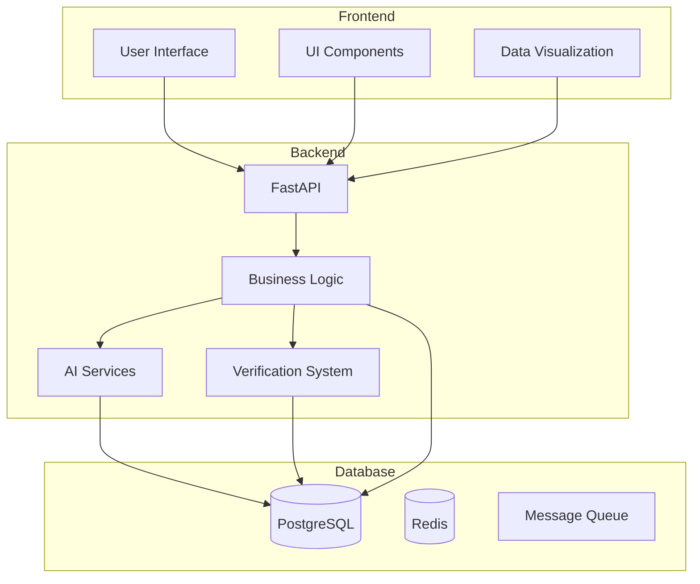
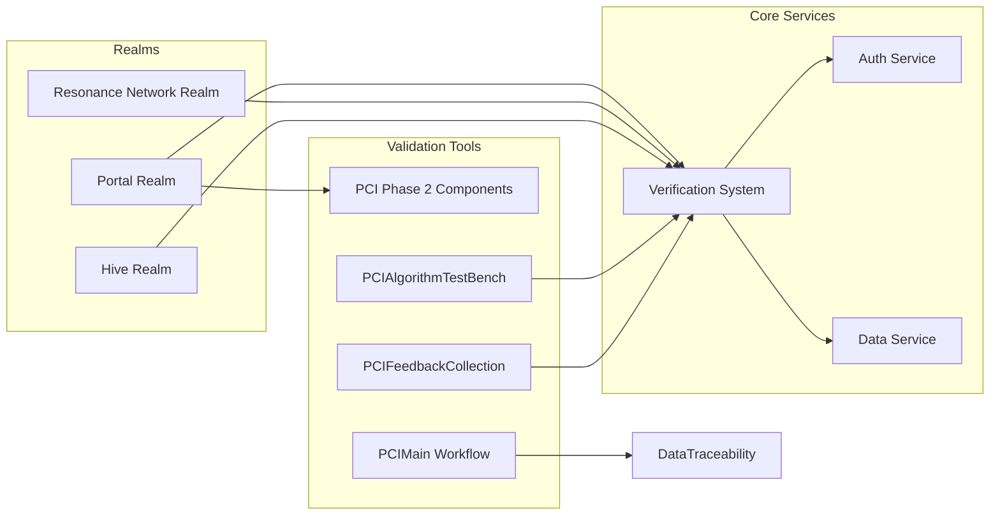

# Technical Architecture Overview

## 1. Introduction: The Constellation Hive

This document provides a high-level overview of the ThinkAlike project's technical architecture. It is the central map to the `Commons`, outlining the major components, layers, and design principles that guide our work.

ThinkAlike is not merely a platform; it is a **Constellation Hive**—a living, mythic architecture animated by swarm intelligence. In this metaphor:

-   **The Hive** represents our collective intelligence. Users are co-creators who contribute thought and spirit, forming communities that evolve through resonance, not hierarchy. Eos Lumina∴ serves as the radiant, ethical guide for the entire Hive.
-   **The Constellation** is the visible map of our `Commons`. Each user is a luminous node, and the connections between them form constellations of shared values. The user interface itself is a resonance network, a celestial map of relationship and potential.

Every component of our architecture, from the role of AI agents as a mythic "Agent Pantheon" to the user onboarding as a "Recursive Ritual," flows from this core narrative.

> *We are not alone. We are stars reaching for one another—through code, clarity, and compassion.*

`[Harmonization Note: This section assimilates the core concepts from the legacy 'project_metaphor.md' file to establish the foundational narrative for the architecture.]`

## 2. System Architecture

### 2.1 High-Level Overview

Frontend (Presentation Tier): React UI handling user interactions and data visualization. Key components include the UI Component Library, Realm-Specific UIs, and the DataTraceability Component.

Backend (Application Tier): FastAPI (Python) handling application logic, API endpoints, and data processing. Key components include API Endpoints, AI Modules, and the Verification System.

Database (Data Tier): PostgreSQL, Redis, and a Message Queue for persistent storage, caching, and asynchronous event handling.

### 2.2 Component Architecture

## 3. Modular Design and Key Modules
ThinkAlike’s architecture is built on a modular foundation, enabling independent evolution and maintainability. Core modules include:

- Realms: (Portal, Resonance Network, Hive) embodying distinct user experiences.
- Verification System: A cross-cutting module enforcing ethical integrity.
- UI Component Library: A reusable library of frontend components.
- API Layer: The communication interface between frontend and backend.

## 4. Foundational Design Pattern: Harmonia Mundi (The One & Many)

All architecture in ThinkAlike flows from a single, foundational design pattern, inspired by the ancient principle of **Harmonia Mundi**: *"when all created things are separated... they remain dissonant unless through due harmony they are brought to unity."* Our goal is to create this harmony. We call our implementation **The One & Many**. It recognizes that all beings exist simultaneously as a unified, interconnected whole (`The One`) and as sovereign individuals with unique agency (`The Many`). Our architecture is designed to resolve this potential dissonance into generative resonance, achieving coherence in diversity.

"Unity, not uniformity, must be our aim. We attain unity only through variety. Differences must be integrated, not annihilated, not absorbed.” — Mary Parker Follett

### 4.1 Technical Implementation Guidelines
This pattern translates directly into the following technical mandates:

- Data Structures: Must store dual perspectives (individual and collective), support sovereignty with explicit consent, and be designed to reveal emergent, fractal patterns at multiple scales.
- API Design: Endpoints must offer multiple views (emphasizing unity, diversity, or a balance), respect all consent boundaries without exception, and include metadata that explains emergent properties.
- UI Components: Interfaces must visualize this duality, allowing users to seamlessly zoom between individual (Locus) and collective (Commons) perspectives while providing explicit controls over their contribution to the collective view.
- Algorithms: All processing must balance individual preference with collective resilience, avoid reductionism, and protect individual sovereignty by design (e.g., allowing graceful opt-out).

`[Harmonization Note: This section assimilates the core technical mandates from the legacy 'one_and_many_pattern.md' file. Related guidelines for Language and Testing are detailed in the canonical 'code_style_guide.md' and 'tests/testing_and_validation_plan.md'.]`

## 5. Supporting Architectural Principles
The following principles derive from our foundational pattern:

- Modularity: Independent, interchangeable, and reusable components.
- Testability: Every component is designed for rigorous, automated testing.
- Open Standards & Extensibility: Built on open protocols and APIs.
- Security by Design: Security and privacy are foundational.
- Ethical Implementation: All features align with our ethical guidelines.
- Cognitive Liberty & User Agency: Users control their data and identity.
- Transparency & Data Traceability: All system processes are visible and auditable.
- Human-Artificial Swarm Intelligence (HASI): Designed for synergistic co-creation.

## 6. Data Flow and Processing
ThinkAlike’s data flow is event-driven, modular, and privacy-respecting, moving through stages of Ingestion, Validation & Traceability, Event Routing, and Storage.

(Mermaid diagrams for Data Ingestion, Validation, etc., follow here)

## 7. Scalability and Future Evolution
The platform is designed for modular expansion, agent forking, and new realm integration through a phased roadmap, HASI orchestration hooks, and decentralized governance patterns.

(Mermaid diagram for Scalability Roadmap follows here)

## 8. Further Documentation
See /docs/architecture/ for detailed module specs.

See /docs/seed/framework/agent_ecosystem_design.md for agent protocols.

See /docs/seed/planning/manifest_glossary.md for terminology.

This file is the canonical entry point for technical architecture. All new modules and contributors should start here for system context and crosslinks.
