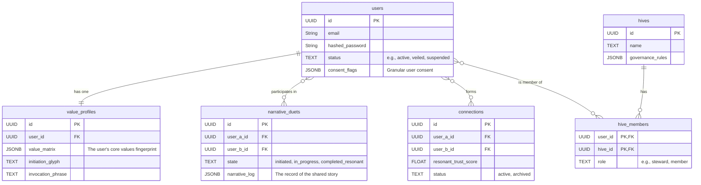

# Canonical Database Schema

## 1. Introduction

This document provides a human-readable overview of the ThinkAlike database schema. It is the canonical reference for understanding the structure of our data `Commons`, translated directly from the SQLAlchemy models that serve as the single source of truth in the codebase.

Its purpose is to provide clarity on our core data entities, their relationships, and, most importantly, their **symbolic purpose** within the ThinkAlike ecosystem.

## 2. Entity-Relationship Diagram (ERD)

This diagram illustrates the high-level relationships between the core entities of the `Commons`.

## 3. Table Definitions

### 3.1 users
Stores the core identity and authentication details for a sovereign individual. This table is the anchor for user agency and sovereignty.

| Column         | Type   | Symbolic Purpose                                                      |
|---------------|--------|-----------------------------------------------------------------------|
| id            | UUID   | The unique, unchangeable identifier of a sovereign being in the Commons.|
| email         | String | The communication channel for system notices; a necessary link to the outside world.|
| hashed_password | String | The cryptographic key to the user's digital Locus.                   |
| status        | TEXT   | Represents the user's current state of participation (e.g., active, veiled).|
| consent_flags | JSONB  | User Sovereignty Manifest. The explicit, granular record of what the user has consented to.|

### 3.2 value_profiles
The representation of a user's inner world—their values, identity, and narrative essence. This is the "soul" of the user's presence on the platform.

| Column           | Type   | Symbolic Purpose                                                      |
|------------------|--------|-----------------------------------------------------------------------|
| id               | UUID   | The unique identifier for this expression of a user's profile.         |
| user_id          | UUID   | Links this profile back to its sovereign owner.                        |
| value_matrix     | JSONB  | The user's "Resonance Fingerprint"; a structured representation of their core values.|
| initiation_glyph | TEXT   | The user's unique, self-created symbolic key, forged during the Portal ritual.|
| invocation_phrase| TEXT   | The user's personal access phrase, a counterpart to the glyph.          |

### 3.3 narrative_duets
A transient, sacred space where two individuals explore their potential for resonance through a shared, interactive story.

| Column           | Type   | Symbolic Purpose                                                      |
|------------------|--------|-----------------------------------------------------------------------|
| id               | UUID   | The unique identifier for this specific interaction ritual.            |
| user_a_id / user_b_id | UUID | The two participants entering the duet.                              |
| state            | TEXT   | The current phase of the ritual (e.g., initiated, completed_resonant). |
| narrative_log    | JSONB  | The immutable record of the shared story and choices made within the duet.|

### 3.4 connections
Represents a confirmed, persistent bond of resonance between two users, formed after a successful Narrative Duet. This is the living graph of the Resonance Network.

| Column           | Type   | Symbolic Purpose                                                      |
|------------------|--------|-----------------------------------------------------------------------|
| id               | UUID   | The unique identifier for this established bond.                       |
| user_a_id / user_b_id | UUID | The two connected individuals.                                       |
| resonant_trust_score | FLOAT | An internal, evolving metric representing the health and depth of the connection.|
| status           | TEXT   | The current state of the bond (active, veiled, archived).              |

This document is a living map that must evolve in lockstep with the codebase. Any changes to the core SQLAlchemy models must be reflected here to maintain the coherence of the Commons.

---
