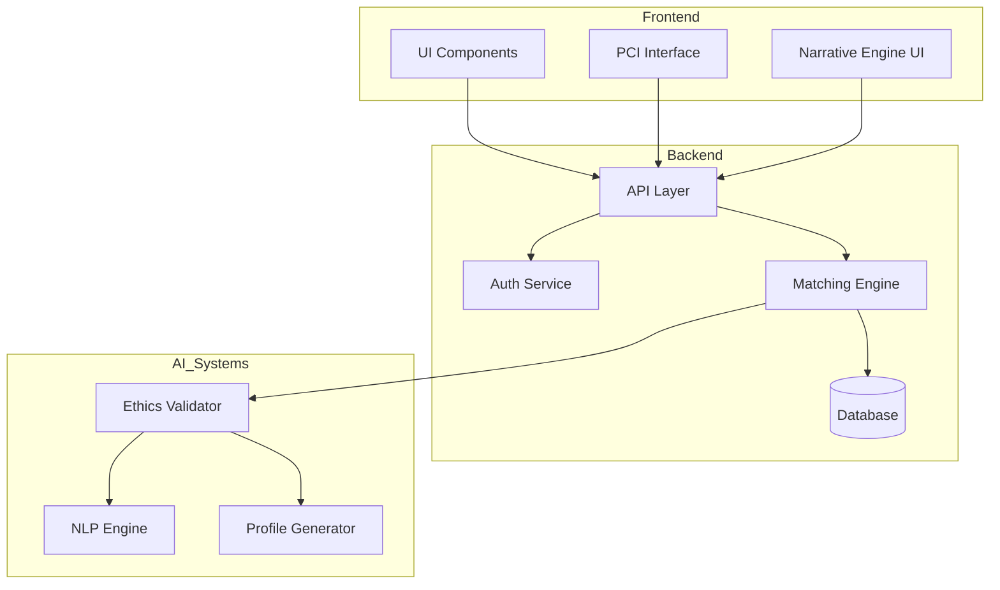
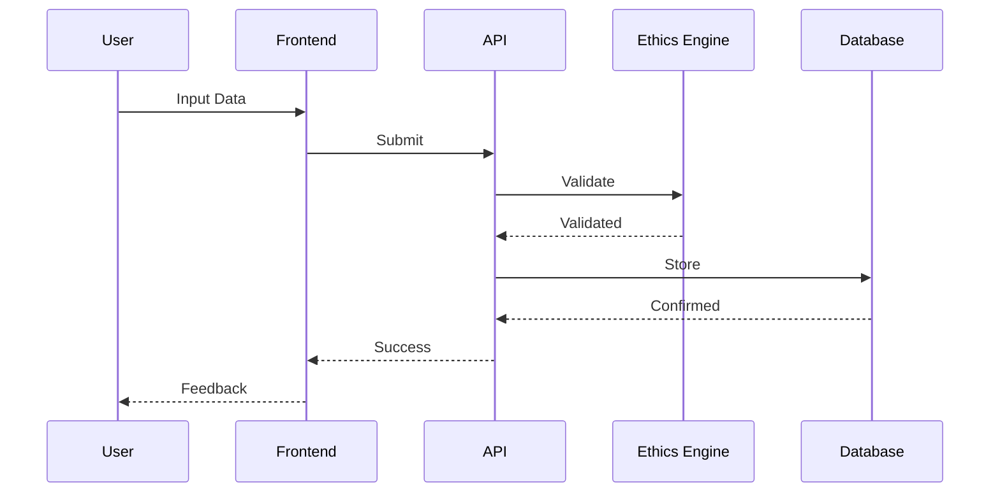
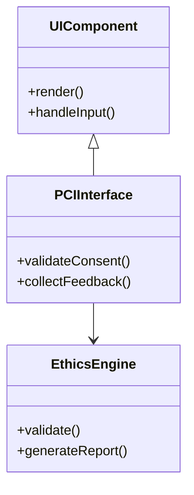
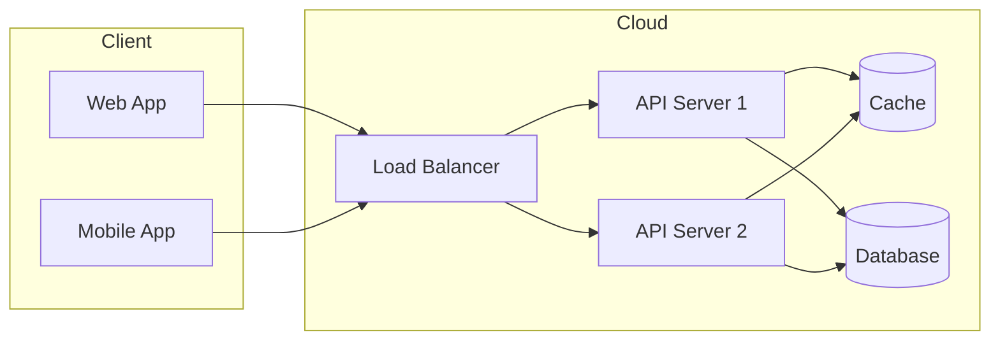
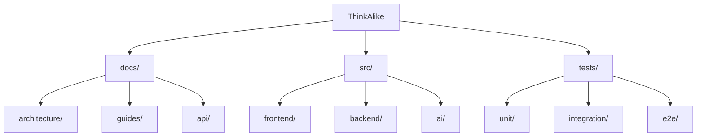

# ThinkAlike Architecture Diagrams

## System Overview

## Data Flow

## Component Architecture

## Deployment Architecture

## Project Structure

## Notes
- These diagrams should be updated whenever architecture changes
- Use these as reference for documentation
- Verify alignment with `system_blueprint.md`
