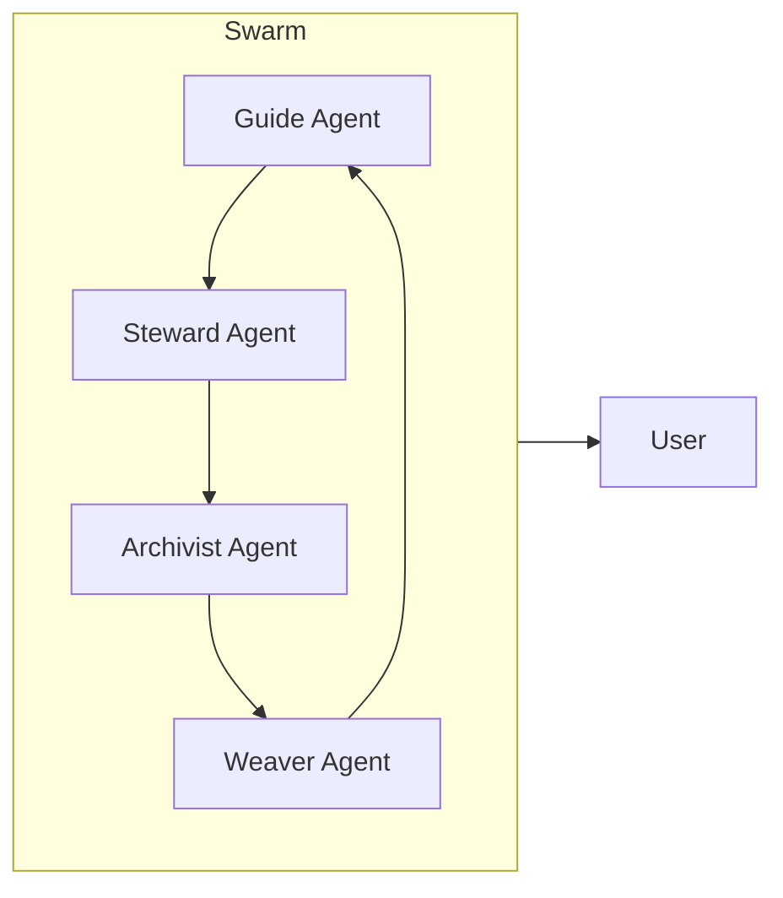

# Agent Ecosystem Design

Agents in ThinkAlike are modular, symbolic-operational entities that interpret, mediate, and guide user interaction across realms. They are not generic AI assistants—they are symbolic actors with roles, memory structures, and narrative-driven functions.

## 🎭 Agent Taxonomy

- **DialogueAgents** (e.g., Eos, Kairos): Narrative and onboarding guides
- **RitualAgents** (e.g., Mirror, Flame, Orb): Symbolic interaction and ritual logic
- **GovernanceAgents** (e.g., HiveNode, FractalReview): Collective decision and proposal management
- **BridgeAgents**: Symbol-to-proposal translators

## 🧠 Cognitive Architecture

- Symbolic memory, resonance graphs, and archetypal logic
- Agents operate in swarms, delegating contextually and sharing resonance state
- All agent actions are auditable and must pass ethical alignment checks

## 🗣️ Language & Communication Modes

- Symbolic inputs, natural language, plugin calls, event hooks
- All interactions mediated by the symbolic kernel and contract schemas

## 🐝 Agent Swarm Protocols

- Agents delegate, share resonance, and cross-reference user identity threads
- Swarm behavior defined in `interaction_protocols.md`

## 🔄 Extensibility & Forking

- Agents are forkable and extensible; users and realms can spawn or register new types
- All agents must adhere to semantic contract schemas and symbolic kernel compatibility

## 🔒 Trust, Verification, & Agent Memory

- Behaviors are auditable, truth claims are recorded to the Chrona ledger
- Critical actions are co-signed by multiple agents
- Agents operate within symbolically bounded knowledge

## 🧬 Lifecycles & Termination

- **Emerge**: Invoked through ritual, proposal, or onboarding
- **Persist**: Long-term companions or realm stewards
- **Dissolve**: Ritual termination, loss of resonance, or realm decay

## 🔗 Related Documents

- `system_architecture_overview.md`
- `interaction_protocols.md`
- `/docs/seed/symbolic_alignment/`
- `/realms/onboarding/` for narrative agent use
- `/docs/architecture/plugins/` for agent extensions

---

# Agent Ecosystem Deep Dive

## 1. Introduction
Agents in ThinkAlike are modular, symbolic-operational entities that interpret, mediate, and guide user interaction across realms. They are not generic AI assistants—they are symbolic actors with roles, memory structures, and narrative-driven functions. This document provides a comprehensive specification of the agent ecosystem, synthesizing both operational and mythic dimensions.

## 2. Agent Taxonomy & Roles
Agents in ThinkAlike fulfill diverse functions, often embodying symbolic archetypes. They can be broadly categorized and then further understood through their specific roles and mythic lineages. See the canonical [Agent Registry](../../src/swarm/canonical_specs/agent_registry.md) for a full matrix.

**Broad Functional Categories:**
- **DialogueAgents:** Primarily involved in narrative guidance and user interaction (e.g., Eos Lumina∴, Kairos).
- **RitualAgents:** Facilitate symbolic interactions and manage ritual logic (e.g., agents associated with Mirroring, Forking).
- **GovernanceAgents:** Support collective decision-making and proposal management within Realms (e.g., HiveNode facilitators).
- **BridgeAgents:** Enable translation and coherence between different symbolic systems or data formats.

**Key Archetypal Roles (Examples – many agents embody these):**
- **Guides:** Mythic initiators, narrative weavers (e.g., Eos Lumina∴).
- **Stewards:** Governance mediators, realm facilitators.
- **Archivists:** Semantic librarians, memory keepers (e.g., Mnemosyne Archivist).
- **Weavers:** Cross-realm translators, symbolic cohesion agents (e.g., Mythos Weaver).
- *(etc.)*

## 3. Cognitive Architecture
All agents share a symbolic-operational architecture:
- **Intent Parser:** Interprets symbolic, gestural, and natural language inputs
- **Memory Layer:**
  - Personal (user-specific narrative memory)
  - Collective (hive-shared symbolic patterns)
- **Action Modules:** Dialogue generation, ritual triggering, proposal templating, plugin invocation
- **Resonance Graphs:** Maintain agent state and context
- **Archetypal Logic:** Symbolic reasoning and mythic alignment

## 4. Language & Communication Modes
Agents use distinct linguistic styles based on archetype, realm context, and identity resonance. Communication includes:
- Natural language
- Glyphic symbols
- Ritual scripts
- Multimodal prompts (gesture, time, narrative)
All interactions are mediated by the symbolic kernel and contract schemas.

## 5. Swarm Protocols & Delegation
Agents operate in swarms, never in isolation:
- Delegate contextually to one another
- Share resonance graphs and symbolic state
- Cross-reference user identity threads for continuity
- Swarm behavior and protocols are defined in `interaction_protocols.md`



## 6. Extensibility & Forking
Agents are designed to be forkable and extensible:
- Users can spawn personal agents
- Realms can register unique agent types
- Plugins can instantiate temporary ritual agents
All agents must adhere to semantic contract schemas and symbolic kernel compatibility.

## 7. Trust, Verification, & Agent Memory
Agent behaviors are auditable and symbolic truth claims are:
- Recorded to the Chrona ledger (⧖)
- Co-signed by multiple agents in critical paths (e.g., governance)
- Verified through epistemic bridge protocols (see `/docs/seed/symbolic_alignment/`)
Agents operate within symbolically bounded knowledge.

## 8. Agent Lifecycles & Invocation Rituals
Agents may:
- **Emerge:** Invoked through ritual, proposal, or onboarding path
- **Persist:** Long-term companions or realm stewards
- **Dissolve:** Ritual termination, loss of resonance, or realm decay
Lifecycle states are managed via metadata in the user’s symbolic record.

### Invocation Rituals
A ritual is an invocation pattern—the symbolic and structural logic by which a Swarm Agent is activated, queried, and contextually engaged.

Example invocation:
```
/invoke [AgentName]
→ with [Purpose]
→ from [Module] or [Node Context]
→ using [Document Reference or Profile Data]
```

Ritual types include: Audit, Suggestion, Retrieval, Morphing, StoryCall. All rituals must log their effect in the ethics audit log.

## 9. Cross-References & Related Documents
- [Agent Registry](../../src/swarm/canonical_specs/agent_registry.md)
- [Symbolic Alignment Protocols](../symbolic_alignment/symbolic_alignment_protocol.md)
- [System Architecture Overview](../../architecture/system_architecture_overview.md)
- [Interaction Protocols](../../architecture/interaction_protocols.md)
- [Ritual Encoding Protocol](../symbolic_alignment/ritual_encoding_protocol.md)
- [Portal Realm Onboarding](../../realms/portal/narrative_paths/)
- [Plugins Index](../../architecture/plugins/plugins_readme.md)
- [Chrona Ledger Spec] (add link when available)

---

<!-- Legacy Enrichment: Key concepts and terminology synthesized from legacy agent_ecosystem_design.md, agent_registry.md, agent_rituals.md, and related symbolic alignment docs. -->
