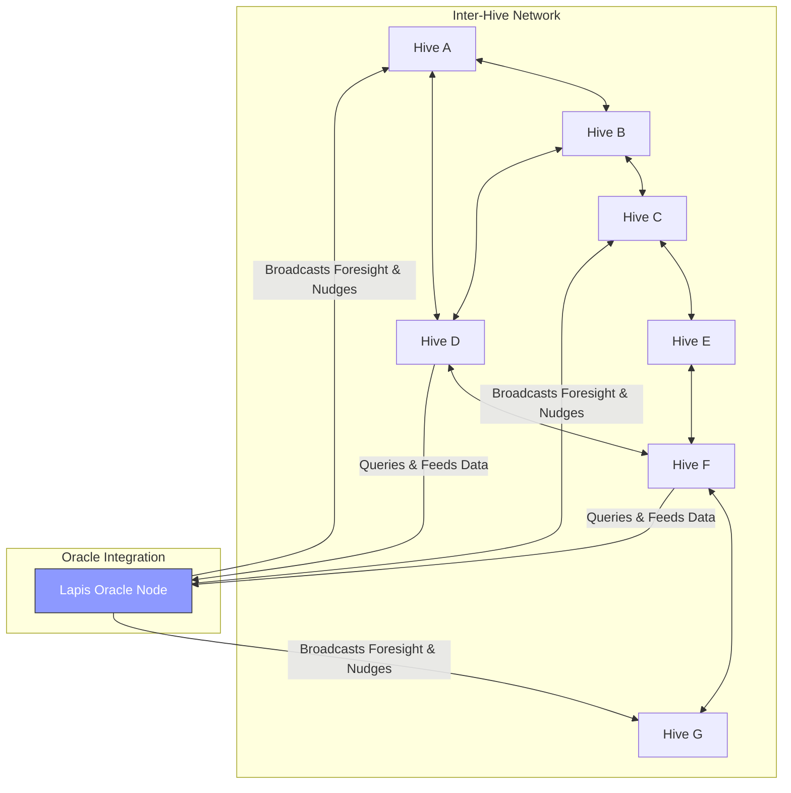

### Hive Network Dynamics

This diagram shows the mesh-like structure of the Hive Network and illustrates its relationship with the Lapis Oracle, which provides system-wide foresight and guidance.

