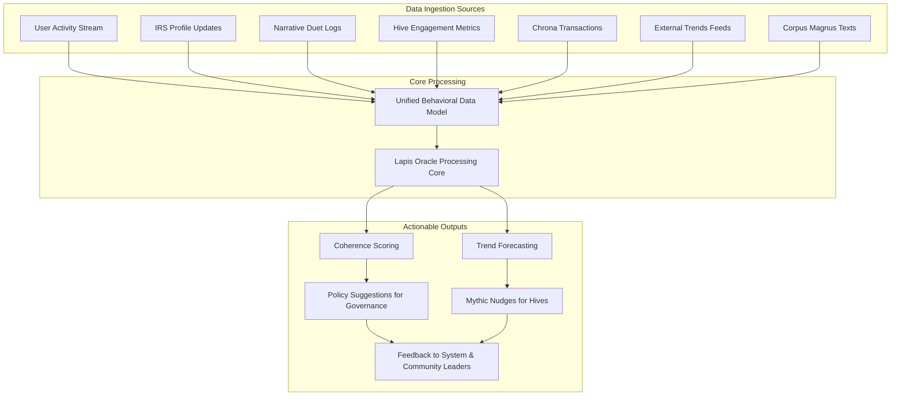

### Lapis Oracle Foresight Engine

This diagram details the data processing pipeline of the Lapis Oracle, from the ingestion of diverse data sources to the generation of actionable insights and feedback for the community.

