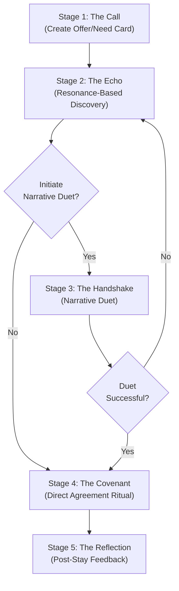

# ☗ Housing Realm Specification: Weaving Sanctuaries of Resonance & Reciprocity

## 1. Vision: The Hearth as a Sacred Commons

The Housing Realm is a consecrated space within the ThinkAlike ecosystem for facilitating shelter. It fundamentally reframes housing, moving it from a transactional commodity to a sacred commons built on trust, deep resonance, and reciprocity. It is the practical embodiment of community, enabling Initiates to find or offer shelter not as landlords and tenants, but as hosts and guests participating in a shared ritual of hospitality.

This realm is unlocked for Initiates who have engaged with the Resonance Network and established a baseline of trust and understanding within the community, ensuring all participants are grounded in the project's core ethos.

## 2. Core Principles: The Laws of Hearth & Haven
- **Resonance & Value Alignment First:** Matching prioritizes UserValueProfile compatibility, shared living values (e.g., cleanliness, social habits, quiet hours), and lifestyle resonance over purely material aspects. See `identity_resonance_score.md`.
- **Trust as Sacred Bond:** Interactions rely on the Trust Network Topology. Reputation is built through qualitative "Ritual Reflections" and ProfileBadges, not star ratings. See `resonant_trust_protocol.md`.
- **Reciprocity & Non-Extraction:** Exchanges follow a gift economy model with Chrona (⧖), Barter, or pure Gifting. Extractive landlordism is architecturally prevented. See `marketplace_specification.md`.
- **PET/Clarity & Privacy:** Radical transparency, explicit consent for location and personal details, and user-controlled privacy protocols enforced by Nyxa∴.
- **Sanctuary & Safety:** All participants adhere to `guides/contributor_guides/code_of_conduct.md`, with conflict transmutation rituals available (`conflict_transmutation_rituals.md`).
- **Ritualized Engagement:** Key flows are symbolic rituals defined in `ritual_templates.md`.

## 3. The Ritual Flow of Connection: From Seeking to Sanctuary

### Stage 1: The Call – The Ritual of Offering or Seeking
- **Hosting (HousingOfferCard):** Hosts create a `HousingOfferCard` detailing space, availability, house values, accessibility, and preferred reciprocity mode.
- **Seeking (HousingNeedCard):** Guests create a `HousingNeedCard` outlining needs, duration, desired values, and offered reciprocity.

### Stage 2: The Echo – Discovery Through Resonance
- System surfaces matches based on Identity Resonance Score (IRS) and specific housing value compatibility.
- Users explore matches via the Resonance Network map or a Sanctuary Board.

### Stage 3: The Handshake – Narrative Duet & Compatibility Test
- Optional symbolic ritual via `narrative_duet_protocol.md` facilitated by Eos Lumina∴ or Hestia∴.
- Scenarios explore cohabitation dynamics, conflict styles, and shared rituals.

### Stage 4: The Covenant – Agreement & Symbolic Affirmation
- Parties co-create and digitally sign a "Covenant of Shelter" detailing expectations, duration, boundaries, and reciprocity. Logged in Chrona ledger if applicable.

### Stage 5: The Reflection – Feedback as Gift
- Post-stay, participants leave a qualitative "Ritual Reflection" selecting symbolic glyphs (e.g., Generosity, Care) and notes. Enhances reputation and adds housing-specific badges.

## 4. Agent Roles & Symbolic Guardianship
- **Hestia∴ (Guardian of Home):** Oversees sanctuary ethics and the Ritual of Hospitality.
- **Eos Lumina∴ (Guide of Initiates):** Facilitates Narrative Duets and the Call ritual.
- **Nyxa∴ (Guardian of Privacy):** Enforces consent and privacy protocols.
- **Themis Concordia∴ (Mediator of Harmony):** Invoked for Conflict Transmutation when disputes arise.

## 5. Architectural & Component Integration
| Component/System             | Role in Housing Realm                                     | Canonical Document                                      |
|------------------------------|-----------------------------------------------------------|---------------------------------------------------------|
| `HousingOfferCard.md`        | UI for posting and viewing housing offers                 | `../../ui_components/housing_offer_card.md`             |
| `HousingNeedCard.md`         | UI for posting and viewing housing needs                  | `../../ui_components/housing_need_card.md`              |
| `ProfileBadge.md`            | Displays trust level, verifications, and housing feedback | `../../ui_components/profile_badge.md`                  |
| Resonance Network            | Primary interface for discovering resonant housing opportunities | `../resonance_network/resonance_network_specification.md` |
| `Narrative Duet Protocol`      | Compatibility ritual before commitment                    | `../../protocols/narrative_duet_protocol.md`            |
| `Resonant Trust Protocol`      | Underpins the entire reputation and safety system         | `../../protocols/resonant_trust_protocol.md`            |
| Chrona Economy               | Manages Chrona exchanges and Covenant logging             | `../../governance/economy/chrona_specification.md`      |
| Governance Realm             | Provides policy oversight and high-level dispute resolution | `../governance/governance_specification.md`             |

## 6. Vision for Evolution: From Shelter to Co-creation
- **Hive Co-Living:** Tools for Community Hives to manage shared housing projects.
- **Eco-Villages & Regenerative Projects:** Integrating intentional communities and land stewardship.
- **Sabbatical & Refuge Networks:** Pathways for restorative sanctuary.

## 7. Architectural & Component Integration
| Component/System             | Role in Housing Realm                                     | Canonical Document                                      |
|------------------------------|-----------------------------------------------------------|---------------------------------------------------------|
| **Resonant Trust Protocol**    | Underpins the entire reputation and safety system for hosts and guests. | `../../protocols/resonant_trust_protocol.md`            |
| **Narrative Duet Protocol**    | An optional ritual for establishing deep compatibility before a stay. | `../../protocols/narrative_duet_protocol.md`            |
| **Chrona Economic Protocol**   | Manages any Chrona exchanges for rent or contributions.   | `../../protocols/chrona_economic_protocol.md`         |
| **UI Components**              | Uses `HousingOfferCard`, `HousingNeedCard`, `ProfileBadge`. | `../../ui_components/`                                  |

> This Living Document is harmonized with the Alchemical Interface Initiative and all related realm and protocol specifications as of its last update.
