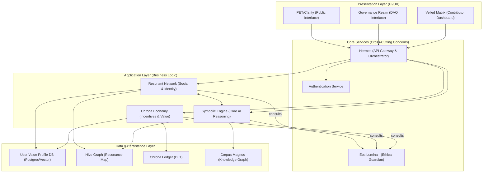

# ThinkAlike System Architecture Overview

This diagram provides a high-level overview of the ThinkAlike system architecture, illustrating the primary layers, core services, and data flow between them.

