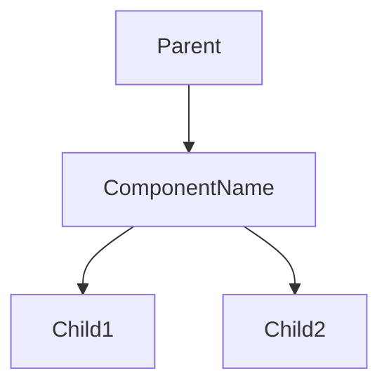

# [Component Name]

## Overview
Brief description of the component's purpose and key features.

## Visual Example
```tsx
// Basic usage example
<ComponentName prop1="value1" prop2="value2" />
```

### Preview
[Screenshot or live example would go here]

## Props
| Prop | Type | Required | Default | Description |
|------|------|----------|---------|-------------|
| prop1 | string | Yes | - | Description of prop1 |
| prop2 | number | No | 0 | Description of prop2 |

## Usage Guidelines
Describe when and how to use this component effectively.

### Best Practices
- Guideline 1
- Guideline 2

### Accessibility
- ARIA roles
- Keyboard navigation
- Screen reader considerations

## Examples

### Basic Usage
```tsx
import { ComponentName } from '@/components';

function Example() {
  return <ComponentName prop1="value" />;
}
```

### Complex Example
```tsx
// More complex implementation example
```

## Style Customization
How to customize the component's appearance:

```scss
// Example style overrides
.componentName {
  // Custom styles
}
```

## Technical Details

### Component Structure


### Internal Implementation
Key implementation details or patterns used.

### Performance Considerations
Any performance notes or optimization tips.

## Testing
How to test this component:

```tsx
// Example test
describe('ComponentName', () => {
  it('should render correctly', () => {
    // Test code
  });
});
```

## Related
- [Related Component 1](./related1.md)
- [Related Component 2](./related2.md)

## Changelog
| Version | Changes | Date | Author |
|---------|---------|------|--------|
| 1.0.0 | Initial version | YYYY-MM-DD | Name |
