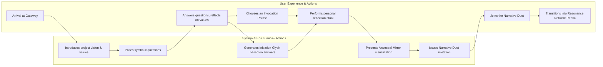

### User Journey Through the Portal Realm

This diagram maps the initial user experience upon entering the ThinkAlike ecosystem, illustrating the interactive flow between system-guided actions and user choices during the onboarding ritual.

