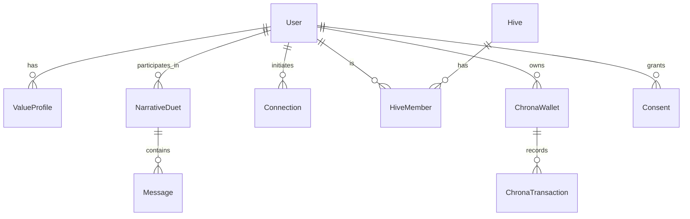
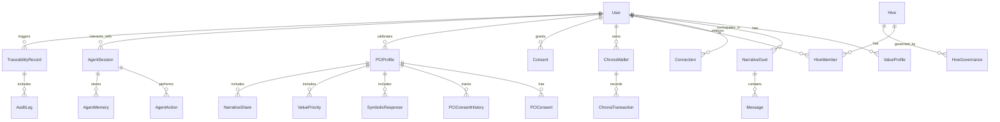

# Data Models & Schemas (Stub)

This document will define the canonical data models and schemas for ThinkAlike.

## TODO
- List all major data entities and relationships
- Provide schema diagrams and examples
- Cross-link to API and architecture docs

# Data Models & Schemas (Draft Canonical Table)

This document defines the canonical data models and schemas for ThinkAlike. All entities must be reflected in the OpenAPI spec and backend code. Update this table as models evolve.

| Entity         | Purpose/Description                        | Key Fields / Relationships                |
|----------------|-------------------------------------------|-------------------------------------------|
| User           | Core user identity                        | id (UUID), username (str), email (str), value_profile_id (UUID), created_at (datetime), is_active (bool) |
| ValueProfile   | User’s values, archetypes, resonance      | id (UUID), user_id (UUID), values (list[str]), archetypes (list[str]), resonance_score (float), updated_at (datetime) |
| NarrativeDuet  | Onboarding/narrative session              | id (UUID), user_id (UUID), agent_id (UUID), transcript (list[Message]), started_at (datetime), completed_at (datetime) |
| Message        | Message in a NarrativeDuet                | id (UUID), duet_id (UUID), sender (str: user/agent), content (str), timestamp (datetime) |
| Connection     | User-to-user or user-to-agent link        | id (UUID), source_id (UUID), target_id (UUID), type (enum: user-user, user-agent), status (enum: pending, active, blocked), created_at (datetime) |
| Hive           | Community/group                           | id (UUID), name (str), description (str), created_at (datetime), members (list[HiveMember]) |
| HiveMember     | Membership in a hive                      | id (UUID), hive_id (UUID), user_id (UUID), role (str), joined_at (datetime), is_admin (bool) |
| ChronaWallet   | Tracks time/currency for user             | id (UUID), user_id (UUID), balance (float), transactions (list[ChronaTransaction]) |
| ChronaTransaction | Chrona currency transaction            | id (UUID), wallet_id (UUID), amount (float), type (enum: earn, spend, transfer), timestamp (datetime), description (str) |
| Consent        | User consent records                      | id (UUID), user_id (UUID), scope (str), granted_at (datetime), revoked_at (datetime, optional), active (bool) |

---

## Entity Relationship Diagram (ERD)

---

## Cross-References
- All models must be reflected in the OpenAPI spec (`docs/api_specs/openapi.json`) and backend code.
- See also: `data_ontology.md`, `agent_persona_protocol.md`, `architecture_overview.md`.

# Data Models & Schemas (Canonical Draft, June 2025)

This section expands the data model to cover all major ThinkAlike modules, future-proofing for agent/AI integration, traceability, and extensibility. Update as new modules and flows are harmonized.

---

## Expanded Entity-Relationship Diagram (ERD)

---

## Expanded Canonical Table

| Entity               | Purpose/Description                        | Key Fields / Relationships                |
|----------------------|--------------------------------------------|-------------------------------------------|
| User                 | Core user identity                         | id (UUID), username, email, ...           |
| ValueProfile         | User’s values, archetypes, resonance       | id, user_id, values, archetypes, ...      |
| NarrativeDuet        | Onboarding/narrative session               | id, user_id, agent_id, transcript, ...    |
| Message              | Message in a NarrativeDuet                 | id, duet_id, sender, content, ...         |
| Connection           | User-to-user or user-to-agent link         | id, source_id, target_id, type, ...       |
| Hive                 | Community/group                            | id, name, description, ...                |
| HiveMember           | Membership in a hive                       | id, hive_id, user_id, role, ...           |
| ChronaWallet         | Tracks time/currency for user              | id, user_id, balance, ...                 |
| ChronaTransaction    | Chrona currency transaction                | id, wallet_id, amount, type, ...          |
| Consent              | User consent records                       | id, user_id, scope, granted_at, ...       |
| PCIProfile           | Persona Calibration Initiative profile      | id, user_id, completeness, ...            |
| PCIConsent           | PCI-specific consent                       | id, profile_id, scope, ...                |
| PCIConsentHistory    | PCI consent audit trail                    | id, profile_id, change_log, ...           |
| SymbolicResponse     | Symbolic question responses                | id, profile_id, response, ...             |
| ValuePriority        | User-defined value priorities              | id, profile_id, priorities, ...           |
| NarrativeShare       | User narrative snippets                    | id, profile_id, content, ...              |
| AgentSession         | Agent/user/AI interaction                  | id, user_id, context, ...                 |
| AgentAction          | Agent protocol actions                     | id, session_id, action_type, ...          |
| AgentMemory          | Persistent agent memory (vector DB)        | id, session_id, embedding, ...            |
| TraceabilityRecord   | Data traceability for all flows            | id, user_id, action, ...                  |
| AuditLog             | Audit log for traceability                 | id, record_id, event, ...                 |
| HiveGovernance       | Governance rules, proposals, votes         | id, hive_id, rules, ...                   |

---

## Technology & Extensibility Notes

- **Primary DB:** PostgreSQL (with JSONB for flexible fields).
- **Vector DB:** Integrate pgvector, Pinecone, or Weaviate for agent memory/context and semantic search.
- **Event Sourcing:** Use event sourcing for Akashic Record and audit logs (EventStoreDB or custom solution).
- **Consent & Traceability:** All flows must be auditable and enforce consent at every step (consider Open Policy Agent for enforcement).
- **Modularity:** All entities are designed for extension (new realms, agent types, protocols).

---

*Update this model as new modules, flows, or requirements are identified. Use as the foundation for the unified OpenAPI spec and protocol documentation.*
