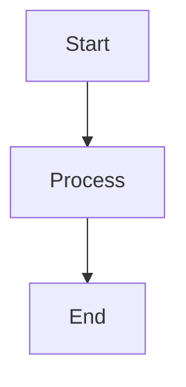

# [Document Title]

## Overview
Brief description of what this document covers and why it matters.

## Table of Contents
1. [Section One](#section-one)
2. [Section Two](#section-two)
3. [References](#references)

## Section One
Content for section one...

### Subsection
Detailed content...

## Section Two
Content for section two...

## Diagrams

## References
- [Link to Related Doc 1](../path/to/doc1.md)
- [Link to Related Doc 2](../path/to/doc2.md)

## Document History
| Date | Version | Changes | Author |
|------|---------|---------|--------|
| YYYY-MM-DD | 1.0.0 | Initial version | Name |

---
*Last harmonized: [Current Date] — All alignments and cross-references verified*
