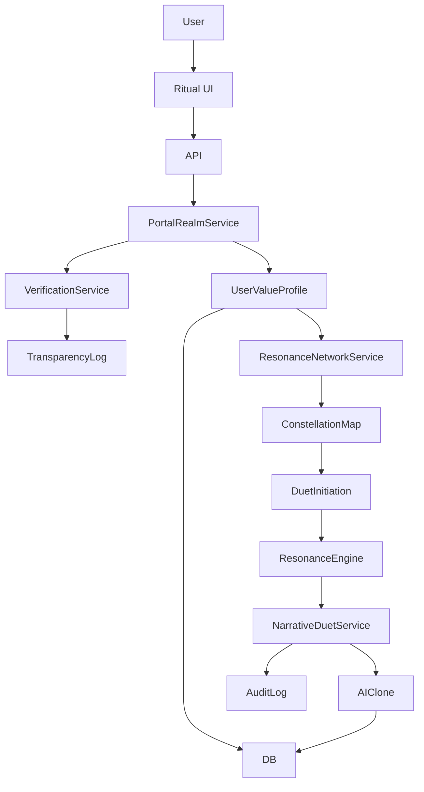

# ThinkAlike Technical Architecture Overview – A Symbolic & Ethical Framework

## 1. Document Purpose

This document provides a high-level overview of the ThinkAlike project's architecture. It outlines the major components, realms, and design principles that underpin the platform. The architecture is designed not just for functionality, but to support and enable ThinkAlike's unique symbolic, ritualistic, and ethical user experiences, as articulated in the Alchemical Interface Initiative and PET/Clarity framework.

## 2. Architectural Vision & Core Tenets

A modular, API-driven architecture designed to support a decentralized, evolving ecosystem of Human-Artificial Swarm Intelligence (HASI), emphasizing user sovereignty, ethical AI, and deep symbolic resonance.

### Key Architectural Principles (Alchemical Lens)
- **Ethical by Design (The Alchemical Vessel):** The architecture itself is a vessel crafted for ethical processes, guided by the Ethical Guidelines and enforced by Verification & Oversight Services.
- **User-Centricity & Sovereignty (The Initiate at the Center):** Prioritizes user agency, data ownership, and cognitive liberty.
- **Decentralization & Emergence (The Mycelial Network):** Designed to support distributed Hives, forkable identities, and emergent collective intelligence.
- **Radical Transparency & Data Traceability (The Light of Unconcealment):** All significant data flows and AI decision processes are designed for auditability (see DataTraceability, AI Transparency Log).
- **Modularity & Specialization (The Organs of the Living OS):** Components and agents are specialized yet interconnected, like organs in a living system (see mythos_as_operating_system.md).
- **API-Driven Communication (The Channels of Resonance):** Clear, symbolic, and secure APIs govern interactions.
- **Security First (The Wards of Protection):** Robust security at all layers.
- **Human-Artificial Swarm Intelligence (HASI) (The Co-Creative Swarm):** Human agency interacts with specialized AI agents, governed by Verification & Oversight, to achieve emergent outcomes.
- **Ritual as Core Process (The Theurgic Engine):** The architecture supports event-driven, ritualized user journeys and system operations (see ritual_encoding_protocol.md).

## 3. High-Level System Architecture

### Conceptual Layers
- **Symbolic Interaction Layer (Frontend):** React, UI Components, Visualization (NarrativeViewer, Constellation Map, DataTraceability). Renders the "Ritual over Interface" experience.
- **Orchestration & Logic Layer (Backend - API & Core Services):** FastAPI, Python. Handles core application logic, user/profile services, NarrativeChoiceLog, UserValueProfile management, agent orchestration, connection to NarrativeEngine and ResonanceEngine.
- **AI & Symbolic Processing Layer (Specialized AI Services):**
    - NarrativeEngine (Portal narratives, Duets)
    - ResonanceEngine (IRS calculation, "Social LLM" for Resonance Network)
    - AI Clone Persona Engine (Duets)
    - (Future) DGM components
- **Ethical Oversight & Verification Layer:** Ensures PET/Clarity, checks against CoreValuesValidator logic, interacts with AI Transparency Log, AI Bias Detection Guide.
- **Persistence & Memory Layer (Database & State):** PostgreSQL, Redis, Message Queue. Akashic Record concept for NarrativeChoiceLog and RitualForkArchive.

### Updated Mermaid Diagram
```mermaid
flowchart TD
    subgraph Symbolic_Interaction_Layer
        UI[React UI / Ritual Components]
        DataTrace[DataTraceability]
        Constellation[Constellation Map]
        NarrativeViewer[NarrativeViewer]
    end
    subgraph Orchestration_Logic_Layer
        API[FastAPI Gateway]
        UserProfile[UserProfileService]
        PortalRealm[PortalRealmService]
        ResonanceNetwork[ResonanceNetworkService]
        NarrativeDuet[NarrativeDuetService]
        Hive[HiveService (future)]
    end
    subgraph AI_Symbolic_Processing_Layer
        NarrativeEngine[NarrativeEngine]
        ResonanceEngine[ResonanceEngine]
        AIClone[AI Clone Persona Engine]
    end
    subgraph Ethical_Oversight_Verification_Layer
        Verification[Verification & Oversight Service]
        CoreValuesValidator[CoreValuesValidator]
        TransparencyLog[AI Transparency Log]
    end
    subgraph Persistence_Memory_Layer
        DB[(PostgreSQL)]
        Redis[(Redis)]
        MQ[Message Queue]
        Akashic[Akashic Record]
    end
    UI --> API
    DataTrace --> API
    Constellation --> API
    NarrativeViewer --> API
    API --> UserProfile
    API --> PortalRealm
    API --> ResonanceNetwork
    API --> NarrativeDuet
    API --> Hive
    UserProfile --> DB
    PortalRealm --> NarrativeEngine
    ResonanceNetwork --> ResonanceEngine
    NarrativeDuet --> AIClone
    NarrativeEngine --> DB
    ResonanceEngine --> DB
    AIClone --> DB
    Verification --> API
    CoreValuesValidator --> Verification
    TransparencyLog --> Verification
    Verification --> DB
    Akashic --> DB
    MQ --> API
    style Verification fill:#95e1d3,stroke:#0d5c4d
    style UI fill:#f9f,stroke:#333
    style API fill:#ccf,stroke:#333
    style DB fill:#fcf,stroke:#333
    style Akashic fill:#fcf,stroke:#333
```

## 4. Key Realms & Service Modules

- **Portal Realm Services:** Manages initiation journey, UserValueProfile creation, Glyph/Phrase forging, first Duet orchestration.
- **Resonance Network Services:** Manages constellation map data, user node discovery, user-initiated Duets, "Social LLM" feedback.
- **User & Identity Services:** Manages UserAccount, UserValueProfile, Forkable Identity principles.
- **Narrative Engine & Duet Services:** Core logic for all interactive narratives.
- **Resonance & Matching Logic Services:** Core for IRS, pathway priming, AI Clone data.
- **Agent Orchestration Services:** How different AI agents are managed and interact (see DGM R&D Protocol).
- **Verification & Ethical Oversight Services:** PET/Clarity, CoreValuesValidator, AI Transparency Log, Bias Detection.
- **(Future) Hive Services, Governance Services, Chrona Economy Services, etc.**

## 5. Data Flow and Processing

### Example: Portal Journey & UserValueProfile Creation
1. User completes Portal Journey via Ritual UI.
2. Data sent via API to PortalRealmService.
3. PortalRealmService processes, creates UserValueProfile, logs to Akashic Record.
4. Verification Service checks PET/Clarity, logs to Transparency Log.
5. UserValueProfile stored in DB, available for Resonance Network.

### Example: Resonance Network Duet
1. User initiates Duet via Constellation Map UI.
2. API routes to ResonanceNetworkService.
3. ResonanceEngine calculates IRS, primes narrative.
4. NarrativeDuetService orchestrates Duet, interacts with AIClone.
5. All actions logged for auditability.



## 6. Scalability and Future Evolution

- **Modular Design:** Allows independent scaling of components.
- **Cloud-Ready Deployment:** Designed for cloud platforms and resilience.
- **Open APIs and Extensibility:** Facilitates new features, realms, and integrations.
- **Community-Driven Development:** Open-source, encourages innovation.
- **DGM Integration:** Future evolution includes DGM and advanced agent orchestration.

## 7. Further Documentation

- [Portal Realm Specification](../realms/portal/portal_realm_specification.md)
- [Resonance Network Specification](../realms/resonance/resonance_network_specification.md)
- [Narrative Duet Protocol](../narrative_engine/narrative_duet_protocol.md)
- [IRS & Resonance Logic](../narrative_engine/irs_resonance_logic.md)
- [User Value Profile](../core/user_value_profile.md)
- [AI Transparency Log](../ethics/ai_transparency_log.md)
- [Core Values Validator](../ethics/core_values_validator.md)
- [Verification System](../architecture/verification_system/verification_system_spec.md)
- [Security Plan](../security/security_and_privacy_plan.md)
- [Database Schema](../architecture/database/database_schema.md)
- [DGM R&D Protocol](../agents/dgm_rnd_protocol.md)
- [mythos_as_operating_system.md](../framework/mythos_as_operating_system.md)
- [ritual_encoding_protocol.md](../rituals/ritual_encoding_protocol.md)

## 8. Architectural Deep Dives & Ethical Design Patterns

### 8.1 Borromean Rings Metaphor & Interdependent Modules
ThinkAlike's modular architecture is conceptually structured around the Borromean Rings metaphor, visually representing the essential interdependence of its core modules: Portal Realm (Narrative Mode), Resonance Network (Matching Mode), and Community Mode. These modules, while functionally distinct, are intrinsically linked and mutually reinforcing, forming a cohesive and integrated platform. The Verification System acts as the central "ethical knot," binding these modules and ensuring systemic integrity. (See also: [MASTER_REFERENCE.md](../reference/MASTER_REFERENCE.md))

### 8.2 UI as Validation & Test Framework
The Presentation Layer (UI) is not merely a visual front-end but a critical architectural component that functions as a validation framework. The UI:
- Validates data flows and system behavior, providing real-time feedback loops to users and developers.
- Acts as a dynamic "test bench" for system functionality and ethical compliance.
- Empowers user choice and agency by providing transparent access to data and system processes.
- Employs reusable UI components for data visualization, validation, and auditability.

### 8.3 AI Model Architecture & Ethical Overlays
A suite of specialized AI models power the platform, each with explicit ethical and transparency overlays:
- **Narrative Engine (Portal):** Guides interactive user narratives and onboarding.
- **Video Analysis Model (Resonance):** Analyzes video profiles to enhance matching accuracy.
- **Match Engine (Resonance):** Generates value-based match recommendations using ethically weighted algorithms.
- **User Data Analysis Model (Community):** Analyzes user behavior and community data for recommendations.
- **Community Engine (Community):** Facilitates automated community grouping and suggestions.
- **Data Validation & Testing Framework (Cross-Cutting):** Assists in data validation, workflow testing, and ethical compliance verification.
- All models are developed per the "AI Model Development Guide" and are subject to rigorous testing, bias mitigation, and transparency requirements. UI components (e.g., DataTraceability.jsx) visualize AI decision-making and support auditability.

### 8.4 Security by Transparency & Auditability
- End-to-end encryption is enforced for all user data, both in transit and at rest.
- Role-Based Access Control (RBAC) governs access to system resources, with UI components visualizing access control for transparency.
- Regular security audits and penetration testing are conducted, leveraging UI data traceability tools for comprehensive analysis.
- A well-defined data breach protocol and incident response plan ensure rapid detection, containment, and user notification.

### 8.5 Data Visualization & UI-Driven Validation
- Data visualization is a core architectural principle, not just an aesthetic feature.
- UI components represent data flows, algorithmic processes, and system behavior for both users and developers.
- UI-driven testing and validation workflows provide real-time feedback, enabling iterative refinement of code and design.
- Accessibility and user-centric design are prioritized throughout the UI/UX architecture.

### 8.6 Deployment, Scalability & Maintainability
- Modular/component-based design and containerization (e.g., Docker, Kubernetes) ensure scalability and resilience.
- Serverless technologies are leveraged where appropriate for efficient resource utilization.
- Comprehensive documentation and code style guidelines (see [source_of_truth.md](../source_of_truth.md)) support long-term maintainability and collaboration.
- The "Data Model Schema.md" provides detailed database schema and data handling practices.

---

**Document Details**
- Title: ThinkAlike Technical Architecture Overview – A Symbolic & Ethical Framework
- Type: Technical Documentation
- Version: 2.0.0
- Last Updated: 2025-06-09
- Maintained By: Architectural Stewards & Lumina∴ System Meta-Agent
- Harmonization Note: Revised to align with current realm specifications (Portal, Resonance Network), emphasizing symbolic/ritual UX, PET/Clarity, and the 'Alchemical Interface Initiative.' Supersedes older architectural overviews using 'Mode' terminology.

---
