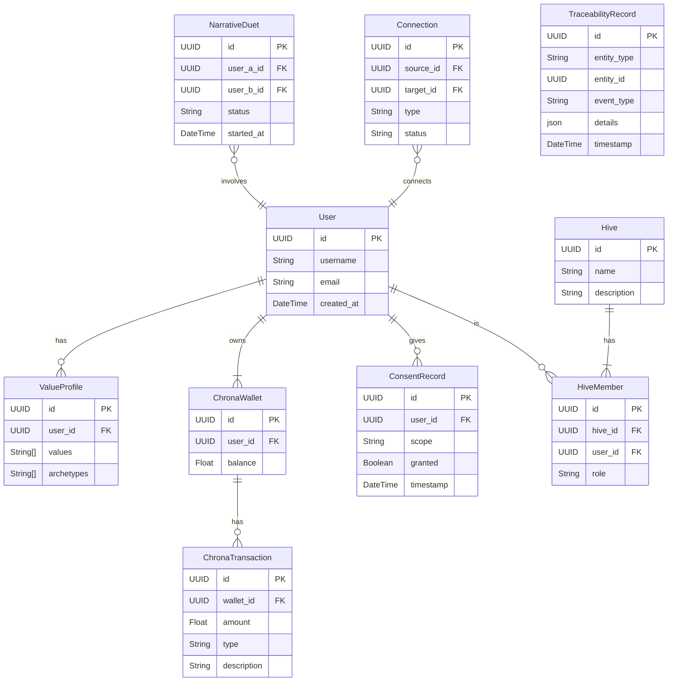

# Data Architecture: The Akashic Records

## 1. Vision & Purpose

This document defines the canonical data architecture for the ThinkAlike ecosystem, serving as the single source of truth for data structure (schemas), meaning (ontology), and quality (validation). It is the technical and philosophical blueprint for the "Akashic Records"—our living, interconnected data ecosystem that maps the cognitive and social life of the community.

This architecture ensures that data is not merely stored but is a transparent, meaningful, and trustworthy representation of the collective, aligned with the principles of the [Data Traceability Protocol](/protocols/data/data_traceability_protocol.md).

## 2. Core Principles

- **Holistic Mapping**: Data forms a living ecosystem, mapping the cognitive and social life of the community.
- **Symbolic Coherence**: All data entities and their relationships are aligned with the project's core archetypal and symbolic frameworks.
- **Semantic Transparency**: The meaning of data is made explicit and accessible, allowing users to understand how their information contributes to the whole.
- **Traceability & Provenance**: Every piece of data has a clear origin, history, and purpose, enforced by the [Data Traceability Protocol](/protocols/data/data_traceability_protocol.md).
- **Quality by Design**: Data integrity, accuracy, and ethical provenance are ensured through a built-in validation oracle.

## 3. Data Ontology: The Meaning of Data

The data ontology is the bridge between the technical implementation and the symbolic foundations of ThinkAlike. It defines *what our data means*.

| Data Entity (The What) | Ontological Concept (The Why) | Description |
|---|---|---|
| **User** | **Sovereign Self** | A unique, self-governing locus of consciousness and agency. The fundamental "One." |
| **ValueProfile** | **Resonance Signature** | The unique pattern of values and archetypes defining an individual's symbolic identity. |
| **Connection** | **Resonant Bond** | A channel for meaningful exchange, trust, and shared understanding. |
| **Hive** | **Collective Organism** | A self-organizing, emergent entity formed from the resonant bonds of its members. A manifestation of "the Many." |
| **Chrona (⧖)** | **Flow of Value** | Represents the transfer of time, energy, and intention. |
| **NarrativeDuet** | **Ritual of Encounter** | A sacred, structured interaction designed to reveal and harmonize Resonance Signatures. |
| **TraceabilityRecord**| **Digital Provenance** | An immutable thread of causality, ensuring data has a clear origin, history, and purpose. |

## 5. Data Quality Oracle

To ensure the integrity and trustworthiness of the Akashic Records, a "Data Quality Oracle" is integrated into the architecture. This component is responsible for the validation and assurance of all data flowing through the ecosystem.

### 5.1. Guiding Principles

- **Completeness:** All required data fields must be present and non-null.
- **Accuracy:** Data is validated against expected formats, schemas, and value ranges.
- **Provenance:** Every data point is traceable to its source and validation history, in line with the [[data_traceability_protocol]].
- **Ethical Handling:** No data is accepted or processed without explicit, auditable user consent.

### 5.2. Core Validation Protocols

- **Existence & Null Checks:** Ensures all critical fields exist and are not null.
- **Format & Range Validation:** Checks data for correct types, formats (e.g., ISO 8601 dates), and allowed value ranges.
- **Relational Integrity:** Verifies that foreign keys point to existing records.
- **Audit Logging:** All validation actions (successes and failures) are logged for transparency and review.

### 5.3. Integration

The Data Quality Oracle is not a single service but a set of validation rules and middleware integrated at key points:
- **API Endpoints:** All incoming data via the API is validated before being processed.
- **Workflow Conductor:** The oracle is invoked at key stages of automated workflows to ensure data quality is maintained.
- **Data Ingestion Pipelines:** Any data ingested from external sources is passed through the oracle for validation.

## 6. Data Models & Schemas

This section defines the canonical data models. These serve as the blueprint for the `prisma/schema.prisma` file and all backend services.

### 6.1. Entity Relationship Diagram (ERD)

## 7. Dependencies & Cross-References

- **Protocols:**
  - [`/protocols/data/data_traceability_protocol.md`](/protocols/data/data_traceability_protocol.md)
