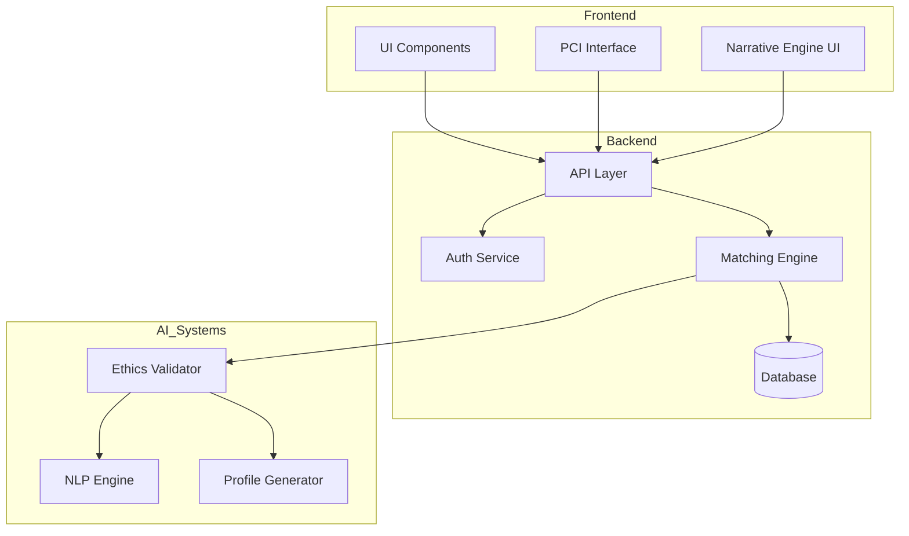
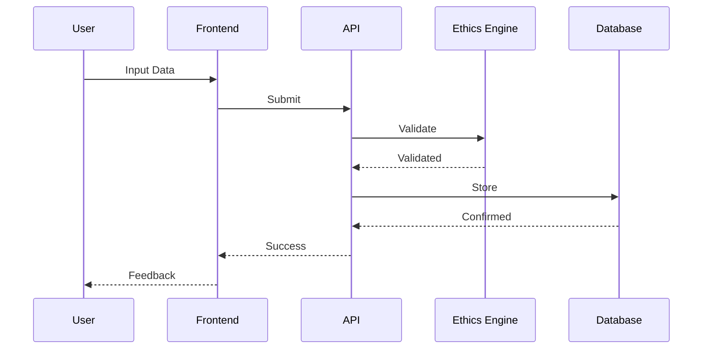
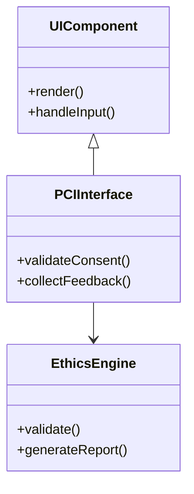
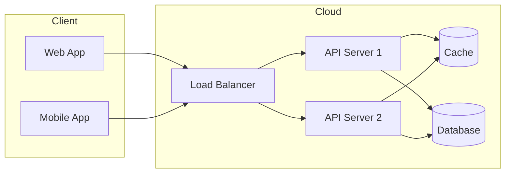
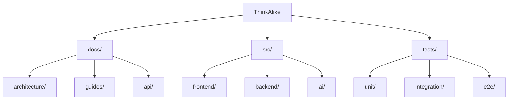

# Blueprint, Whitepaper, and Matrix Provenance

> **This overview is part of a federated, living documentation system.**
> To fully understand and rebuild ThinkAlike, consult the following foundational files:
>
> - **Blueprints:**
>   - `docs/_src_archive/Think_Alike/docs/seed/core/whitepaper_blueprint.md` (current, harmonized, unified vision)
>   - `docs/_src_archive/Think_Alike/docs/unclassified_review/blueprint.md` and `blueprint_v_old.md` (legacy/archival, detailed features and ethics)
>   - `docs/_src_archive/docs/branches/protocols/technical/blueprint_gaps_checklist.md` (actionable gaps and next steps)
> - **Whitepapers:**
>   - `docs/_src_archive/Think_Alike/docs/seed/core/whitepaper_blueprint.md` (philosophy, ethics, architecture)
>   - `docs/_src_archive/Think_Alike/docs/unclassified_review/from_archive/whitepaper_blueprint.md` (legacy, foundational vision)
> - **Matrix Files:**
>   - `docs/trunk/project/roadmap/status/matrix.md` (canonical, tabular map of modules, agents, status)
>   - `docs/_to migrate/realms/matrix/matrix_specification.md` (realm specification, vision, principles)
>   - Additional matrix/meta files in meta, archive, and branches folders
>
> For harmonization, recovery, and implementation:
> - Cross-reference these files with the Living Archeology Map and canonical indices.
> - Never delete or overwrite legacy blueprints or matrices—archive and reconcile instead.
> - Use the blueprint gaps checklist as your actionable to-do list.

# ThinkAlike Architecture Diagrams

## System Overview

## Data Flow

## Component Architecture

## Deployment Architecture

## Project Structure

## Notes
- These diagrams should be updated whenever architecture changes
- Use these as reference for documentation
- Verify alignment with `system_blueprint.md`
