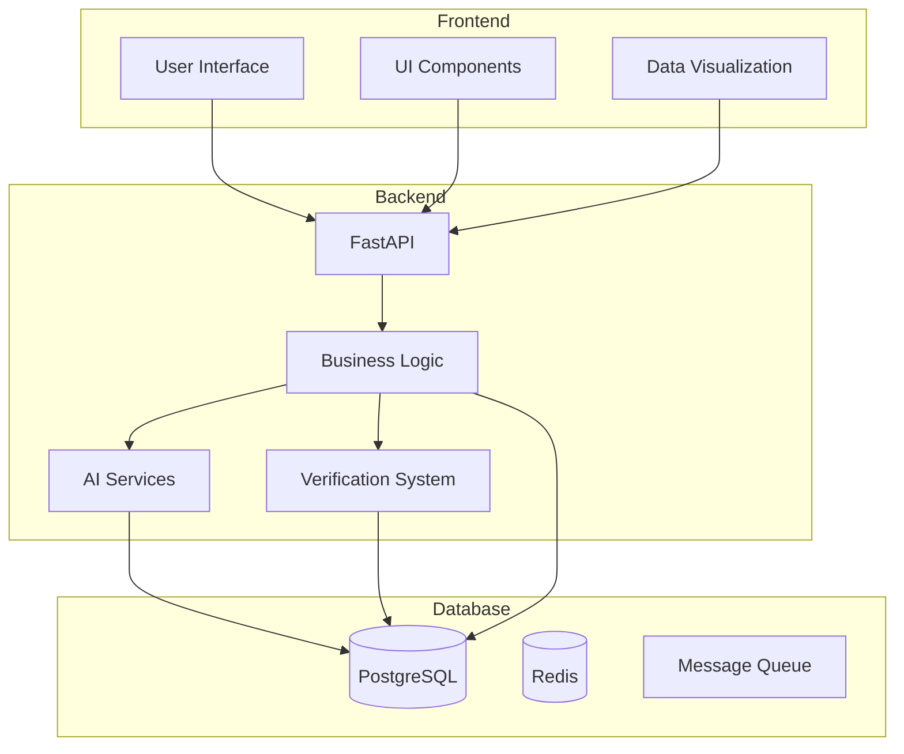
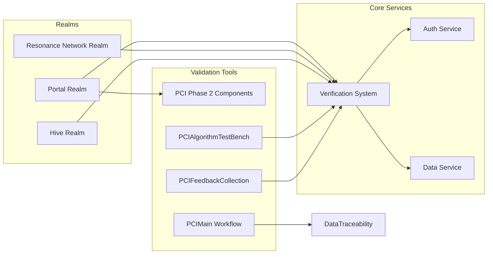
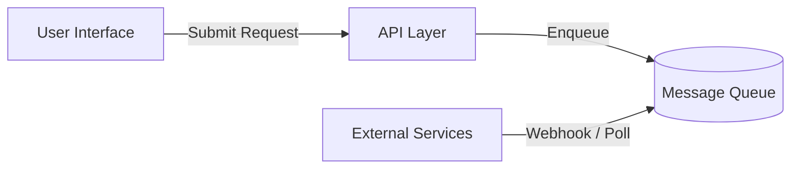
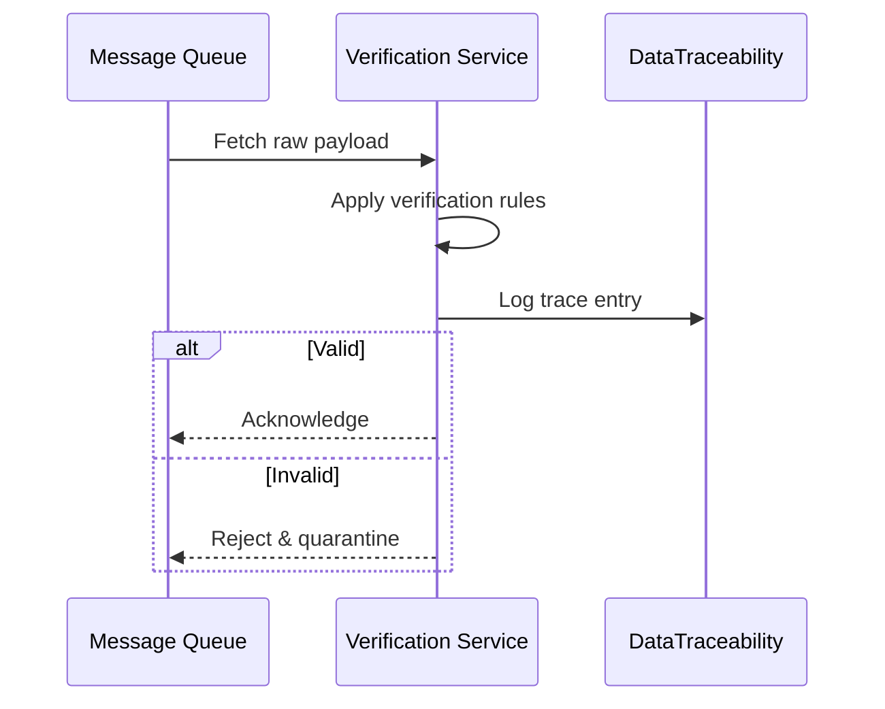
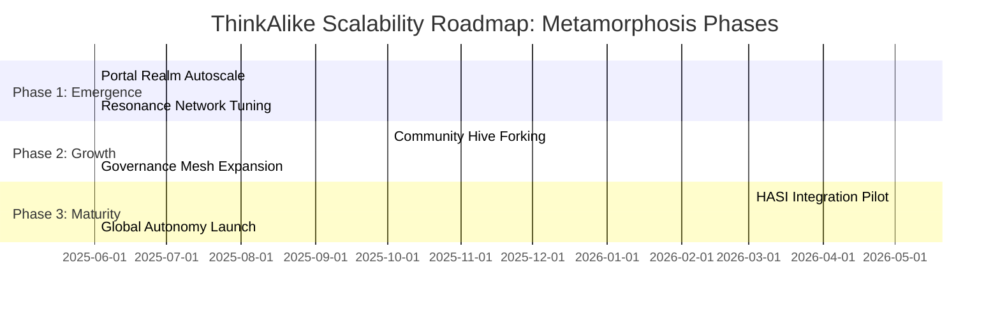

# Technical Architecture Overview

## 1. Introduction
This document provides a **high-level overview of the ThinkAlike project's architecture.** It outlines the major components, layers, and design principles that underpin the platform. This document serves as an entry point to understanding the overall technical structure of ThinkAlike and provides links to more detailed architectural specifications for specific modules and components.
<!-- Integrated from legacy_architectural_overview.md "Document Purpose" section -->

The entire system is built upon the foundational design philosophy of the **[One and Many: Core Design Pattern](../seed/core/one_and_many_design_pattern.md)**, which emphasizes the dual nature of individuals as both sovereign entities and interconnected parts of a collective.

> **Legacy Enrichment:**
> - See [one_and_many_pattern.md](../filtered_legacy/batch6/one_and_many_pattern.md) for the original articulation of this pattern, including symbolic, philosophical, and technical implications.
> - See [project_metaphor.md](../filtered_legacy/batch6/project_metaphor.md) for the narrative framing and mythic metaphors that inform the system's ethos.
>
> **Action:** Use these legacy sources to ensure all new modules and documentation remain aligned with the project's symbolic and philosophical roots.

## 2. System Architecture

### 2.1 High-Level Overview

- **Frontend (Presentation Tier):**
    - **Technology:** React UI
    - **Responsibility:** Handles the User Interface (UI), user interactions, and data visualization.
    - **Key Components:**
        - Reusable UI Component Library (see [`../components/ui_component_library/ui_component_library.md`](../components/ui_component_library/ui_component_library.md))
        - Realm-Specific UI Components
        - DataTraceability Component ([`../components/datatraceability/datatraceability_component_spec.md`](../components/datatraceability/datatraceability_component_spec.md))
        - API Client
        - **Dashboard & Visualization Logic:** See [dashboard_visualization_logic.md](./dashboard_visualization_logic.md) for the canonical specification and [obsidian_dashboard_logic.md](../filtered_legacy/batch6/obsidian_dashboard_logic.md) for legacy UI scripting and dashboard patterns. The dashboard system integrates with backend event streams and data traceability overlays, providing modular, symbolic, and real-time feedback in the UI framework.
    <!-- Integrated from legacy_architectural_overview.md -->

- **Backend (Application Tier):**
    - **Technology:** FastAPI (Python)
    - **Responsibility:** Handles application logic, data processing, API endpoints, security, and interaction with the database.
    - **Key Components:**
        - API Endpoints ([`./api/api_endpoints.md`](./api/api_endpoints.md))
        - Business Logic (including Matching Algorithm and Community Management Logic)
        - AI Modules
        - Verification System Modules ([`./verification_system/verification_system_spec.md`](./verification_system/verification_system_spec.md))
        - Security Modules ([`./security/security_considerations.md`](./security/security_considerations.md))
    <!-- Integrated from legacy_architectural_overview.md -->

- **Database (Data Tier):**
    - **Technology:** PostgreSQL (production), SQLite (development), Redis (cache), Message Queue.
    - **Responsibility:** Persistent storage of all platform data, including user profiles, narratives, values, community data, relationships, and system logs.
    - **Key Components:** Database Schema ([`./database/database_schema.md`](./database/database_schema.md)).
    <!-- Integrated from legacy_architectural_overview.md -->

### 2.2 Component Architecture

### 3. Modular Design and Key Modules

ThinkAlike’s architecture is built on a modular foundation, enabling independent evolution, maintainability, and symbolic clarity across all platform layers. The core modules include:

- **Realms:** Each Realm (Portal, Resonance Network, Hive, and any additional Realms defined in the platform) embodies a distinct set of user experiences and symbolic workflows, supporting narrative onboarding, resonance-based matching, community co-creation, and future expansions.
- **Verification System:** A cross-cutting module that enforces ethical integrity, radical transparency, and auditability throughout all Realms and services.
- **UI Component Library:** A reusable library of frontend components, ensuring a unified and accessible user interface across the platform.
- **API Layer:** Defines the communication interface between frontend and backend, supporting modular development and clear separation of concerns.

This modular approach empowers rapid innovation, community-driven extension, and robust compliance with ThinkAlike’s Enlightenment 2.0 principles.

<!-- Legacy Enrichment: Details on modular design and key modules adapted from legacy_architectural_overview.md, section on 'Modular Design and Key Modules'. -->

## 4. Key Architectural Principles

ThinkAlike’s architecture is guided by foundational principles that ensure ethical, user-centric, and resilient system evolution:

- **Modularity:** Independent, interchangeable, and reusable components enable maintainability, parallel development, and rapid evolution.
- **Testability:** Every component and workflow is designed for rigorous, automated testing, ensuring reliability, traceability, and continuous improvement.
- **Open Standards & Extensibility:** Built on open protocols and APIs, the architecture supports integration, extensibility, and community-driven innovation. The system is designed for modular extension and community-driven evolution; see [Swarm Roadmap Operational Guide](../development_framework/swarm_roadmap_operational_guide.md) for the canonical module submission and integration process.
- **Security by Design:** Security and privacy are foundational, with robust protections, ethical data handling, and proactive threat mitigation embedded at every layer.
- **Ethical Implementation:** All features and workflows are developed in alignment with ThinkAlike’s ethical guidelines, prioritizing user dignity, fairness, and transparency.
- **Cognitive Liberty & User Agency:** The system empowers users to control their data, choices, and digital identity, upholding sovereignty and freedom of thought.
- **Transparency & Data Traceability:** All data flows, AI decisions, and system processes are made visible and auditable, fostering trust and enabling users to understand and act on system behavior.
- **Decentralized & Community-Driven:** Where possible, architecture supports decentralized governance, distributed control, and participatory development, especially in Community Mode.
- **Human-Artificial Swarm Intelligence (HASI):** The platform is designed for synergistic co-creation between humans and ethical AI agents, leveraging collective intelligence while respecting agency and consent.
- **User-Centricity:** Every design decision centers on user experience, accessibility, and empowerment, ensuring technology serves real human needs.
- **Scalability & Resilience:** The system is architected for robust performance, adaptability, and graceful recovery under growth, change, or stress.

<!-- Legacy Enrichment: Principles adapted and harmonized from legacy_architectural_overview.md, section on 'Key Architectural Principles'. -->

## 5. Data Flow and Processing

ThinkAlike’s data flow is event-driven, modular, and privacy-respecting. All data flows are traceable, PET-enforced, and user sovereignty and consent are enforced at every layer.

### 5.1 Overview
The platform uses a modular pipeline to ingest, validate, process, and store data. Key stages include Data Ingestion, Validation & Traceability, Event Routing, and Storage.

### 5.2 Data Ingestion

### 5.3 Validation & Traceability

### 5.4 Event Routing & Processing
- **Core Services** subscribe to specific event topics (e.g., user.actions, content.updates).
- Services process events asynchronously, emitting new events (e.g., audit.logs, data.transform).
- Errors and exceptions are forwarded to the **Error Handling Service** for retry/exponential backoff.

### 5.5 Storage & Indexing
- Processed events are written to the **Data Service** and persisted in PostgreSQL.
- Real-time views are updated via Redis streams for low-latency dashboards.
- Audit logs and data lineage are stored in a dedicated append-only store for compliance.

<!-- Legacy Enrichment: Data flow and processing details adapted from legacy_architectural_overview.md, section on 'Data Flow and Processing'. -->

## 6. Scalability and Future Evolution

ThinkAlike is designed for modular expansion, agent forking, and new realm integration. The scalability roadmap, HASI orchestration, decentralized governance, and transparency are all core to future evolution.

### 6.1 Phased Evolution Roadmap
This roadmap frames scalability as a mythic “Metamorphosis Phase” journey, guiding realms through Emergence, Growth, and Maturity under user control.

### 6.2 HASI Orchestration Hooks
Human-Artificial Swarm Intelligence (HASI) ensures real-time collaboration between users and AI agents. Hooks include:
- **Swarm Coordinator Service**: Dynamically allocates human and AI nodes for tasks like matching, verification, and moderation.
- **Feedback Loop API**: `/api/hasi/feedback` to surface user ratings, biases, and context for continuous learning.
- **Symbolic Trigger Engine**: Orchestrates narrative rituals (e.g., consent reaffirmations) during autoscale events.

### 6.3 Decentralized Governance Patterns
Applying positive anarchism, governance is peer-to-peer:
- **Realm Councils**: Elected by community hive members, manage resource quotas and policy updates.
- **Proposal Streams**: On-chain-like event topics (`governance.proposals`) enabling transparent decision logging via DataTraceability.
- **Consent Protocol**: Users self-authorize new governance forks through cryptographic signature flows.

### 6.4 Transparent Auto-Scaling & DataTraceability
Every scale, failover, or redundancy action is immutably recorded:
- **Autoscale Audit Logs**: Emitted as `audit.autoscale` events and stored append-only.
- **Real-time Dashboard**: Exposes current node counts, latency, and throughput across realms.
- **Explainability UI**: Within the Portal Realm, users can visualize the provenance of each autoscale decision.

<!-- Legacy Enrichment: Scalability and future evolution details adapted from legacy_architectural_overview.md, section on 'Scalability and Future Evolution'. -->

## 7. Further Documentation

- See `/docs/architecture/` for detailed module specs
- See `/docs/seed/framework/agent_ecosystem_design.md` for agent protocols
- See `/docs/seed/planning/manifest_glossary.md` for terminology

---

*This file is the canonical entry point for technical architecture. All new modules and contributors should start here for system context and crosslinks.*
