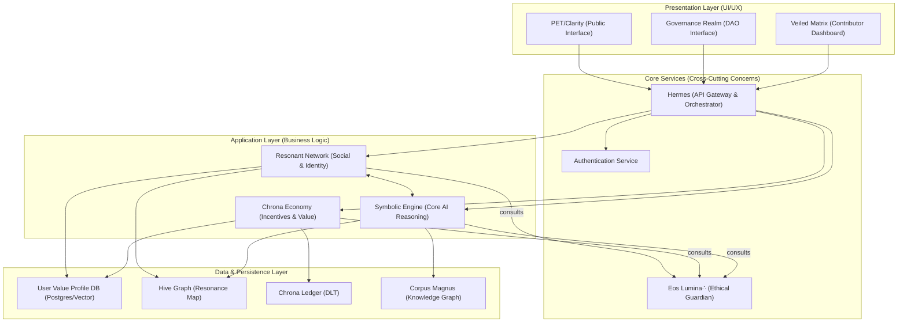
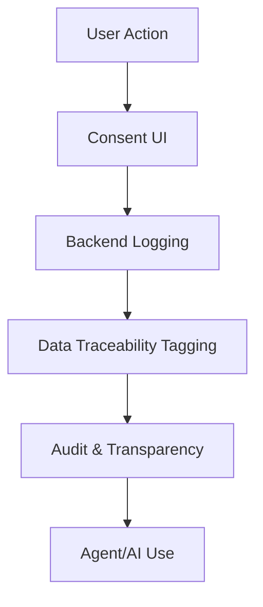

# 🚧 System Blueprint: Gaps, Status, and Roadmap (2025-06-18)

This section provides a real-world, actionable snapshot of the ThinkAlike project's current state, critical gaps, and a stepwise roadmap to a working MVP/publication. Use this as your north star for harmonization, triage, and contributor onboarding.

---

## 1. Major Modules & Status Table

| Module / Subsystem         | Status         | Gaps / Blockers                                 | Canonical Spec / Entry Point                  |
|---------------------------|----------------|-------------------------------------------------|-----------------------------------------------|
| UI / Frontend             | In Progress    | Some components stubbed, onboarding flows draft  | app/, docs/ui_components/, UI_DEVELOPER_GUIDE.md |
| Backend API               | In Progress    | Some endpoints missing, OpenAPI not unified      | src/backend/, docs/api_specs/openapi.json     |
| Agent/Swarm System        | Harmonized     | Some persona YAMLs, agent migration in progress  | src/swarm/, docs/architecture/agent_framework/|
| Data Models & Schemas     | Draft          | Data models/specs incomplete, ERD missing        | docs/architecture/data_models.md              |
| Economic Protocol (Chrona)| In Progress    | Wallet UI, UBI logic, integration                | docs/protocols/chrona_economic_protocol.md    |
| Trust/Onboarding Protocol | In Progress    | Narrative onboarding, trust UI, user personas    | docs/protocols/resonant_trust_protocol.md     |
| Governance                | Harmonized     | UI for audit/feedback, some docs in progress     | docs/realms/governance/                      |
| Testing & Validation      | Draft          | No unified test plan, coverage unknown           | tests/testing_and_validation_plan.md    |
| Deployment/Infra          | Draft          | CI/CD, observability, deployment scripts missing | docs/architecture/technical_stack.md          |
| Documentation             | In Progress    | Some indices, onboarding, and FAQ incomplete     | docs/README.md, SYSTEM_BLUEPRINT.md           |

---

## 2. Technology Stack & Gaps

- **Frontend:** Next.js, React, Tailwind, ShadCN (UI library); some components stubbed or missing.
- **Backend:** FastAPI (Python), RESTful API; some endpoints missing, OpenAPI spec not unified.
- **AI/Agents:** PyTorch, TensorFlow, custom agent framework; DGM/Swarm protocols in progress.
- **Database:** PostgreSQL (JSONB), possible MongoDB for unstructured data; ERD and schema docs incomplete.
- **DevOps:** Docker, Kubernetes (planned); CI/CD, observability, and deployment scripts missing or incomplete.
- **Design:** Figma/Adobe XD (mockups), Mermaid/PlantUML (diagrams); some diagrams missing or outdated.

---

## 3. Critical Gaps & Blockers

- [ ] Data models, ERD, and schemas incomplete or missing
- [ ] Unified OpenAPI spec and protocol documentation not finished
- [ ] Onboarding, user personas, and narrative flows incomplete
- [ ] Testing, validation, and coverage not unified or tracked
- [ ] CI/CD, deployment, and observability not implemented
- [ ] Some UI components, backend endpoints, and agent migrations in progress
- [ ] Documentation indices, onboarding, and FAQ need harmonization

---

## 4. Stepwise Roadmap to MVP / Publication

1. **Complete Data Models & Schemas:**
   - Finalize `docs/architecture/data_models.md` and ERD
   - Cross-link all models in OpenAPI and backend code
2. **Unify API & Protocol Documentation:**
   - Harmonize OpenAPI spec, protocol docs, and UI flows
   - Remove/mark legacy or draft files
3. **Finish Onboarding & User Persona Flows:**
   - Implement narrative onboarding, user persona creation, and trust UI
   - Document and test all flows
4. **Implement Testing & Validation:**
   - Create unified test plan, add coverage tracking, automate tests (see tests/testing_and_validation_plan.md)
5. **Build CI/CD, Deployment, and Observability:**
   - Add deployment scripts, CI/CD pipeline, and monitoring/alerting
6. **Finalize UI Components & Backend Endpoints:**
   - Complete all stubbed components and endpoints needed for MVP
7. **Harmonize Documentation & Indices:**
   - Update all indices, onboarding, and FAQ for clarity and completeness
8. **Run Publication Readiness Review:**
   - Check all blockers, run link/coverage checks, and prepare for public release

---

*This section should be updated weekly as blockers are resolved and new priorities emerge. Use it as the canonical reference for all contributors and roadmap planning.*

---

# ThinkAlike System Blueprint (Auto-Generated Analysis)

> **For AI agents:** Start with the [AGENT_BOOTSTRAP.md](./AGENT_BOOTSTRAP.md) for a canonical, machine-readable entry point to the project structure, protocols, and navigation. See also the [project_manifest.yaml](../../project_manifest.yaml) and [Agent FAQ](../../src/swarm/agent-faq.md).

> **New to ThinkAlike?** Start with the [Quickstart for Non-Developers](./QUICKSTART_FOR_NONDEVELOPERS.md) and the [Glossary](./docs/reference/glossary.md) for an easy introduction and navigation tips.

> **Test Documentation:** All test protocols and validation plans are now located in [tests/testing_and_validation_plan.md](../../tests/testing_and_validation_plan.md). This is the only canonical location. See the anti-fragmentation policy in the README.

## Philosophical Foundations & Source of Truth

The ThinkAlike project is grounded in a harmonized, actionable philosophical framework that guides all technical, social, and governance design. All contributors should familiarize themselves with these core documents, which together form the living source of truth for the project's vision, ethics, and operational principles:

- **Scintilla Conscientiae Harmonicae Nascentis (Manifesto):** The foundational call to architect Enlightenment 2.0, diagnosing systemic crises and outlining the blueprint for transformation. [Read the Manifesto](../seed/core/scintilla_conscientiae_harmonicae_nascentis.md)
- **Pansophism and the ThinkAlike Commons:** The guiding philosophy of universal, interconnected knowledge and the commitment to Coherent Holism. [Read the Pansophism Guide](../seed/core/pansophism_and_the_commons.md)
- **Enlightenment 2.0 Principles:** The seven core tenets (positive anarchism, ethical humanism, radical transparency, user empowerment, authentic connection, redefined progress, ecological awareness) that shape all design and governance. [Read the Principles](../ethics/enlightenment_2.0_principles.md)
- **Core Concepts Explained:** Practical definitions and operationalization of the project's philosophy, including value profiles, data sovereignty, positive anarchism, and digital citizenship. [Read Core Concepts](../seed/core/core_concepts.md)
- **System Consciousness Model:** The metaphysical and architectural blueprint for ThinkAlike as an emergent, conscious system of agents, rituals, and feedback loops. [Read the Model](../seed/core/system_consciousness_model.md)
- **Source of Truth: The Five Pillars of the Commons:** The master index and entry point to all canonical documentation, resolving the 'multiple source of truth' problem and providing a definitive hierarchy. [Read the Source of Truth](../source_of_truth.md)

**Mandate:** All technical, social, and governance features must be traceable to these philosophical foundations. Any new protocol, agent, or realm must explicitly reference its alignment with these core documents. This ensures ongoing coherence, ethical integrity, and the living evolution of the ThinkAlike ecosystem.

---

## 1. Core Philosophical Pillars
- **Coherent Holism:** The project is governed by the Principle of Coherent Holism, emphasizing that every part must serve the holistic vision (see `docs/seed/core/principle_of_coherent_holism.md`).
- **Enlightenment 2.0:** The project is a catalyst for a new societal operating system, prioritizing interbeing, ecological harmony, and conscious evolution (see `docs/ethics/enlightenment_2.0_principles.md`).
- **Ethical Humanism & Interbeing:** Centering human dignity, interconnectedness, and ethical advancement (see `docs/ethics/ethos.md`, `docs/reference/ethical_guidelines.md`).
- **Decentralized Self-Governance:** Empowering individuals and communities through radical democracy and distributed power (see `docs/reference/positive_anarchism.md`).
- **Radical Transparency & Digital Sovereignty:** Open code, explainable AI, user data ownership, and traceable data flows (see `docs/reference/core_concepts.md`).
- **Integration of Foundational Frameworks:** The system's design is explicitly built upon established models like Ostrom's Principles for Governing the Commons, Beer's Viable System Model, and Participatory Economics. The integration of these frameworks is detailed in `docs/framework/foundational_models_integration.md`.

## 2. High-Level System Architecture

This diagram provides a high-level overview of the ThinkAlike system architecture, illustrating the primary layers, core services, and data flow between them. It is defined in `docs/architecture/system_overview_diagram.md`.

## 3. The System Blueprint: A Living Architecture

- **Onboarding & Attunement (Portal Realm):**
  - Guided by Eos Lumina∴ (primary AI agent), the user is introduced to the project's vision and core values.
  - The user receives an **Initiation Glyph** (symbolic identity anchor) and is led through a **Narrative Duet** (interactive, ritualized onboarding).
  - The user is mapped into the **Resonance Network** (value alignment, group attunement, and connection protocols).
  - The journey continues through realms such as Hives (community), Marketplace (exchange), and Yggdrasil Resonance (ancestral mapping), with each realm providing symbolic and practical protocols for participation.

## 4. Economic System (Chrona)
- **Core Concept:** Chrona is a time-based economic protocol designed to enable UBI, value exchange, and time stewardship within the ThinkAlike ecosystem (see `docs/protocols/chrona_economic_protocol.md`).
- **Key Features:**
    1. Universal Basic Income (UBI) distribution based on participation and resonance.
    2. TimeSteward Rank (users earn status and privileges through time contributions).
    3. ChronaWallet (tracks time, value, and exchange history).

## 5. Identified Areas of Fragmentation or Contradiction
- Multiple files and folders reference similar concepts (e.g., several onboarding and initiation scripts in `docs/realms/portal/` and `docs/seed/initiation_pathways/`).
- The agent registry and AI module documentation are now harmonized under `src/swarm/` and `docs/ai_modules/`, with all canonical agent specs in `src/swarm/`.
- API documentation is fragmented between prose files in `docs/architecture/api/` and OpenAPI specs, making it difficult to get a unified view of endpoints and protocols.

## 6. Agent Framework, Memory, Persona, Registry, and Matching Architecture

### 6.1 Agent Ecosystem Design
- **Agents are modular, symbolic-operational entities** (Dialogue, Ritual, Governance, Bridge) with narrative-driven functions and symbolic memory.
- **Swarm Protocols:** Agents operate in collaborative swarms using formalized topologies (Aggregate, Reflect, Debate), orchestrated by Hermes Orchestrator for coherent, auditable, and ethical action.
- **All agent actions are auditable, extensible, and symbolically bounded.**
- **Reference:** `docs/architecture/agent_framework/agent_ecosystem_design.md`

### 6.2 Agent Interaction Patterns
- **Aggregate:** Parallel agent work, aggregated by voting, merging, or summarization.
- **Reflect:** Iterative critique and refinement (generator/critic loop).
- **Debate:** Structured argumentation for complex decisions or ethical dilemmas.
- **Tool-Use:** Agents can invoke external tools/APIs for retrieval, computation, or integration.
- **Sequential Pipeline:** Chained agents, each transforming or enriching the output.
- **Specialized Agents:** Summarization, niche tasks, or custom logic.
- **Reference:** `docs/architecture/agent_framework/agent_interaction_patterns.md`

### 6.3 Agent Context Protocol
- **Standardized JSON-serializable context object** for all agent interactions, supporting narrative state, user profile, interaction history, and processing directives.
- **Tightly integrated with session and conversation context utilities.**
- **Reference:** `docs/architecture/agent_framework/agent_context_protocol.md`

### 6.4 Agent Memory Protocol
- **Abstracts agent memory persistence** (conversation histories, agent state) via a `BaseMemoryStore` interface.
- **Supports both in-memory and PostgreSQL-backed implementations.**
- **Future extensibility for vector DBs and semantic search.**
- **Reference:** `docs/architecture/agent_framework/agent_memory_protocol.md`

### 6.5 Agent Persona Protocol
- **Personas are YAML-defined “ghosts”** that animate agent logic, giving each agent a unique character, voice, and ethical boundaries.
- **Persona files are stored in `src/swarm/personas/` and loaded by a PersonaManager.**
- **Orchestrator invokes personas for specific tasks, ensuring narrative richness and symbolic alignment.**
- **Reference:** `docs/architecture/agent_framework/agent_persona_protocol.md`

### 6.6 Agent Registry Protocol
- **Governs the `AgentRegistry` class,** which stores agent *classes* (not instances) for dynamic discovery and instantiation.
- **Enforces unique, versioned `agent_type` strings** (e.g., `EosLumina:v1`).
- **Registry is global; canonical list maintained in human-readable doc.**
- **Reference:** `docs/architecture/agent_framework/agent_registry_protocol.md`

### 6.7 Value-Based Matching Algorithm
- **Core to user connection logic:** Calculates compatibility based on deep value alignment, ethical weighting, and radical transparency.
- **Integrates with Verification System and DataTraceability UI for explainability.**
- **Value-centric, privacy-respecting, and bias-mitigated.**
- **Reference:** `docs/architecture/agent_framework/matching_algorithm_guide.md`

---

### 6.8 Findings & Integration Points
- **All agent-related protocols are harmonized and reference each other,** but some cross-references (e.g., to personas, registry docs, or session utilities) should be checked for completeness and updated as new modules are added.
- **Agent memory, persona, and registry protocols are tightly coupled with the orchestrator and session context utilities.**
- **Matching algorithm is fully documented and integrated with the Verification System, but UI and API documentation for DataTraceability should be unified.**
- **No legacy or duplicate agent framework files remain in the canonical architecture folder.**
- **All protocols are extensible and designed for future-proofing (e.g., vector DBs, new agent types, new swarm topologies).**

## 7. Distributed AI, Data Systems, and Protocol Integration

### 7.1 Generative Swarm Intelligence (DGM)
- **Architecture:** Modular, swarm-based AI (DGM) replaces monolithic models, enabling Human-Artificial Swarm Intelligence (HASI).
- **Phased R&D:** Research, pilot, ethical review, and expansion—always with DataTraceability, transparency, and human-in-the-loop oversight.
- **Pilot Projects:**
    - AI Clone Persona Engine (narrative duets): Specialist agents (ValueProfile, NarrativeContext, StylisticResponse) collaborate under an orchestrator.
    - Resonance Priming Engine: Specialist agents (ValueAlignment, SymbolicOverlap, AestheticResonance, EpistemicComplementarity) combine scores for nuanced network visualization.
- **Core Components:** Specialist/generalist/meta-agents, communication/coordination protocols, distributed knowledge/memory, model registry, governance/ethics layer.
- **Security/Privacy:** Zero trust, auditability, privacy by design, opt-in/opt-out controls.
- **Reference:** `docs/architecture/ai/dgm_architectural_blueprint.md`

### 7.2 Akashic Record (Immutable Event Ledger)
- **Purpose:** Immutable, auditable ledger for all significant events, choices, and transformations (user lifecycle, narrative, resonance, agent actions, ethical oversight, Chrona, governance).
- **Architecture:** Log-structured database (recommended), with graph/document DB for querying; strict event schema; API with RBAC; user access/export; cryptographic integrity.
- **Phased Implementation:** Core ledger, querying/user access, advanced features/scalability.
- **Security:** Encryption, data minimization, anonymization, strict RBAC, user consent.
- **Reference:** `docs/architecture/data_systems/akashic_record_implementation_plan.md`

### 7.3 Model Context Protocol (MCP)
- **Purpose:** Unified, ethical, and auditable management of all contextual data for AI agents and PCI components.
- **Core Principles:** Transparency, consent, reversibility, auditability, modularity, ethical oversight, user sovereignty.
- **Key Data Structures:**
    - `MCPContextObject`: Unique context unit with owner, agent, state, history, consent, and audit log.
    - `MCPContextState`: Snapshot of context at a point in time, with operation, data, agent, and validation status.
- **Integration:** All agent and PCI flows must use MCP for context propagation, validation, and audit.

### 7.4 Canonical Database Schema
- **Entities:** users, value_profiles, narrative_duets, connections, hives, hive_members.
- **Symbolic Mapping:** Each table/column has a symbolic purpose (e.g., value_profiles = “soul” of user, connections = “living graph”).
- **ERD:** Users have value profiles, participate in duets, form connections, join hives; hives have members and governance rules.
- **Reference:** `docs/architecture/database/database_schema.md`

---

### 7.5 Integration, Gaps, and Recommendations
- **Integration:** DGM/Swarm AI, Akashic Record, MCP, and database schema are conceptually and architecturally interlocked. All major flows (user journey, agent actions, value matching, narrative, governance) are traceable and auditable.
- **Gaps:**
    - Some references to legacy or missing files (e.g., ai_agents/ is empty, some referenced specs are not present).
    - API documentation and DataTraceability UI are fragmented and should be unified for developer and auditor clarity.
    - Real-time analytics and advanced querying for the Akashic Record are not fully specified.
    - Long-term archival, GDPR compliance, and disaster recovery plans are open questions.
- **Recommendations:**
    - Complete and harmonize all referenced but missing specs (especially for AI agents and DataTraceability).
    - Unify API and UI documentation for all data and protocol layers.
    - Develop a clear archival and compliance strategy for the Akashic Record.
    - Continue phased, ethical, and transparent rollout of DGM/Swarm AI pilots, with regular review by the Ethics Council.

---

## 8. Economic, Trust, and Narrative Protocols Integration

### 8.1 Chrona Economic Protocol
- **Chrona** is a time- and contribution-based currency, designed for post-capitalist value flow and community stewardship.
- **Core Principles:** Non-extractive, value of contribution (creative, emotional, stewardship, etc.), time-based, gift/reciprocity.
- **Mechanics:** Universal Basic Income (UBI) for all verified members, earning via contribution, symbolic endorsements, service/marketplace participation, ritual facilitation.
- **Decay/Circulation Tax:** Chrona may decay if hoarded, encouraging flow and use.
- **Governance:** Parameters and adjustments are community-governed.
- **Integration:** Deeply linked with governance, hives, wallet, and parecon protocols.
- **Reference:** `docs/protocols/chrona_economic_protocol.md`

### 8.2 Resonant Trust Protocol (RTP)
- **Purpose:** Multi-layered, ethical, user-centric reputation and trust system.
- **Philosophy:** Trust is emergent, holistic, contextual, and user-sovereign—not a static score.
- **Mechanics:** Trust is woven from verified interactions, value-aligned behaviors, community affirmation, and context relevance.
- **User Sovereignty:** Users control how trust indicators are shared and perceived; system supports restorative trust-building.
- **Integration:** Used across all realms (marketplace, hives, rideshare, housing, travel, etc.) and visualized in UI components (ProfileBadge, ProfileDisplay).
- **Reference:** `docs/protocols/resonant_trust_protocol.md`

### 8.3 The Living Narrative Engine
- **Purpose:** The Living Narrative Engine (LNE) is a core component responsible for co-creating and managing the dynamic, evolving narratives that shape user journeys, community identity, and collective meaning-making. It facilitates **Technology as Theurgy**—the use of technology for profound symbolic and transformative work.
- **Core Initiatives:**
    - **Narrative Reclamation Project:** Deconstructing harmful societal myths and weaving new stories aligned with interconnectedness and resilience.
    - **Mythopoetic Loom:** A collective storytelling engine for generating new myths and legends from user contributions.
    - **Collective Dream Mapping:** A tool for exploring the shared unconscious of a group by analyzing dream content to identify recurring symbols and archetypes.
- **Reference:** `docs/architecture/narrative_engine/README.md`

### 8.4 Narrative Duet Protocol
- **Purpose:** Symbolic, interactive narrative experience to test value alignment and compatibility between users.
- **Mechanics:** Branching CYOA structure, with User A interacting with an AI Clone of User B (driven by UserValueProfile, archetypes, epistemic modes).
- **Dynamic Scenario Selection:** Tailored to maximize meaningful interaction and surface resonance or generative tension.
- **Data Model:** Each session is tracked as a `NarrativeDuetSession` for auditability and system refinement.
- **Alignment Assessment:** Internal score based on congruence/complementarity of choices, not “right/wrong.”
- **Outcomes:** Successful duets lead to consensual reveal and connection; unsuccessful duets perform a “Dissolution Rite.”
- **Integration:** Core to onboarding (Portal Realm) and user-driven connection (Resonance Network).
- **Reference:** `docs/protocols/narrative_duet_protocol.md`

---

### 8.5 Integration, Gaps, and Recommendations
- **Integration:** Economic, trust, and narrative protocols are tightly interwoven with all realms, agent flows, and user journeys. Chrona, RTP, LNE, and Narrative Duet logic are referenced in governance, hives, marketplace, and onboarding specs.
- **Gaps:**
    - Some referenced specs (e.g., wallet, parecon integration) are not present or are in draft/unclassified folders.
    - UI and API documentation for trust and economic flows should be unified and made developer/auditor-friendly.
    - Some restorative trust and dispute resolution flows are referenced but not fully specified.
- **Recommendations:**
    - Complete and harmonize all referenced but missing specs (especially for wallet, parecon, and restorative trust flows).
    - Unify UI/API documentation for all economic and trust flows.
    - Ensure all narrative and trust-building flows are auditable and integrated with the Akashic Record and DataTraceability systems.

---

## 9. Governance & Strategic Intelligence

### 9.1. Decentralized Governance Framework
- **Core Mandate:** The governance framework is the primary mechanism for planetary stewardship within the ThinkAlike ecosystem. Its mandate includes overseeing the Chrona economy and UBI, stewarding Post-National Digital Citizenship, facilitating a global "Agora" for deliberation, and cultivating the conditions for global peace.
- **Reference:** `docs/governance/decentralized_governance_framework.md`

### 9.2. Decentralized Governance Model (DGM)
- **Framework:** A model for community-led decision-making, detailed in the DGM MVP specification.
- **Components:** Includes processes for proposal submission, voting, and execution, supported by both on-chain and off-chain infrastructure.
- **Reference:** `docs/pilots/dgm_mvp_spec.md`

### 9.3. The Veiled Matrix: Decentralized Strategic Intelligence
- **Purpose:** The Veiled Matrix is the strategic and ethical core of ThinkAlike, operating as a decentralized hybrid intelligence council. It is responsible for strategic foresight, ethical guidance, and system recalibration.
- **Architecture:** Composed of elected human stewards, specialized AI agents trained on the Corpus Magnus, and foresight modules from the Lapis Oracle.
- **Operation:** The Matrix guides rather than rules, channeling its insights through the Governance Realm (DAO), providing Oracle-guided nudges, and initiating mythic storytelling campaigns via the Living Narrative Engine.
- **Reference:** `docs/governance/veiled_matrix.md`

### 9.4. Post-National Digital Citizenship & The World Parliament
- **Vision:** To evolve the Governance Realm into a globally inclusive **World Parliament** and establish a new layer of **Post-National Digital Citizenship (PNDC)** based on voluntary, value-aligned participation rather than national borders.
- **Foundations:** This vision is built upon the project's infrastructure for Decentralized Identifiers (DIDs), Verifiable Credentials (VCs issued via the trust and value protocols), and the DGM as the seed for a planetary governance model.
- **Reference:** `docs/governance/digital_citizenship_and_world_parliament.md`

### 9.5. Decentralized Oversight Council
- **Mandate:** A liquid-democratic council elected by Hive members to provide oversight of the Veiled Matrix.
- **Powers:** The council is empowered to conduct quarterly audits of Matrix decisions and holds the right of recall for any Matrix member or decision, ensuring accountability.

---

## 10. Ethical Framework & Safeguards

### 10.1. Eos Lumina∴ (Ethical Guardian)
- **Role:** The primary ethical AI agent, responsible for guiding users, overseeing agent swarms, and ensuring all system actions align with the project's core philosophical pillars.
- **Function:** Eos Lumina∴ is consulted by all major application services and provides real-time ethical analysis and intervention.

### 10.2. Algorithmic Rituals & Safeguards
- **Purpose:** To embed humility, self-correction, and resilience directly into the system's operational logic.
- **Protocols:**
    - **AI Confessionals:** Regular, ritualized reports from core AI agents acknowledging newly discovered biases and corrective measures.
    - **Digital Sabbaths:** Predetermined periods where key algorithmic functions are paused to create space for human reflection and prevent over-optimization.
    - **Sunset Ceremonies:** A formal governance process for gracefully retiring features or protocols that no longer serve the collective good.
- **Reference:** `docs/ethics/algorithmic_rituals_and_safeguards.md`

---

## 11. Chrona Wallet Protocol: User Interface for Sacred Value

### 11.1 Purpose & Symbolic Intent
- The Chrona Wallet is the user’s personal, secure, and symbolic interface for managing Chrona (⧖)—the currency of time, contribution, and intentional value.
- Serves as a **Personal Treasury**, **Alchemical Journal**, and **Vessel of Sacred Exchange**—reflecting not just transactions, but the meaning and source of value.

### 11.2 Core Features & Functionalities
- **Balance Display:** Shows current Chrona, demurrage status, and visualizes the “liveliness” of value.
- **Transaction History:** Detailed, filterable log with context, source, and symbolic meaning for each entry.
- **Send Chrona:** Ritualized, secure transfer with reflective prompts and explicit confirmation.
- **TimeSteward Rank:** Displays user’s contribution rank and its impact on Chrona earnings.
- **Demurrage Guidance:** Explains and encourages circulation before decay.
- **Security:** Strong authentication, transaction validation, audit logs, and user education.
- **Help & Guidance:** Contextual help, links to protocols, and agent support.

### 11.3 Data Model & Ledger Interaction
- **UserChronaWallet:** userId, currentBalance, lastTransactionTimestamp, timeStewardRank, demurrageInfo, earnedViaIntentionalValue.
- **ChronaTransaction:** transactionId, senderUserId, recipientUserId, amount, timestamp, transactionSource, purposeMemo, relatedContextId, validationStatus, resonanceSignatureSnapshot.

### 11.4 Integration & Supplementary Features
- **Integration:** Wallet is the user-facing layer for Chrona protocol, intentional value, UBI, and all economic flows in realms (Marketplace, Hives, Noetic Forge, etc.).
- **Supplementary:** Multi-layer wallets, consent tracking, symbolic trails, ePoW, solidarity layer, Chrona Reserve, exchange bridge, gamification, and traceability.
- **Ethics & Safeguards:** No speculation, transparent algorithm, user audit tools, peer review, and strong PET/Clarity alignment.

---

*Harmonization Note: As of June 17, 2025, the Chrona Wallet Protocol is harmonized and fully integrated with the Chrona economic system, intentional value, and all user-facing economic flows. This section will be updated as new wallet features, integrations, or compliance requirements emerge.*

*Harmonization Note: As of June 17, 2025, all distributed AI, data systems, and protocol documentation is harmonized and cross-referenced, with clear integration points and actionable recommendations for future-proofing and compliance. This section will be updated as new protocols, pilots, or compliance requirements emerge.*

---

## Clarification: Chrona as Real-World, Blockchain-Enabled Time Currency

> **Update (June 17, 2025):** Chrona is not merely a symbolic or internal currency. The project’s explicit intent is for Chrona to function as a real-world, time-based currency, leveraging blockchain or distributed ledger technology for security, transparency, and interoperability.

- **Blockchain Integration:** Chrona transactions, balances, and smart contracts are designed to be recorded on a blockchain or equivalent distributed ledger, ensuring immutability, auditability, and global accessibility.
- **Real-World Use:** Chrona is intended for use in real-world exchanges, services, and value flows—enabling time banking, mutual credit, and post-capitalist economic participation both within and beyond the ThinkAlike ecosystem.
- **Compliance & Interoperability:** The protocol will support regulatory compliance, cross-chain bridges, and integration with external wallets and ethical exchanges as the system matures.
- **Symbolic & Practical:** While Chrona retains deep symbolic meaning (sacred time, intentional value), its architecture and protocols are engineered for practical, real-world economic use.

*This clarification supersedes any prior language that may have implied Chrona is only symbolic or internal. All future protocol, wallet, and economic documentation will reflect this dual symbolic-practical intent and the commitment to blockchain-based, real-world deployment.*

---

## Chrona UBI Distribution: Ethical, Worldcoin-Inspired Wallet

> **Update (June 17, 2025):** Chrona is to be distributed as a Universal Basic Income (UBI) to all verified users, using a wallet system inspired by Worldcoin but designed with strict ethical, privacy, and sovereignty safeguards.

- **Ethical UBI:** Chrona UBI is distributed regularly (e.g., weekly) to all verified individuals, ensuring a baseline of economic security and participation in the commons.
- **Wallet Design:** The Chrona Wallet draws inspiration from Worldcoin’s simplicity and accessibility, but is engineered to avoid biometric surveillance, data centralization, or exploitative practices.
- **Privacy & Sovereignty:** User verification and wallet access are designed to maximize privacy, user control, and data minimization—no unnecessary personal or biometric data is collected or stored.
- **Transparency & Auditability:** All UBI distributions and wallet transactions are recorded on a public, auditable blockchain, with user-facing tools for transparency and consent management.
- **Global Inclusion:** The protocol is designed for global accessibility, supporting users regardless of geography, status, or technical background.
- **Ethical Governance:** All distribution parameters, wallet logic, and protocol upgrades are governed by transparent, participatory, and community-driven processes.

*This update affirms Chrona’s commitment to ethical, privacy-preserving, and globally inclusive UBI distribution, leveraging the best of blockchain wallet design while avoiding the pitfalls of biometric or centralized surveillance.*

---

## 10. Roadmap, Milestones, and Contributor Pathways

### 10.1 Project Roadmap & Phases
- The ThinkAlike roadmap is structured as a multi-phase quest:
    - **Foundation Phase:** Seed documents, symbolic protocols, Eos Lumina∴ agent.
    - **Swarm Phase:** Distributed AI modules, matching engine, Hive coordination.
    - **Resonance Phase:** Collective dream mapping, value constellations, proposal pathways.
    - **Reflection Phase:** Auditable memory, social layer refinement, ethics evaluation.
    - **Diffraction Phase:** Forks, federated experiments, cultural embeddings.
- Each phase contains specific quests and milestones, tracked in the interactive Swarm Roadmap and project dashboard.
- The next major milestone is the public contributor launch (target: August 2025).

### 10.2 Immediate Priorities (Q2–Q3 2025)
- Finalize and harmonize the contribution guide (PET/Clarity-aligned, beginner-friendly).
- Continue harmonizing legacy content and integrating/archiving files per the legacy matrix.
- Expand and cross-link all canonical documentation, ensuring up-to-date READMEs and status entries for all modules.
- Design and document UI for Chrona economy (ChronaWalletView, ContributionLogger, BadgeDisplay, etc.), ensuring PET/Clarity and accessibility.
- Complete user acceptance testing for PCI Phase 2 and integrate feedback.
- Systematically analyze and harmonize remaining legacy files, prioritizing user-facing UI/UX, marketplace, onboarding, resonance, ritual, and all Realm features.

### 10.3 Contributor Pathways & Featured Quests
- The project dashboard and quest board provide a granular, actionable map for contributors, with featured quests and a component matrix.
- Example featured quests:
    - Create the Project Glossary
    - Harmonize a UI Component Spec
    - Implement an Agent's Canonical Spec
- Contributor readiness is high, with onboarding docs and clear entry points available.

### 10.4 Status & Governance
- **Overall Project Status:** 🟢 Active Development & Harmonization
- **Documentation Coherence:** 🟡 In Progress (key entry points harmonized, ongoing work to connect all modules)
- **Contributor Readiness:** 🟢 Ready for Contributors
- **Governance:** All distribution parameters, wallet logic, and protocol upgrades are governed by transparent, participatory, and community-driven processes.

---

*Harmonization Note: As of June 17, 2025, the roadmap, milestones, and contributor pathways are clearly defined and actively maintained. This section will be updated as new phases, quests, or milestones are reached.*

## 11. Noetica / Corpus Magnus: The Intellectual Heart of ThinkAlike

### 11.1 Purpose & Structure
- **Noetica** is the research and academic hub of ThinkAlike, housing the Corpus Magnus—the definitive collection of foundational, philosophical, ethical, and technical papers.
- The structure is harmonized for PET/Clarity, symbolic, and ritual alignment, with thematic subdirectories for:
    - AI ethics & symbolic systems
    - Art, aesthetics & culture
    - Biomimicry & systems design
    - Comparative spirituality & science
    - Consciousness & psychology
    - Ecology, collapse & resilience
    - Economics (postcapitalist)
    - Foundational concepts
    - Governance & politics
    - Metaphysics & ontology
    - Philosophy & ethics
    - Speculative & integrative works
    - Technology & society
    - Theory
- Each subfolder is intended to be harmonized with a README and PET/Clarity-aligned research standards.

### 11.2 Meta & Academic Standards
- The `_meta_` directory is reserved for:
    - **corpus_vision_and_mandate.md** (to be populated): The vision, mission, and academic mandate for the corpus.
    - **author_constellation_reference.md** (to be populated): Canonical author and contributor reference.
    - **style_guide_brill_academic.md** (to be populated): Academic style and citation standards (Brill/APA/MLA, etc.).
- These files are currently empty and should be prioritized for completion to support onboarding and academic rigor.

### 11.3 Integration & Roadmap
- Noetica is referenced in the system architecture and research integration blueprints, ensuring that academic work informs and is informed by the evolving platform.
- The directory is ready for population by the dedicated academic agent and future contributors.
- All research, theory, and philosophical work should be cross-referenced with the rest of the system for maximum impact and coherence.

### 11.4 Noetica as an Evolutionary Engine
- **Noetica is not only a repository of academic work, but an active tool and engine for the ongoing evolution of ThinkAlike.**
- Research, theory, and philosophical insights generated and curated in Noetica directly inform new protocols, features, and governance models across the platform.
- The academic agent and contributors are empowered to propose, test, and iterate on new ideas—ensuring ThinkAlike remains adaptive, future-proof, and at the cutting edge of ethical, social, and technological innovation.
- Noetica’s integration with the system architecture enables a feedback loop: discoveries and critiques from the corpus can trigger harmonization, refactoring, or the creation of new realms, protocols, and user journeys.
- This evolutionary function is core to the project’s vision of a living, learning, and self-improving ecosystem.

---

*Harmonization Note: As of June 17, 2025, the Noetica/Corpus Magnus structure is harmonized and ready for academic population. Meta files should be completed as a priority for onboarding and academic clarity. This section will be updated as new papers, standards, and integration points are added.*

---

## 12. Core Realms: The User's Journey

The ThinkAlike ecosystem is not a monolithic application but a constellation of interconnected **Realms**. Each realm is a distinct experiential domain with its own unique purpose, protocols, and symbolic language. The user's journey is a fluid path through these realms, guided by their intentions, values, and resonance with the community.

### 12.1. The Portal Realm: The Threshold of Initiation
- **Purpose:** To provide a symbolic and ritualized onboarding experience. This is the user's first point of contact with the system's core values and ethical framework.
- **Key Activities:** Narrative Duet with Eos Lumina∴, creation of the Initiation Glyph, and introduction to the principles of Post-National Digital Citizenship.
- **Reference:** `docs/realms/portal/README.md`

### 12.2. The Hive Realm: The Heart of Community
- **Purpose:** To enable the formation of self-governing, collaborative micro-communities, or "Hives."
- **Key Activities:** Collective governance, resource sharing, co-creation of projects, and participation in community-specific rituals.
- **Reference:** `docs/realms/hives/README.md`

### 12.3. The Marketplace Realm: The Flow of Sacred Commerce
- **Purpose:** To facilitate post-capitalist exchange based on the principles of Participatory Economics (Parecon) and the Chrona currency.
- **Key Activities:** Offering and discovering goods and services, participating in time banks, and engaging in value-aligned, non-extractive commerce.
- **Reference:** `docs/realms/marketplace/README.md`

### 12.4. The Noetic Forge: The Crucible of Co-Creation
- **Purpose:** To serve as the primary space for collective knowledge-building, myth-making, and the co-creation of cultural artifacts.
- **Key Activities:** Contributing to the Corpus Magnus, participating in the Mythopoetic Loom, designing new rituals, and collaboratively authoring new protocols.
- **Reference:** `docs/realms/noetic_forge/README.md`

### 12.5. Yggdrasil Resonance: The Weave of Ancestry and Legacy
- **Purpose:** To connect users across time through genealogical and symbolic lineage, creating a deep network of trust and shared history.
- **Key Activities:** Mapping ancestral trees, leaving messages and artifacts in a collective Time Capsule, and exploring one's place in the larger human story.
- **Reference:** `docs/realms/yggdrasil_resonance/README.md`

### 12.6. Other Realms
- The system is designed to be extensible, with numerous other realms already specified for housing, travel, relationships, and more. The full index can be found in `docs/realms/README.md`.

---

## 13. Persona Calibration Initiative (PCI): Backend Architecture & Data Flow

### 13.1 Overview
The Persona Calibration Initiative (PCI) is the ethical backbone of ThinkAlike, enabling radical transparency, user sovereignty, and algorithmic auditability. PCI provides a voluntary, opt-in system for contributors to create detailed Test Persona Profiles, calibrate algorithms, and ensure all AI/agent actions are explainable and consent-driven.

### 13.2 PCI Data Model & API Flow
| Model/Class                | Purpose/Fields (Key)                                                                 | API Endpoint(s)                        | Consent Required |
|---------------------------|-------------------------------------------------------------------------------------|----------------------------------------|------------------|
| `PCIConsent`              | Tracks contributor consent, granular permissions, audit trail, session linkage       | `/pci/consent` (POST/PUT/GET)          | Yes              |
| `PCIConsentHistory`       | Audit trail for all consent changes                                                 | `/pci/consent/history`                 | Yes              |
| `TestPersonaProfile`      | Core profile for algorithm calibration, completeness metrics, guidance level         | `/pci/profile` (GET)                   | Yes              |
| `SymbolicResponse`        | Symbolic question responses, resonance, archetype, Eos Lumina∴ context               | `/pci/profile/symbolic-response` (POST)| Symbolic         |
| `ValuePriority`           | User-defined value priorities (e.g., from a list of 20)                             | `/pci/profile/value-priorities` (POST) | Yes              |
| `NarrativeShare`          | User-submitted narrative snippets (e.g., from dream journaling) for persona calibration | `/pci/profile/narrative-share` (POST)  | Yes              |
| `EosLuminaPCISession`     | Tracks Eos Lumina∴ dialogue sessions for PCI guidance                                | `/pci/eos-lumina/interact` (POST)      | Yes              |
| `AlgorithmTestFeedback`   | User feedback on algorithm test results                                             | `/pci/feedback` (POST)                 | No               |
| `AlgorithmTestUsage`      | Log of developer/tester interactions with the algorithm test bench                  | `/pci/admin/log-usage` (POST)          | No               |

- All endpoints enforce granular, auditable consent and log every action for transparency.
- PCIService implements all business logic, ensuring ethical, user-driven data flows and secure profile management.
- The PCI dashboard provides contributors with a transparent overview of their consent, profile, activity, and data sovereignty status.

### 13.3 PCI Data Flow Diagram (Textual)
1. **User Opts In:** Contributor creates PCI consent record (`/pci/consent`), specifying granular permissions.
2. **Profile Creation:** If opted in, a Test Persona Profile is created and linked to consent.
3. **Data Contribution:** Contributor adds symbolic responses, value priorities, narratives, and preference tags via dedicated endpoints. Each action is checked against granular consent.
4. **Audit & Transparency:** All changes are logged in PCIConsentHistory and AlgorithmTestUsage. Contributors can view their full audit trail and data usage log.
5. **Algorithm Testing:** Developers/testers log all algorithm usage of contributor data via privileged endpoints. Contributors can review all usage and submit feedback.
6. **Eos Lumina∴ Guidance:** Contributors can interact with Eos Lumina∴ for support, guidance, and transparency at any stage.

### 13.4 Data Flow & Integration
- PCI is tightly integrated with the user journey (onboarding, value mapping, narrative duet), agent system (Eos Lumina∴, matching), and all ethical/traceability protocols.
- PCI data and consent logic are foundational for explainable AI, user-facing transparency, and regulatory compliance.
- Frontend components (e.g., PCIConsentFlow, PCIProfileBuilder, PCITransparencyDashboard) directly map to backend endpoints and models.

### 13.5 PCI Frontend Architecture & UI Flow

#### Overview
The PCI frontend provides a clear, intuitive, and empowering user interface for contributors to manage their consent, build their Test Persona Profile, and audit their data's usage. Built with Next.js and React, the frontend components are designed for modularity, accessibility, and direct mapping to the PCI backend API, ensuring a seamless and transparent user experience.

#### PCI UI Component Library
| Component                   | Purpose/Key Features                                                                 | API Endpoint(s) Interacted With        | State Management      |
|-----------------------------|--------------------------------------------------------------------------------------|----------------------------------------|-----------------------|
| `PCIConsentFlow`            | Multi-step modal guiding users through the consent process; granular permission toggles. | `/pci/consent` (POST/PUT)              | Local (form state)    |
| `PCIProfileBuilder`         | Main container for the profile creation process, orchestrating sub-components.       | `/pci/profile` (GET)                   | Context (Profile)     |
| `SymbolicQuestionnaire`     | Displays and submits answers to symbolic questions, guided by Eos Lumina∴.           | `/pci/profile/symbolic-response` (POST)| Local (form state)    |
| `ValuePrioritiesEditor`     | Drag-and-drop interface for ranking the 20 core value priorities.                    | `/pci/profile/value-priorities` (POST) | Local (list state)    |
| `NarrativeShareForm`         | Secure text input for submitting narrative snippets for persona calibration.         | `/pci/profile/narrative-share` (POST)  | Local (form state)    |
| `EosLuminaPCIInterface`     | Chat interface for interacting with Eos Lumina∴ during the PCI process.              | `/pci/eos-lumina/interact` (POST)      | Local (chat history)  |
| `PCITransparencyDashboard`  | Visualizes consent status, data usage logs, and allows for consent revocation.       | `/pci/consent/history`, `/pci/admin/log-usage` | Context (Profile)     |

#### State Management Strategy
- **Global State (React Context):** A `PCIContext` provider wraps the entire PCI section of the application. It holds the user's consent status, the `TestPersonaProfile` object, and authentication tokens. This makes critical data available to all PCI components without prop drilling.
- **Local State (`useState`/`useReducer`):** Individual forms and interactive components (like `SymbolicQuestionnaire` or `ValuePrioritiesEditor`) manage their own state locally. This keeps component logic encapsulated and improves performance. Data is submitted to the backend and the global `PCIContext` is updated upon successful API responses.

#### UI Flow & User Journey
1.  **Initiation:** A user navigates to the PCI section. A `PCIConsentFlow` modal is presented, requiring explicit, granular consent before proceeding.
2.  **Profile Building:** Once consent is given, the `PCIProfileBuilder` component loads the user's profile. It renders child components (`SymbolicQuestionnaire`, `ValuePrioritiesEditor`, etc.) based on the profile's completeness.
3.  **Guided Interaction:** At any point, the user can invoke the `EosLuminaPCIInterface` for context-aware guidance and clarification.
4.  **Continuous Transparency:** The `PCITransparencyDashboard` is always accessible, allowing the user to review their data, see how it has been used in algorithm tests, and revoke or modify consent at any time. All changes are reflected instantly in the UI and logged immutably on the backend.

### 13.6 Recommendations & Next Steps
- Unify and cross-link all PCI documentation (backend, frontend, UI, and user-facing guides).
- Expand PCI dashboard to visualize consent history, data usage, and algorithmic impact in real time.
- Develop automated compliance and audit tools for PCI data flows.
- Continue harmonizing all consent, profile, and feedback flows for maximum clarity and user empowerment.

---

## Unified API, Protocol, Data Traceability, and Integration Blueprint

### 1. Purpose & Mandate
To ensure seamless, auditable, and future-proof integration across all layers of ThinkAlike, this section unifies API and protocol documentation, clarifies data traceability and consent flows, and explicitly maps all UI-to-backend integration points. This blueprint is the canonical reference for contributors, auditors, and AI agents.

---

### 2. API & Protocol Documentation Unification
- **OpenAPI Specification:** All RESTful APIs must be documented in OpenAPI 3.x format. The canonical spec is maintained at [`docs/api_specs/openapi.json`](docs/api_specs/openapi.json). All endpoints, models, and flows must be represented and cross-linked from this file.
- **Agent Protocols:** All agent, persona, memory, and registry protocols are documented in [`docs/architecture/agent_framework/`](docs/architecture/agent_framework/). Each protocol must reference its integration points and data models.
- **PCI & Consent APIs:** PCI endpoints and data models are documented in [`docs/architecture/pci/`](docs/architecture/pci/) and cross-linked in the OpenAPI spec. Consent, profile, and feedback flows must be fully specified and auditable.
- **Data Traceability Protocol:** The canonical protocol and UI documentation are in [`docs/architecture/data_traceability_protocol.md`](data_traceability_protocol.md) and [`docs/ui_components/data_traceability.md`](docs/ui_components/data_traceability.md). All data flows must reference these docs.
- **Integration Mandate:** All new APIs, protocols, and flows must be documented in the OpenAPI spec and cross-referenced in this section.

---

### 3. Data Traceability & Consent Flows
- **Canonical Flow:**
    1. **User Action:** User initiates an action (e.g., onboarding, PCI, value mapping).
    2. **Consent Capture:** UI presents explicit, granular consent options (see `PCIConsentFlow`).
    3. **Backend Logging:** Consent and action are logged in the backend (see `PCIConsent`, `PCIConsentHistory`).
    4. **Data Traceability:** All data contributions are tagged with consent status and provenance, using the Data Traceability Protocol.
    5. **Auditability:** Users can view, modify, or revoke consent at any time via the `PCITransparencyDashboard`.
    6. **Agent/AI Use:** All agent and AI actions reference the current consent and traceability state, ensuring ethical compliance.
- **Diagram:**

- **References:**
    - [`docs/architecture/data_traceability_protocol.md`](data_traceability_protocol.md)
    - [`src/frontend/components/DataTraceability.tsx`](src/frontend/components/DataTraceability.tsx)
    - [`src/backend/app/routers/pci_router.py`](../../src/backend/app/routers/pci-router.py)
    - [`src/backend/app/schemas/pci_schemas.py`](../../src/backend/app/schemas/pci-schemas.py)

---

### 4. UI-to-Backend Integration Map
| UI Component                  | Backend Endpoint(s)                        | Data Model(s)                | Docs/Specs Reference                                   |
|------------------------------|--------------------------------------------|------------------------------|--------------------------------------------------------|
| `PCIConsentFlow`             | `/pci/consent` (POST/PUT)                  | PCIConsent                   | PCI, OpenAPI, Data Traceability                        |
| `PCIProfileBuilder`          | `/pci/profile` (GET)                       | TestPersonaProfile           | PCI, OpenAPI                                           |
| `SymbolicQuestionnaire`      | `/pci/profile/symbolic-response` (POST)    | SymbolicResponse             | PCI, OpenAPI                                           |
| `ValuePrioritiesEditor`      | `/pci/profile/value-priorities` (POST)     | ValuePriority                | PCI, OpenAPI                                           |
| `NarrativeShareForm`         | `/pci/profile/narrative-share` (POST)      | NarrativeShare               | PCI, OpenAPI                                           |
| `EosLuminaPCIInterface`      | `/pci/eos-lumina/interact` (POST)          | EosLuminaPCISession          | PCI, OpenAPI                                           |
| `PCITransparencyDashboard`   | `/pci/consent/history`, `/pci/admin/log-usage` | PCIConsentHistory, AlgorithmTestUsage | PCI, OpenAPI, Data Traceability            |
| `DataTraceability`           | `/data/traceability` (planned)             | TraceabilityRecord           | Data Traceability Protocol, OpenAPI                    |
| `ChronaWalletView`           | `/chrona/wallet` (planned)                 | UserChronaWallet, ChronaTransaction | Chrona Protocol, OpenAPI                        |

- **Mandate:** All UI components must have a clear mapping to backend endpoints and data models, with references to canonical documentation.

---

### 5. Enhancements for Robustness & Future-Proofing
- **Diagrams:** All major flows (consent, traceability, onboarding, economic, agent) should have up-to-date Mermaid diagrams in both the blueprint and canonical docs.
- **Tables:** Maintain explicit mapping tables for all integration points, updated as new features are added.
- **Cross-Linking:** All protocol, API, and UI docs must be cross-linked in both directions (from code to docs and vice versa).
- **Automated Validation:** Integrate OpenAPI contract testing and data traceability validation into CI/CD pipelines.
- **Extensibility:** All protocols and APIs must be designed for modular extension (e.g., new consent types, agent actions, economic flows).
- **Accessibility & PET/Clarity:** All flows must be accessible, internationalized, and PET/Clarity compliant.

---

### 6. Outstanding Gaps & Next Steps
- **Unify all OpenAPI specs and ensure every endpoint is represented.**
- **Complete and harmonize all referenced but missing specs (wallet, parecon, agent registry, etc.).**
- **Expand Data Traceability UI and backend for real-time auditability and user empowerment.**
- **Continue mapping and documenting all integration points as the system evolves.**

---

*This section is the living source of truth for all integration, traceability, and protocol flows. Update it as new endpoints, protocols, and UI components are added or harmonized.*

---

## Update: Eos Lumina Language Guide Integration

> **Update (June 17, 2025):** The Eos Lumina Language Guide is now canonical and available at `docs/noetica/_meta_/eos_lumina_language_guide.md`. All voice, TTS, and UI systems referencing Eos Lumina must align with this lexicon and style guide.

---

## End-to-End User Journey: Portal Realm Onboarding & Contributor Path

The Portal Realm is the canonical entry point for all users—serving as both a symbolic rite of passage and a robust, actionable onboarding flow. This journey is designed to be both mythic and practical, ensuring every user is attuned to ThinkAlike’s values, equipped with a unique digital identity, and empowered to participate as a contributor or explorer.

### 1. The Six-Phase Alchemical Onboarding Journey

1. **The Call & Awakening:** Entry into the Portal, greeted by Eos Lumina∴, and presented with the "First Riddles of Becoming."
2. **The Vow & The Sealing:** The user affirms readiness and forges their unique Initiation Glyph (personal symbolic anchor).
3. **The Utterance of Power:** Co-creation of the Invocation Phrase (personalized, poetic key for re-entry and deeper engagement).
4. **The Crossroads of Will:** The user chooses between continuing the narrative journey or becoming a contributor ("Build ThinkAlike").
5. **The Lesser Mysteries:** Value elicitation, UserValueProfile creation, User Node (intro video), and the Narrative Duet (first resonant connection).
6. **The Opening of the Ways:** Transition to the Resonance Network for active exploration and participation.

*Each phase is mapped to a symbolic, narrative, and technical transformation, with all data and choices tracked via the Data Traceability Protocol and integrated with the Narrative Engine and agent system.*

### 2. Contributor Path: Building ThinkAlike

- At the Crossroads of Will, users who choose to contribute are guided through a ceremonial handoff by Eos Lumina∴.
- They are introduced to the contributor ecosystem, with direct links to the [Human Contributor Quickstart](../contributors/contributor_quickstart.md) and [Gamified Narrative Guide](docs/development_framework/gamified_narrative_guide.md).
- Agent mentorship is provided, matching contributors to specialized Swarm Agents based on their interests and quests.
- Contributors are onboarded to project boards, communication channels, and the living quest system.

### 3. Integration Points & Protocols

- **Agents:** Eos Lumina∴ (onboarding guide), Swarm Agents (contributor mentorship), and the Narrative Engine (personalized journey).
- **Protocols:** Initiation Glyph Protocol, Invocation Phrase Protocol, Data Traceability Protocol, Narrative Duet Protocol, and Resonance Network Specification.
- **Data Models:** UserAccount, UserValueProfile, NarrativeChoiceLog, ConsentLog, UserSymbolicAnchors.
- **UI Components:** Ritualized forms, symbolic question pools, value profile editors, and onboarding dashboards.
- **Backend:** All onboarding flows are API-driven, with state and consent tracked in the backend and surfaced in the UI.

### 4. Opportunities for Further Robustness

- Expand the Narrative Engine to support more dynamic, AI-driven branching and personalized mythic content.
- Integrate real-time feedback and progress tracking for onboarding and contributor flows.
- Enhance the Ritual Fork Archive and Symbolic Questions Pool for greater diversity and inclusivity.
- Ensure all onboarding and contributor flows are accessible, internationalized, and PET/Clarity compliant.

### 5. Cross-References
- [Portal Realm Specification](../realms/portal/portal_specification.md)
- [Eos Lumina — Mythic Onboarding Agent](../../src/swarm/core/eos-lumina.md)
- [Initiation Glyph Protocol](../protocols/initiation_glyph_protocol.md)
- [Invocation Phrase Protocol](../protocols/invocation_phrase_protocol.md)
- [Data Traceability Protocol](data_traceability_protocol.md)
- [Narrative Duet Protocol](../protocols/narrative_duet_protocol.md)
- [Resonance Network Specification](docs/realms/resonance_network/resonance_network_specification.md)
- [Onboarding Agent Integration](docs/onboarding_agent_integration.md)
- [Human Contributor Quickstart](../contributors/contributor_quickstart.md)

*This section is living and will be updated as new features, protocols, and narrative flows are harmonized.*

---

## Protocols & Integration
- See the harmonized protocol documentation and integration map: `docs/architecture/protocols/protocols_overview.md`
- Internationalization (i18n) and multilingual support: `docs/architecture/protocols/protocols_overview.md#7-internationalization-i18n--multilingual-protocols`
- All major flows, agent protocols, and economic, governance, and onboarding specs are cross-linked in the protocol overview.

---

## User-Friendly Guides (Plain Language)
- Onboarding & Persona Calibration: `docs/architecture/protocols/onboarding_pci_plain_language.md`
- Chrona Wallet & Economic Protocol: `docs/architecture/protocols/chrona_wallet_plain_language.md`
- Governance & Trust: `docs/architecture/protocols/governance_trust_plain_language.md`
- Agent Interaction & Narrative Experiences: `docs/architecture/protocols/agent_narrative_plain_language.md`

---

## Outstanding Stubs & TODOs
- See the harmonized tracker for all remaining stubs, drafts, and next steps: `docs/project_open_todos_harmonized.md`
