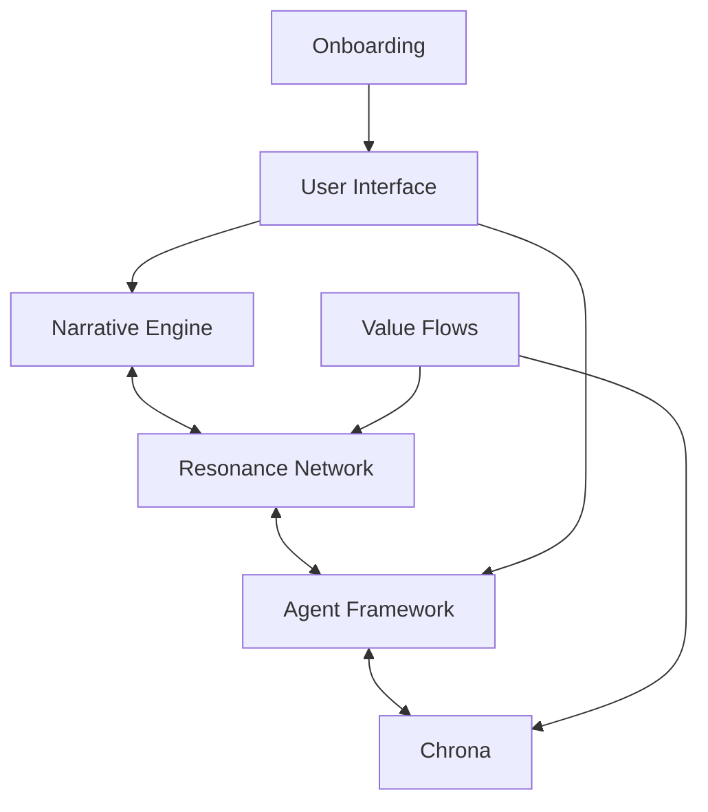

# Holistic System Architecture (Draft)

## Purpose
This document provides a comprehensive, high-level overview of the entire ThinkAlike ecosystem. It serves as the master blueprint, illustrating how the Narrative Engine, Resonance Network, Agent Framework, Chrona, and other major components interact and form a cohesive whole.

## Contents
- Visual system architecture diagrams (e.g., Mermaid, data flow)
- Component overviews and their relationships
- Key protocols and data flows
- Integration points (UI, agents, onboarding, value flows)
- Cross-references to canonical specs and guides

## [Insert diagrams and detailed sections here]

### System Overview Diagram

---

### Major Components

#### Narrative Engine
*Description: Central logic for narrative generation, context management, and story progression.*

#### Resonance Network
*Description: Connects agents and components, enabling communication, synchronization, and emergent behavior.*

#### Agent Framework
*Description: Provides agent definitions, protocols, and lifecycle management for autonomous and semi-autonomous entities.*

#### Chrona
*Description: Temporal coordination, event scheduling, and time-based state management across the system.*

#### User Interface (UI)
*Description: Frontend components for user interaction, visualization, and onboarding.*

#### Onboarding
*Description: Processes and flows for introducing new users, agents, or data into the system.*

#### Value Flows
*Description: Mechanisms for tracking, exchanging, and visualizing value within the ecosystem.*

---

---

This document is a living blueprint. Expand with diagrams, component details, and integration flows as the system evolves.
