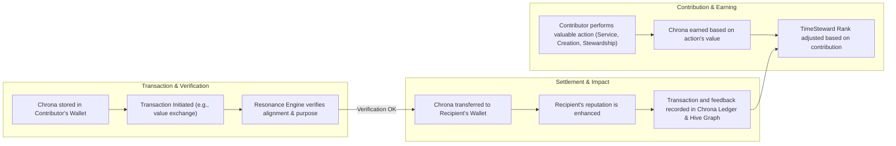

### Chrona Transaction Lifecycle

This diagram illustrates the complete lifecycle of a Chrona transaction, from earning to settlement and the resulting feedback loop that influences the system's economy and reputation layers.

