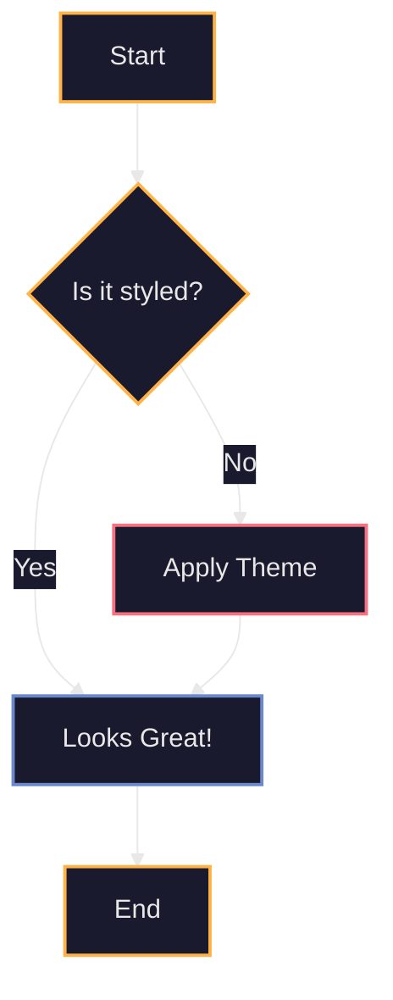

# Mermaid Diagram Styling Guide

To ensure visual consistency, all Mermaid diagrams used in ThinkAlike documentation should be styled to match the official color palette.

## Mermaid Theme Definition

You can define a theme at the top of your Markdown file or directly within the Mermaid code block using `%%{init: ...}%%`. Here is the recommended theme for ThinkAlike:

## Usage

Copy the `%%{init: ...}%%` block into any Mermaid diagram to apply the theme. You can also define custom styles for specific nodes as shown in the example above to use accent colors.

Refer to the [Visual Identity Guide](../visual_identity_guide.md) for the full color palette.
