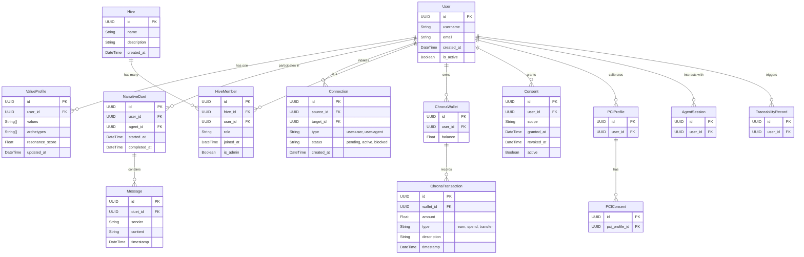

# 🧬 Canonical Data Models & Schemas

This document defines the canonical data models and schemas for the ThinkAlike ecosystem. It is the source of truth for all persistent data structures, guiding backend development, API design, and database architecture. All entities defined herein must be reflected in the `prisma/schema.prisma` file, the OpenAPI specification, and all related backend services.

## 1. Core Principles

- **Clarity & Consistency:** Models are designed to be self-explanatory and consistently named.
- **Scalability:** Schemas are structured to support millions of users and complex interactions.
- **Extensibility:** The design accommodates future features and modules with minimal disruption.
- **Traceability:** Key entities include fields for tracking data provenance and user consent, aligning with the `data_traceability_protocol.md`.

## 2. Entity Relationship Diagram (ERD)

This diagram illustrates the relationships between the core entities of the ThinkAlike system.

## 3. Canonical Entity Table

This table provides detailed descriptions and key fields for each data entity.

| Entity | Purpose/Description | Key Fields / Relationships |
|---|---|---|
| **User** | The core identity for any individual interacting with the ThinkAlike ecosystem. Represents the sovereign digital self. | `id (UUID)`, `username (str)`, `email (str)`, `value_profile_id (FK)`, `created_at (datetime)`, `is_active (bool)` |
| **ValueProfile** | A detailed representation of a user's core values, archetypal alignments, and resonance scores. This is central to the matching and personalization algorithms. | `id (UUID)`, `user_id (FK)`, `values (list[str])`, `archetypes (list[str])`, `resonance_score (float)`, `updated_at (datetime)` |
| **NarrativeDuet** | An interactive, AI-guided session for onboarding, self-reflection, or specific narrative quests. | `id (UUID)`, `user_id (FK)`, `agent_id (FK)`, `transcript (list[Message])`, `started_at (datetime)`, `completed_at (datetime)` |
| **Message** | A single utterance within a `NarrativeDuet`, sent by either the user or an AI agent. | `id (UUID)`, `duet_id (FK)`, `sender (enum: user, agent)`, `content (text)`, `timestamp (datetime)` |
| **Connection** | Represents a persistent, directional link between two entities, such as a friendship, mentorship, or follow. | `id (UUID)`, `source_id (FK)`, `target_id (FK)`, `type (enum: user-user, user-agent)`, `status (enum: pending, active, blocked)` |
| **Hive** | A self-organized community or group focused on a shared interest, project, or goal. | `id (UUID)`, `name (str)`, `description (text)`, `created_at (datetime)`, `members (list[HiveMember])` |
| **HiveMember** | A record of a user's membership within a `Hive`, including their role and status. | `id (UUID)`, `hive_id (FK)`, `user_id (FK)`, `role (str)`, `joined_at (datetime)`, `is_admin (bool)` |
| **ChronaWallet** | A user's personal wallet for managing `Chrona (⧖)`, the internal time-based currency. | `id (UUID)`, `user_id (FK)`, `balance (float)`, `transactions (list[ChronaTransaction])` |
| **ChronaTransaction** | A record of a single `Chrona` transaction, whether earned, spent, or transferred. Provides a complete, auditable history. | `id (UUID)`, `wallet_id (FK)`, `amount (float)`, `type (enum: earn, spend, transfer)`, `description (str)`, `timestamp (datetime)` |
| **Consent** | A granular record of a user's explicit consent for data processing, sharing, or interaction within a specific scope. | `id (UUID)`, `user_id (FK)`, `scope (str)`, `granted_at (datetime)`, `revoked_at (datetime, nullable)`, `active (bool)` |
| **PCIProfile** | (Personal Consciousness Interface) A specialized profile for deep, calibrated interaction with AI systems, managing fine-grained permissions and interaction patterns. | `id (UUID)`, `user_id (FK)`, `calibration_data (JSONB)`, `consents (list[PCIConsent])` |
| **PCIConsent** | A specific consent record related to the `PCIProfile`, governing sensitive AI interactions and data sharing. | `id (UUID)`, `pci_profile_id (FK)`, `scope (str)`, `details (JSONB)` |
| **AgentSession** | A record of a user's interaction with a specific AI agent outside of a `NarrativeDuet`. | `id (UUID)`, `user_id (FK)`, `agent_id (FK)`, `start_time (datetime)`, `end_time (datetime)` |
| **TraceabilityRecord** | A log entry that traces the origin, transformation, and use of a piece of data, ensuring accountability and transparency. | `id (UUID)`, `user_id (FK)`, `data_id (UUID)`, `action (str)`, `timestamp (datetime)`, `details (JSONB)` |

## 4. Cross-References

- **Implementation:** The canonical implementation of these models resides in `prisma/schema.prisma`.
- **API:** The public interface for interacting with these models is defined in `docs/api_specs/openapi.json`.
- **Ontology:** For the conceptual and semantic layer underpinning these models, see `data_ontology.md`.
- **Architecture:** For how these models fit into the broader system, see `architecture_overview.md`.
