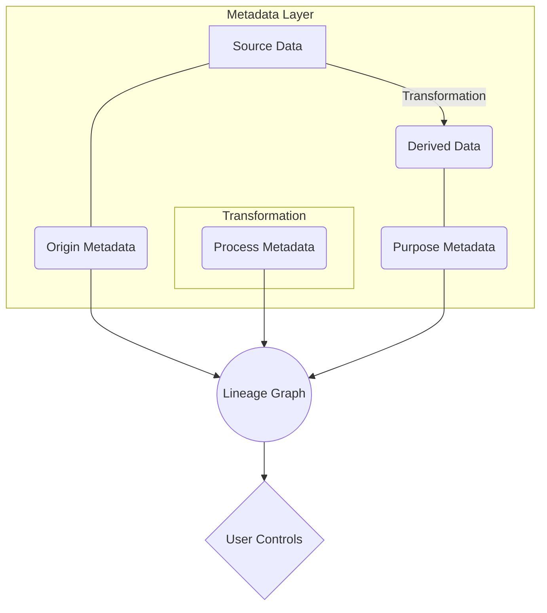

# 🔍 Data Traceability Protocol

## 1. Overview

The Data Traceability Protocol ensures that all data within the ThinkAlike ecosystem—whether user-provided, system-generated, or algorithmically derived—maintains a complete, transparent, and auditable lineage. It provides clear pathways for tracking data origins and transformations, robust mechanisms for users to understand and control their data, and firm ethical boundaries for data collection, storage, and processing. This protocol is fundamental to building user trust and ensuring system accountability.

## 2. Core Principles

-   **Origin Transparency**: All data must maintain a clear, immutable record of its source (e.g., user input, agent inference, system process). This origin metadata is captured at the moment of creation and persists through all subsequent transformations.
-   **Transformation Traceability**: Every transformation, inference, or aggregation applied to data is logged with a timestamp, the method used, and the identity of the responsible agent or process. "Black box" operations are prohibited.
-   **Consent Anchoring**: Every piece of data, especially personal traits, values, or profile insights, must be linked to a specific, granular, and revocable user consent event.
-   **Immutable Audit Trails**: All data operations generate cryptographically signed audit logs. These logs are immutable and allow users and auditors to review the full history of any data point.
-   **User Agency & Visual Lineage**: The system must provide users with interactive, intuitive visualizations of their data's flow, transformations, and provenance, enabling them to inspect, revoke, or annotate any entry in their data's lineage.

## 3. Protocol Specification

### 3.1. Lineage Architecture

-   All data operations must generate and maintain lineage metadata. No "black box" transformations are permitted.
-   Lineage metadata must be encrypted at the same level as the primary data it describes and must persist across all system states, including caching, queuing, and long-term storage.
-   Each module is responsible for maintaining its portion of the data lineage. Integrity is validated at module boundaries, and automated testing continuously checks for lineage breaks.
-   While enforcement is decentralized at the module level, a logically centralized lineage repository ensures unified storage, high availability, and consistent backup/recovery.
-   The system will employ continuous monitoring to detect lineage breaks, with automated alerts for unauthorized data usage or access.

#### Architecture Diagram



## 4. Data Structures

### 4.1. Lineage Metadata Schema

The following schema is the minimum required metadata for any data element.

| Field                   | Type    | Description                                                                                             |
| ----------------------- | ------- | ------------------------------------------------------------------------------------------------------- |
| `data_id`               | UUID    | A unique identifier for the data element.                                                               |
| `creation_timestamp`    | ISO8601 | The timestamp of data creation.                                                                         |
| `origin_type`           | Enum    | The source type: `user_provided`, `system_generated`, `derived`, `external`.                            |
| `consent_reference`     | UUID    | A link to the specific consent record authorizing the data's existence and use.                         |
| `purpose_codes`         | Array   | An array of authorized use-case codes (e.g., `agent_matching`, `narrative_generation`).                 |
| `transformation_chain`  | Array   | An ordered list of references to parent data elements from which this data was derived.                 |
| `security_classification` | Enum    | The privacy sensitivity level (e.g., `public`, `private`, `sensitive`).                                 |
| `verification_status`   | Enum    | The data quality and verification state (e.g., `unverified`, `user_verified`, `system_validated`).      |
| `access_log`            | Array   | A log of recent access events (optional, based on classification).                                      |

### 4.2. Origin Path Ledger Example

This ledger provides a granular, human-readable audit trail for a specific user trait.

| Field        | Description                                                | Example                                     |
| -------------- | ---------------------------------------------------------- | ------------------------------------------- |
| `trait_key`    | Unique identifier for the trait.                           | `skill:creative_writing`                    |
| `source_type`  | The specific system context where the data was generated.  | `narrative_decision`                        |
| `timestamp`    | Date and time of origin.                                   | `2025-07-07T10:00:00Z`                      |
| `context_link` | A reference to the component/event that created the data.  | `narrative/chapter3/decision_point_alpha`   |
| `consent_flag` | Explicit user approval for this trait's usage.             | `true`                                      |

## 5. API Endpoints

A secure, permissioned API provides access to traceability information.

`GET /v1/data/trace/{data_id}`
:   Retrieves the full lineage graph for a specific data ID, including origins, transformations, and current state.

`GET /v1/data/purpose/{data_id}`
:   Returns the authorized purposes and consent record for a given data ID.

`GET /v1/data/access/{data_id}`
:   Provides the access history for a given data ID, subject to user permissions.

`POST /v1/data/permissions/{data_id}`
:   Allows a user to update permissions or revoke consent for a specific data ID.

## 6. Integration Points

-   **Eos Lumina (Narrative Engine)**: Must generate trace markers for all user choices that result in new data.
-   **Resonance Logic**: All agent matching and recommendation logic must be based on data with clear, auditable trace markers.
-   **Agent Personas**: All agent-derived insights or data must be traceable back to the specific agent and its operational context.
-   **UI Components**: Any component displaying user data must integrate with the `DataTraceability` component to show its origin.

## 7. Ethical Considerations

1.  **No Invisible Data**: The system must not collect, process, or derive data without transparent disclosure to the user.
2.  **No Orphaned Data**: All data must maintain its full lineage. Untraceable data will be automatically flagged for review and potential deletion.
3.  **No Purpose Creep**: Data collected for one purpose cannot be repurposed without explicit, informed user consent.
4.  **Control Resides with the User**: While different system actors may have varying levels of access, ultimate control and ownership remain with the user who is the source of the data.
5.  **Revocability by Default**: All data permissions are revocable at any time. No data agreement is permanent.

## 8. User Experience

The `DataTraceability.jsx` component (and its equivalents in other frontends) is the primary user-facing implementation of this protocol. It provides an interactive, visual representation of data flows, algorithmic processes, and value influences, allowing users to explore the "how" and "why" behind any piece of their data.

## 9. Future Development


-   Integration with decentralized identity (DID) and verifiable credential standards.
-   Development of advanced anomaly detection to proactively identify potential data misuse or lineage tampering.
-   Research into zero-knowledge proofs for verifying data lineage without revealing the data itself.

---
## Technical Supplement & Harmonization Notes

### TraceabilityRecord Schema (from v3)

The fundamental unit of this protocol is the `TraceabilityRecord`. A new record is created for every significant event in a data asset's lifecycle.

```json
{
  "record_id": "UUID", // Unique identifier for this log entry
  "data_asset_id": "UUID", // Identifier for the data being acted upon
  "previous_record_id": "UUID", // Links to the previous record in the chain, forming the ledger
  "actor_id": "UUID", // The user, agent, or system process performing the action
  "action_type": "ENUM", // [CREATE, READ, UPDATE, DELETE, VALIDATE, TRANSFORM, CONSENT_GRANT, CONSENT_REVOKE]
  "timestamp": "ISO8601",
  "details": {
    // Context-specific information about the action
    "source_ip": "string", // Optional: for access tracking
    "validation_result": "object", // Result from the Data Quality Oracle
    "transformation_logic": "string" // Description or hash of the transformation applied
  },
  "signature": "string" // Cryptographic signature of the record to ensure integrity
}
```

#### Key Actions & Events

- **CREATE:** Generated when a new data asset is created (e.g., a user uploads a file, an agent creates a new document).
- **READ:** Logged when data is accessed. Critical for privacy and security audits.
- **UPDATE:** Captures changes to a data asset, linking to the previous version.
- **DELETE:** Marks a data asset for deletion, initiating the data lifecycle's end-of-life phase.
- **VALIDATE:** Records the outcome of a `Data Quality Oracle` check.
- **CONSENT_GRANT / CONSENT_REVOKE:** Logs changes in user consent, which directly impacts data accessibility.

### Implementation & Integration

- **Middleware Hooks:** The traceability protocol is implemented as a middleware layer in the API gateway and data access layers. All data-related function calls must pass through a traceability hook.
- **Cryptographic Hashing:** Each `TraceabilityRecord` is hashed, and that hash is included in the subsequent record, creating a blockchain-like chain of integrity.
- **Database Integration:** Traceability records are stored in a dedicated, optimized, and secured data store (e.g., a specialized ledger database or a highly-indexed table).

### Auditing & Verification

- **Transparency Dashboard:** Provides a user-friendly interface for data owners to view the entire history of their data.
- **Automated Monitors:** System agents continuously monitor the traceability chains for anomalies (e.g., broken links, signature mismatches) and flag them for review.
- **Verification API:** An endpoint will allow any authorized entity (user or agent) to submit a `TraceabilityRecord` and verify its integrity against the ledger.

### Cross-References

- [`/protocols/data/data_quality_oracle_protocol.md`](/protocols/data/data_quality_oracle_protocol.md)
- [`/architecture/data_architecture.md`](/architecture/data_architecture.md)
- [`/protocols/identity/sovereign_stack_protocol.md`](/protocols/identity/sovereign_stack_protocol.md)
- [`/architecture/ai_transparency_dashboard.md`](/architecture/ai_transparency_dashboard.md)
