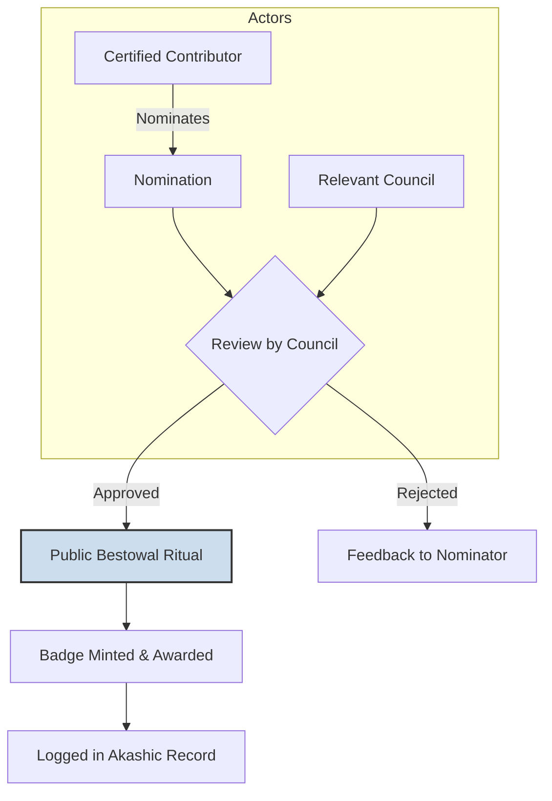

# Contributor Recognition Protocol v3.0.0

## 1. Purpose: A Ritual of Recognition

This protocol is not a traditional certification system. It is a **Ritual of Recognition** for contributors whose work demonstrates deep understanding, skillful craft, and consistent alignment with ThinkAlike’s core principles. It replaces simplistic reputation scores with a **narrative of trusted contributions**, building a web of trust and mutual recognition. It is not about hierarchy, but about making living trust visible.

## 2. The Nature of Recognition: Symbolic Badges

Recognition is bestowed as **Symbolic Badges**. These are non-fungible, non-transferable digital artifacts displayed on a contributor's profile. Badges are earned through the qualitative review of meaningful contributions, not by accumulating points or activity metrics.

## 3. Pathways to Recognition (Arenas of Mastery)

Recognition pathways are structured around core contribution roles. Each pathway recognizes a unique form of mastery.

-   **Lorekeeper:** For significant, high-quality contributions to documentation, harmonization, and maintaining the clarity of the project's knowledge base.
-   **Ethical Guardian:** For insightful contributions to ethical reviews, refining protocols, or identifying and mitigating bias.
-   **Architect:** For elegant, robust, and well-documented contributions to the system’s core architecture.
-   **Resonance Tuner:** For work on the resonance engine or matching logic that demonstrably improves connection quality.
-   **Ritualist:** For designing and implementing symbolic, mythopoetic, or transformative user experiences.

## 4. The Bestowal & Revocation Process

### 4.1. The Ritual of Recognition (Bestowal)

1.  **Nomination:** A nomination is initiated by an already-recognized contributor or a Realm Steward.
2.  **Review:** The nomination is reviewed by the relevant council (e.g., the Ethics Council for an Ethical Guardian badge).
3.  **Bestowal:** If approved, the act of bestowal is a public (within the contributor community) Ritual of Recognition.
4.  **Logging:** The event is transparently logged in the Akashic Record.

### 4.2. Transparent Revocability

-   Badges are not permanent. They may be reviewed or suspended if a contributor’s actions fall out of alignment with the Code of Conduct.
-   This process is handled through the formal `governance_specification.md` framework, with a clear path for appeal and restoration.

## 5. System Integration

-   **Profile Display:** Symbolic Badges are integrated into contributor profiles via the `profile_display.md` component specification.
-   **Governance Realm:** Appeals and reviews are managed through the governance framework.
-   **Akashic Record:** All recognition events are logged for transparency and auditability.
