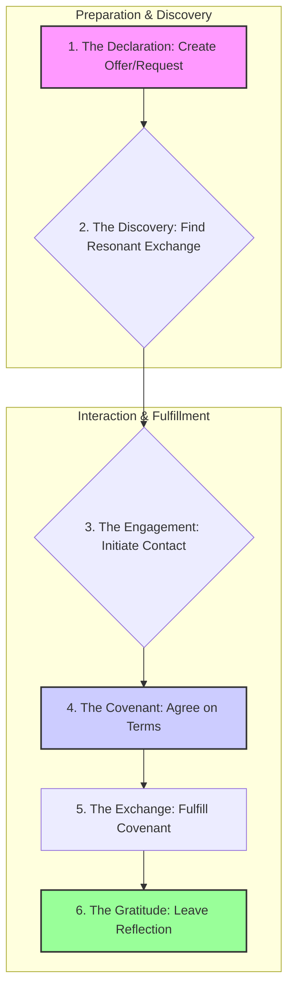

# 🛒 Marketplace Realm Specification

## 1. Vision: The Bazaar of Souls

The ThinkAlike Marketplace is not a store; it is a Bazaar of Souls, a Ritual of Resonant Exchange. It is the realm where the flow of value—skills, services, creative works, and intentional time—is made visible and facilitated. It rejects the logic of profit and scarcity, embracing instead a vibrant ecosystem of reciprocity, mutual aid, and appreciation.

Its purpose is to create a "resonant service web" where connections for exchange are based on trust and shared values, not just price signals.

## 2. Core Principles

- **Value Pluralism:** Chrona (⧖), Barter, and Gifting are all first-class, equally valid modes of exchange.
- **Trust as Foundation:** All participants are vetted through the Resonant Trust Protocol. Reputation and vouches are paramount.
- **Resonance-Based Discovery:** The visibility of listings is influenced by the value alignment between participants, not just search terms.
- **Non-Extraction by Design:** The system is designed for circulation and mutual benefit, not accumulation or exploitation.
- **Ritualized Exchange:** Every transaction is framed as a clear, consensual, symbolic ritual.

## 3. The Ritual of Resonant Exchange

The user journey is a structured ritual that ensures clarity, consent, and gratitude.

1.  **The Declaration:** A user creates an `OfferCard` or `RequestCard`, defining the exchange.
2.  **The Discovery:** Users find listings through a resonance-based feed or filtered search.
3.  **The Engagement:** A user expresses interest, opening a secure chat to discuss terms.
4.  **The Covenant:** The parties formalize their agreement in a "Covenant of Value." Chrona transactions are proposed to wallets.
5.  **The Exchange:** The agreed-upon service, good, or skill is exchanged.
6.  **The Gratitude:** Participants leave qualitative reflections, selecting symbolic "value glyphs" (e.g., Generosity, Skillfulness) that enrich the trust network.

## 4. Agent Roles in the Marketplace

-   **Eos Lumina∴:** Guides users through their first "Ritual of Declaration."
-   **Themis Concordia∴:** Can be invoked to mediate disputes over unfulfilled Covenants.
-   **Market Steward (Future):** A conceptual agent to monitor the health of the economy, ensuring fairness and flagging potential exploitation.

## 5. Architectural & Component Integration

The Marketplace is a central hub, deeply integrated with other platform systems.

| Integration Point | Direction | Purpose & Description | Key Protocols & Documents |
| --- | --- | --- | --- |
| **Chrona Economy** | Usage | Manages all Chrona (⧖) transactions and wallet interactions. | `../../protocols/chrona_economic_protocol.md` |
| **Resonant Trust** | Input | The entire reputation and safety system is built upon the Resonant Trust Protocol. | `../../protocols/resonant_trust_protocol.md` |
| **Governance Realm** | Oversight | Provides a high-level path for dispute resolution and policy oversight. | `../governance/governance_specification.md` |
| **Community Hives** | Usage | Hives can offer collective services or fund projects from a shared Hive Treasury. | `../hives/hives_specification.md` |
| **UI Components** | Usage | Utilizes canonical components like `OfferCard`, `RequestCard`, and `ProfileBadge`. | `../../ui_components/` |

## 6. Vision for Evolution

-   **Hive-Based Economies:** Developing tools for Hives to create and manage their own internal, micro-marketplaces.
-   **Project Crowdfunding:** Enabling Hives and individuals to post large-scale projects and solicit contributions in Chrona or skills.
-   **Integration with Physical World:** Creating pathways for local, tangible goods and services to be offered in a way that strengthens local communities.

> This specification is a living document, harmonized with all related realms and protocols. It is subject to evolution through the Governance Realm.
