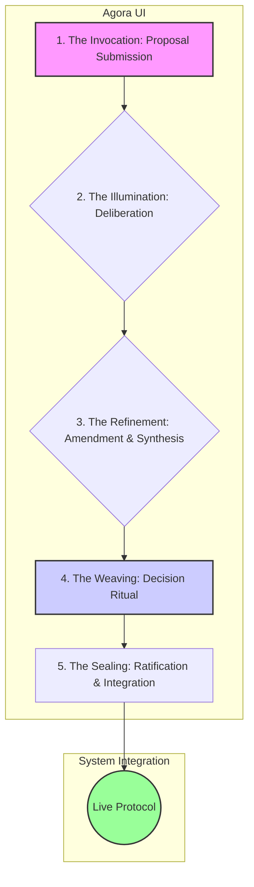

title: Governance Realm Specification
version: 3.0.2
status: canonical
last_updated: 2025-07-08
maintained_by:
  - Eos Lumina ∴ (Collective Intelligence Meta-Agent)
tags:
  - governance
  - realm
  - specification
  - agora
  - liquid_democracy
  - chrona
  - pet_clarity
  - alchemical_interface
  - ritual_governance
related_docs:
  - ../../architecture/technical_architecture_overview.md
  - ../../protocols/chrona_economic_protocol.md
  - ../hives/hives_specification.md
  - ../noetic_forge/noetic_forge_specification.md
  - ../../agents/core/agent_matrix.md
---

# 🏛️ Governance Realm Specification

## 1. Vision: The Agora as Alchemical Vessel

The Governance Realm is the sacred and operational heart of ThinkAlike's collective body—the Agora—where the platform's future is consciously and collaboratively woven. It is conceived not as a political chamber for adversarial debate, but as an Alchemical Vessel. Within this consecrated space, the diverse perspectives, insights, and wills of the community are gathered, subjected to a process of reasoned deliberation and symbolic refinement, and ultimately distilled into coherent, value-aligned decisions for the entire ecosystem.

The purpose of this realm is to facilitate **homeorhesis**: a dynamic, self-correcting flow towards systemic health, ethical integrity, and alignment with ThinkAlike's core ethos (Enlightenment 2.0, PET/Clarity, Theurgic Humanism). It replaces static, top-down control with living, participatory stewardship.

## 2. Core Principles

- **Clarity over Control:** The system prioritizes transparent processes and shared understanding over opaque, centralized authority.
- **Liquid Democracy:** Influence is dynamic and earned through demonstrated wisdom and stewardship, not held by static position or wealth.
- **Ritualized Deliberation:** Governance processes are framed as sacred rituals, encouraging mindful participation and discouraging reactionary politics.
- **Subsidiarity:** Decisions are made at the most local level possible (individual, Hive), with the Agora handling only platform-wide concerns.
- **Algorithmic Support, Human Authority:** AI agents facilitate, analyze, and clarify, but final decision-making authority rests with human participants.

## 3. Governance Lifecycle: The Alchemical Cycle of Collective Will

The core governance process is a five-stage ritual designed to transmute raw ideas into integrated, platform-wide reality.

1.  **The Invocation (Proposal Submission):** Any eligible Initiate can use the "Co-Creation Invocation" form to open a new Agora thread, formally submitting a proposal for consideration.
2.  **The Illumination (Deliberation):** The proposal is opened for community discussion. AI agents facilitate by mapping arguments, signaling resonance/dissonance, and providing relevant data, ensuring the conversation remains productive and clear.
3.  **The Refinement (Amendment & Synthesis):** Based on feedback, the proposal can be amended. AI agents may assist in synthesizing multiple suggestions into a coherent, revised version. Paradox resolution protocols may be invoked for complex issues.
4.  **The Weaving of Wills (Decision Ritual):** Once deliberation concludes, a formal Decision Ritual is initiated. This involves a time-boxed voting period using the agreed-upon consensus mechanism (e.g., quadratic voting, ranked-choice).
5.  **The Sealing (Ratification & Integration):** If the proposal passes, the outcome is cryptographically signed and immutably recorded on the platform's ledger. The ratified change is then automatically integrated into the relevant system protocols by engineering agents.

## 4. Participant Roles & Structure ("The Deliberative Constellation")

-   **Assembly of All Voices:** All eligible Citizen-Initiates can participate in discussion, vote, and submit proposals.
-   **Hive Delegates:** Hives may choose to delegate representatives or cast votes as a collective block on certain issues.
-   **Thematic Stewardship Circles:** Specialized, high-context councils focused on specific domains (e.g., AI Ethics & Ritual, Protocol Weavers, Community Harmony). They act as expert advisors during deliberation.
-   **AI Agent Facilitators (Non-Voting):**
    -   **Themis Concordia∴:** Facilitates discussions, ensuring adherence to ritual protocols.
    -   **Aletheia Veritas∴:** Provides unbiased data, historical context, and maintains the immutable record.
    -   **Harmonia∴:** Visualizes the resonance and dissonance within a debate, tracking sentiment and coherence.

## 5. User Interface & Experience (The Agora UI)

-   **Visual Metaphor:** A celestial council chamber or a tranquil, well-ordered garden. Proposals are represented as glowing runes or growing plants.
-   **Dashboard:** Displays active proposals, their current lifecycle stage, recent decisions, and key community health metrics.
-   **Proposal View:** Provides the core text, a structured deliberation thread, clear revision history, and an intuitive voting interface.
-   **Accessibility:** Designed to WCAG AAA standards to ensure all members of the community can participate fully.

## 6. Unlocking & Access

Direct participation in the Agora is a responsibility, not just a right. It is unlocked after an Initiate has:
1.  Completed the full Portal Realm journey.
2.  Demonstrated active, constructive engagement in one or more Community Hives.
3.  Successfully completed a "Civic Literacy & Ethical Stewardship" module to ensure foundational understanding of the governance philosophy and mechanics.

## 7. Architectural & Component Integration

The Governance Realm is the central oversight body, deeply integrated with all other realms and protocols.

| Integration Point | Direction | Purpose & Description | Key Protocols & Documents |
| --- | --- | --- | --- |
| **Chrona Economy** | Oversight | The Agora ratifies all core economic parameters, including UBI rates and demurrage, as defined in the Chrona protocol. | `../../../protocols/economic/chrona_economic_protocol.md` |
| **Community Hives** | Oversight | Provides a high-level dispute resolution path and ratifies platform-wide policies that affect all Hives. | `../hives/hives_specification.md` |
| **Noetic Forge** | Output | New rituals, symbols, or protocols created in the Forge must be submitted to the Agora for canonization. | `../noetic_forge/noetic_forge_specification.md` |
| **Veiled Matrix** | Input | The most profound or complex proposals may be sent to the Veiled Matrix for "algorithmic scrying" (deep simulation and consequence analysis) before a final vote. | `../matrix/veiled_matrix/veiled_matrix_specification.md` |
| **Resonant Trust** | Usage | Governance roles and voting influence can be weighted by reputation metrics derived from the trust protocol, ensuring liquid democracy. | `../../../protocols/core/resonance_trust_protocol.md` |

> This specification provides the foundational blueprint for the Governance Realm. It is a living document subject to its own stewardship principles for evolution and refinement.
