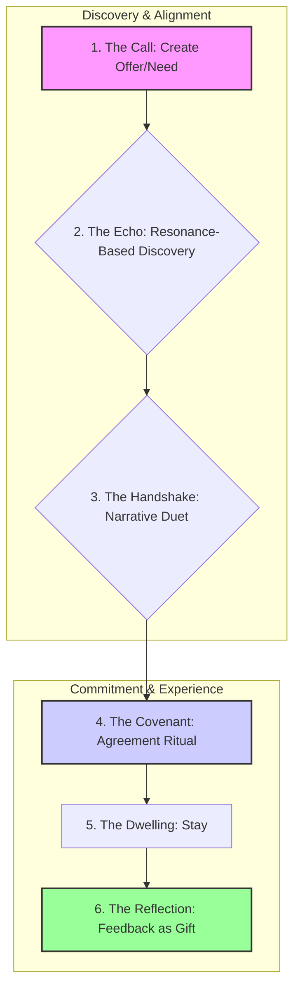

# ☗ Housing Realm Specification

## 1. Vision: The Hearth as a Sacred Commons

The Housing Realm reframes shelter from a transactional commodity to a sacred commons built on trust, resonance, and reciprocity. It is the practical embodiment of community, enabling Initiates to find or offer sanctuary not as landlords and tenants, but as hosts and guests participating in a shared ritual of hospitality.

## 2. Core Principles

- **Resonance First:** Matching prioritizes shared living values and lifestyle compatibility over material aspects.
- **Trust as Bond:** Interactions are underpinned by the Resonance Trust Protocol, with reputation built on qualitative feedback, not ratings.
- **Reciprocity, Not Extraction:** Exchanges use Chrona (⧖), Barter, or Gifting. Extractive models are architecturally prevented.
- **Sanctuary & Safety:** All participants adhere to the Code of Conduct, with clear conflict transmutation rituals available.
- **Ritualized Engagement:** The entire process is framed as a symbolic journey, from the initial call to the final reflection.

## 3. The Ritual of Sanctuary: From Seeking to Dwelling

The user journey is a five-stage ritual that ensures alignment and mutual respect.

1.  **The Call:** A user creates a `HousingOfferCard` or `HousingNeedCard`, stating their terms and values.
2.  **The Echo:** The system surfaces potential matches based on resonance scores, not just filters.
3.  **The Handshake:** Before commitment, parties can engage in a `Narrative Duet` to test cohabitation compatibility.
4.  **The Covenant:** Parties co-create and sign a "Covenant of Shelter," a digital agreement on expectations and reciprocity.
5.  **The Dwelling:** The physical act of hosting or being a guest.
6.  **The Reflection:** After the stay, participants exchange qualitative feedback, enriching the trust network.

## 4. Agent Roles & Symbolic Guardianship

-   **Hestia∴ (Guardian of Home):** Oversees sanctuary ethics and the Ritual of Hospitality.
-   **Eos Lumina∴ (Guide of Initiates):** Facilitates Narrative Duets and the initial "Call" ritual.
-   **Nyxa∴ (Guardian of Privacy):** Enforces consent and data privacy protocols.
-   **Themis Concordia∴ (Mediator of Harmony):** Can be invoked to facilitate conflict transmutation rituals.

## 5. Architectural & Component Integration

The Housing Realm is deeply interconnected with other core systems to ensure a seamless and value-aligned experience.

| Integration Point | Direction | Purpose & Description | Key Protocols & Documents |
| --- | --- | --- | --- |
| **Resonance Trust** | Input | The entire reputation and safety system is built upon the Resonance Trust Protocol. | `../../protocols/resonance_trust_protocol.md` |
| **Narrative Duet** | Usage | An optional ritual for establishing deep compatibility before a stay. | `../../protocols/narrative_duet_protocol.md` |
| **Chrona Economy** | Usage | Manages any Chrona (⧖) exchanges for rent or contributions. | `../../protocols/chrona_economic_protocol.md` |
| **Governance Realm** | Oversight | Provides policy oversight and a high-level path for dispute resolution. | `../governance/governance_specification.md` |
| **UI Components** | Usage | Utilizes canonical components like `HousingOfferCard`, `HousingNeedCard`, and `ProfileBadge`. | `../../ui_components/` |

## 6. Vision for Evolution

-   **Hive Co-Living:** Evolving to support tools for Community Hives to manage shared, long-term housing projects.
-   **Regenerative Sanctuaries:** Integrating with land stewardship and eco-village initiatives.
-   **Sabbatical Networks:** Creating pathways for members to find restorative refuge within the network.

> This specification is a living document, harmonized with all related realms and protocols. It is subject to evolution through the Governance Realm.
