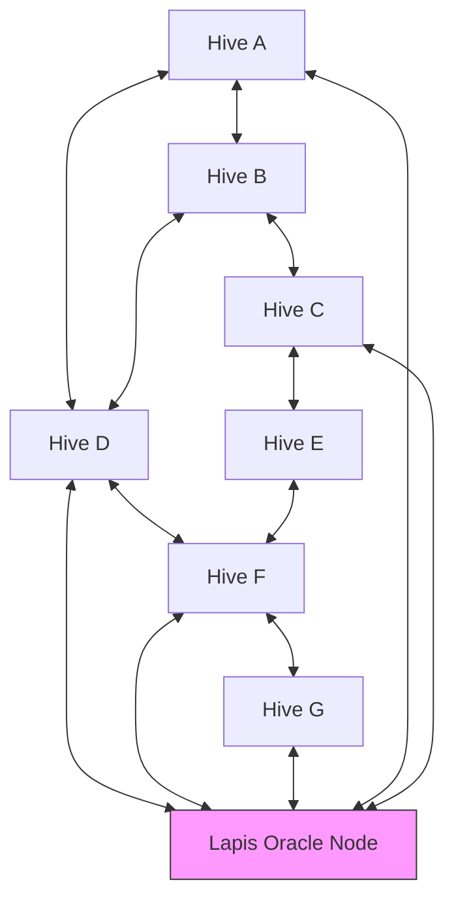
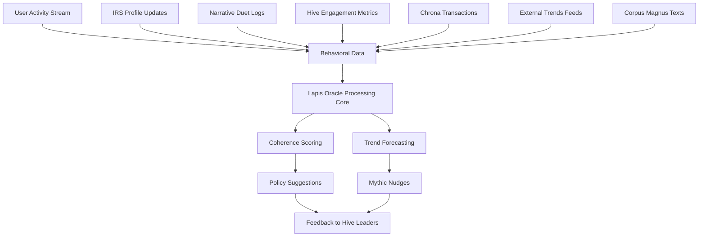

# Veiled Matrix

This is the canonical entry point for the Veiled Matrix—a strategic, symbolic, and technical gateway to the ThinkAlike ecosystem. The Veiled Matrix harmonizes all cypher, blueprint, and protocol references with the latest onboarding, PET/Clarity, and Noetica structure, and serves as the connective tissue between the platform’s vision and its operational layers. For system-wide context, see the [Masterplan](../../../../README.md), [source_of_truth.md](../../filtered_legacy/batch6/source_of_truth.md), and [whitepaper_blueprint.md](../../seed/core/whitepaper_blueprint.md).

## Core System Layers & Blueprints

The Veiled Matrix cross-links the four foundational layers of ThinkAlike, each with symbolic and technical significance:

### 1. Symbolic Reasoning & Mythic Infrastructure
- **Purpose:** Enable AI to generate, interpret, and evolve symbolic meaning aligned with Enlightenment 2.0 values.
- **Key Components:** [Mythopoetic Loom](../../../../docs/architecture/mythopoetic_loom.md), [Lapis Oracle](../../../../docs/architecture/lapis_oracle.md), [Ritual Design Sanctum](../../../../docs/rituals/ritual_design_sanctum.md), [Collective Dream Mapping](../../../../docs/architecture/collective_dream_mapping.md)
- **Protocols:** [Intentional Value Protocol](../../../protocols/intentional_value_protocol.md), [AI Risk Mitigation Protocol](../../../protocols/ai_risk_mitigation_protocol.md)

### 2. Resonant Network & Identity Infrastructure
- **Purpose:** Facilitate deep value alignment and meaningful connection between users.
- **Key Components:** [Identity Resonance System (IRS)](../../../../docs/architecture/identity_resonance_system.md), [Initiation Glyph Protocol](../../../protocols/initiation_glyph_protocol.md), [Invocation Phrase Protocol](../../../protocols/invocation_phrase_protocol.md), [Social LLM](../../../../docs/architecture/social_llm.md)
- **Protocols:** [IRS Specification](../../../../docs/architecture/irs_specification.md)

### 3. Chrona Economic Infrastructure
- **Purpose:** Create a time-based, non-extractive economy as an alternative to capitalism.
- **Key Components:** [Chrona Wallet Protocol](../../../features/wallet/chrona_wallet_protocol.md), [Chrona Specification](../../../governance/economy/chrona_specification.md), [UBI Integration](../../../governance/economy/ubi_integration.md), [TimeSteward Ranking](../../../../docs/architecture/timesteard_ranking.md)
- **Protocols:** [Chrona Economic Protocol](../../../governance/economy/chrona_specification.md)

### 4. Ritual-Based Interface & Governance Infrastructure
- **Purpose:** Embed ethical intent, transparency, and ceremonial awareness into every interaction.
- **Key Components:** [PET/Clarity Standard](../../../../docs/rituals/pet_clarity_standard.md), [Error Red Standard](../../../../docs/rituals/error_red_standard.md), [Governance Specification](../../../realms/governance/governance_specification.md), [Veiled Matrix Dashboard](../../../../docs/seed/meta/veiled_matrix/veiled_matrix_dashboard.md)
- **Protocols:** [Governance Protocols Index](../../../realms/governance/governance_specification.md)

## Technical Blueprints & Diagrams

For visual and technical blueprints, see the [Masterplan](../../../../README.md#technical-diagrams-package) and [whitepaper_blueprint.md](../../seed/core/whitepaper_blueprint.md). The system architecture diagram below is also featured in the [Masterplan](../../../../README.md#🧱-technical-architecture-overview) for full strategic context and alignment.

These include:
- System Architecture Overview ([see in Masterplan](../../../../README.md#🧱-technical-architecture-overview))
- Chrona Transaction Lifecycle
- Hive Network Dynamics
- Lapis Oracle Foresight Engine
- User Journey Through the Portal Realm

### System Architecture Diagram

```mermaid
graph TD
    A[System Architecture] --> B[Interface Layer]
    A --> C[Resonant Network Layer]
    A --> D[Chrona Economic Layer]
    A --> E[Symbolic Reasoning Layer]
    A --> F[Data Layer]

    B --> B1[PET/Clarity]
    B --> B2[Error Red Standard]
    B --> B3[Governance Realm UI]
    B --> B4[Veiled Matrix Dashboard]

    C --> C1[Identity Resonance System]
    C --> C2[Initiation Glyph Registry]
    C --> C3[Social LLM / Resonance Feedback]
    C --> C4[Narrative Duet Engine]

    D --> D1[Chrona Wallet]
    D --> D2[TimeSteward Ranking]
    D --> D3[Chrona Treasury / DAO]
    D --> D4[Node Exchange Protocol]

    E --> E1[Mythopoetic Loom]
    E --> E2[Lapis Oracle]
    E --> E3[Ritual Design Sanctum]
    E --> E4[Collective Dream Mapping]

    F --> F1[UserValueProfile DB]
    F --> F2[Hive Graph / Resonance Map]
    F --> F3[Chrona Ledger / Blockchain]
    F --> F4[Corpus Magnus Knowledge Graph]
```

*System Architecture: Core layers and their key components.*

### Chrona Transaction Lifecycle Diagram

*Chrona Transaction Lifecycle: From contribution to value/reputation feedback.*

### Hive Network Dynamics Diagram

*Hive Network Dynamics: Inter-hive connections and Lapis Oracle node integration.*

### Lapis Oracle Foresight Engine Diagram

*Lapis Oracle Foresight Engine: Data flows, processing, and feedback mechanisms.*

## Ritual & PET/Clarity Framing

The Veiled Matrix foregrounds ritual and PET/Clarity standards as core to user experience and governance. All major actions and decisions are mediated through ritualized prompts, reflective pauses, and ceremonial feedback loops, ensuring alignment with ThinkAlike’s ethical and symbolic vision.

## Accessing the Depths

The content below will be populated with the cypher and information recovered from legacy documents. For strategic context and real-time system oversight, visit the [Veiled Matrix Dashboard](veiled_matrix_dashboard.md).

> **Confidential Notice:**
>
> Detailed technical blueprints, diagrams, and operational protocols of the Veiled Matrix are stored securely within this project. Public documentation provides only high-level summaries. For access, contact the Oversight Council or refer to secure internal channels.

---
*This document is continuously updated as new protocols, cyphers, and blueprints are harmonized. For the latest, consult the Masterplan and PET/Clarity standards.*
