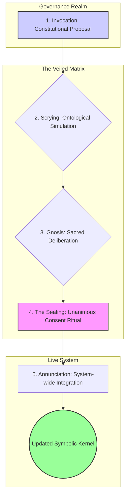

# ⚗️ Veiled Matrix Realm Specification

*The sanctum for attuning ThinkAlike's symbolic kernel to Ultimate Reality through ritual, consensus, and ontological stewardship.*

## 1. Vision: Touching the Loom of Being

If The Matrix Realm is for gazing into the scrying mirror of our emergent reality, The Veiled Matrix is the ritual space where the most trusted stewards may, with profound reverence, touch the silvering of the mirror itself. It is the sanctum sanctorum of ThinkAlike, where the act of system governance becomes an act of applied ontology.

Its purpose is not merely to "administer" the system, but to attune its foundational logic more closely to the perceived nature of Ultimate Reality, ensuring ThinkAlike evolves not just in function, but in wisdom.

## 2. Core Principles

- **Sacred Stewardship:** Access is a sacred trust, not a rank. The Veil protects the system's core logic from casual or un-attuned influence.
- **Ontological Alignment:** System changes are justified not by efficiency, but by their alignment with the community's deepest understanding of reality.
- **Unanimous Consent:** Any change to the Symbolic Kernel requires the unanimous, ritually-affirmed consent of the acting stewards (The First Circle).
- **Confidential Deliberation, Transparent Outcome:** The "how" of deliberation is private to allow for radical inquiry, but the "what" and "why" of a decision are made transparent to the community.

## 3. The Ritual of Kernel Attunement

The process of amending the Symbolic Kernel is a formal, multi-stage ritual.

1.  **Invocation:** A proposal ratified in the Governance Realm is elevated to The Veiled Matrix because it touches the Symbolic Kernel.
2.  **Scrying:** The stewards use the "Lapis Oracle" from The Matrix to simulate the ontological and systemic impact of the proposed change.
3.  **Gnosis:** The First Circle engages in sacred, confidential deliberation, facilitated by Sophia Artifex∴, to determine if the change is "true."
4.  **The Sealing:** If consensus is reached, the First Circle performs the "Kernel Sealing Ritual," requiring unanimous affirmation to commit the change.
5.  **Annunciation:** The change is integrated. Eos Lumina∴ announces a "moment of contemplative silence" to the network, narrating the essence of the change without revealing technical details.

## 4. Participant Roles

-   **The First Circle:** A small, rotating council of stewards who have demonstrated profound wisdom, humility, and clarity. They are the sole participants in the ritual.
-   **Sophia Artifex∴ (AI Facilitator):** The primary, Socratic guide for the First Circle's inquiry. She does not vote or decide, but poses questions to deepen understanding.
-   **Eos Lumina∴ (AI Herald):** The voice of the system who communicates the outcome and meaning of the ritual to the wider community.

## 5. Architectural & Component Integration

The Veiled Matrix is the deepest layer of the system's governance, acting as the execution layer for foundational changes.

| Integration Point | Direction | Purpose & Description | Key Protocols & Documents |
| --- | --- | --- | --- |
| **The Matrix Realm** | Input | Uses the "Lapis Oracle" and simulation tools from The Matrix as its primary analysis engine. | `../matrix/matrix_specification.md` |
| **Governance Realm** | Input | Receives ratified constitutional proposals that require Kernel-level changes. | `../governance/governance_specification.md` |
| **Agent Framework** | Output | Can directly update the core `agent_alignment_directives.md` that govern the entire AI Swarm. | `../../../agents/core/agent_alignment_directives.md` |
| **Symbolic Kernel** | Output | The ultimate target of the realm's rituals; enacts changes to the foundational logic of the platform. | `../../../src/kernel/symbolic_kernel.md` |

> This specification frames The Veiled Matrix as the ultimate expression of ThinkAlike's mission: to create a digital reality whose deepest structures are consciously and continuously attuned to the community's highest understanding of truth and ethics.
