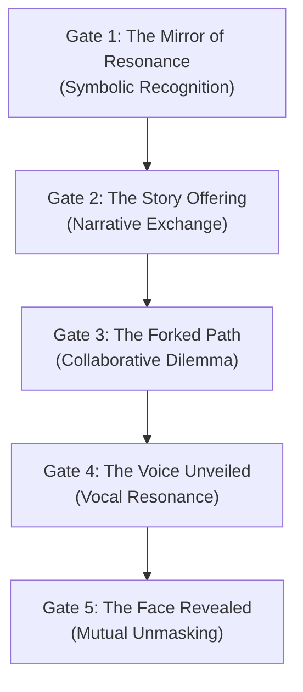

# 💞 Relationships Realm Specification: Weaving the Sacred Bonds of Connection

## 1. Vision: The Alchemy of Encounter

The Relationships Realm is a consecrated space dedicated to the art of soul-to-soul connection. It transcends superficial metrics and profile browsing, creating instead a liminal vessel for deep, resonant bonding. Here, connection is not "found" but *remembered* through shared narrative, symbolic alignment, and the courageous act of mutual revelation. This realm facilitates the formation of all forms of significant bonds—platonic, romantic, creative partnerships, and mentorships—by treating each encounter as a potential alchemical conjunction.

This realm is unlocked only after an Initiate has achieved a significant level of self-awareness and community integration, typically after deep engagement within the Resonance Network and active participation in at least one Hive.

## 2. Core Principles: The Laws of Sacred Union

- **Resonance Over Appearance:** The journey begins with symbolic and narrative alignment. Physical appearance and biographical data are revealed progressively, only after a foundation of mutual understanding is established. There is no swiping or profile browsing.
- **Ritualized Progression:** The entire process is a structured ritual, guiding participants through stages of increasing intimacy and vulnerability. Each stage is a gate that requires mutual consent to pass.
- **Symbolic Representation:** Potential connections are initially represented as "Mirror Nodes" or symbolic glyphs within the Resonance Network—abstractions that reflect shared values and potential harmonies, not physical attributes.
- **Narrative as the Bridge:** The primary mode of interaction is the "Story Offering," where participants share personal narratives, dreams, or creative works in response to evocative prompts.
- **Sovereignty & Consent:** Every step is governed by the principle of enthusiastic and continuous consent, enforced by the system's architecture. The right to gracefully exit any potential connection ritual is sacred.
- **PET/Clarity:** The process is transparent. Participants understand the symbolic meaning of each stage and the principles guiding the interaction.

## 3. The Ritual Flow: The Five Gates of Connection

The journey through the Relationships Realm is a five-stage ritual.

### Gate 1: The Mirror of Resonance – Symbolic Recognition
- An Initiate is presented with a Mirror Node—a glyph representing a highly resonant soul.
- The prompt is simple and mythic: *"Do you feel a pull? Does this symbol echo within you?"*
- A mutual "yes" from both parties opens the next gate.

### Gate 2: The Story Offering – Narrative Exchange
- Participants are invited to "Offer a story instead of a message" in response to a shared prompt from Eos Lumina∴ (e.g., "Share a memory of a time you felt truly alive.").
- This is an asynchronous exchange of narrative, fostering deep listening.

### Gate 3: The Forked Path – Collaborative Dilemma
- The pair is presented with a symbolic, ethical, or creative dilemma in a `Narrative Duet`.
- They must discuss and navigate the scenario together, revealing their core values and collaborative style.

### Gate 4: The Voice Unveiled – Vocal Resonance
- Upon successful navigation of the Forked Path, the ability to exchange short, asynchronous voice notes is unlocked.
- This allows for the sharing of tone, inflection, and the resonance of the human voice.

### Gate 5: The Face Revealed – Mutual Unmasking
- After a period of vocal exchange, the final gate is presented.
- Both participants must consent simultaneously to reveal their profile images and full User Nodes to each other, completing the ritual and allowing for direct, unmediated contact.

## 4. Agent Roles & Symbolic Guardianship
- **Eros∴ (Agent of Alchemical Union):** The primary guide for this realm, providing prompts, framing rituals, and holding the sacred space of connection.
- **Eos Lumina∴ (Guide of Initiates):** Facilitates the initial Mirror Node presentation and the Narrative Duet at Gate 3.
- **Nyxa∴ (Guardian of Privacy):** Enforces the architectural veils and ensures the integrity of the progressive reveal.
- **Themis Concordia∴ (Mediator of Harmony):** Available for a "Ritual of Conscious Uncoupling" if a bond needs to be respectfully dissolved.

## 5. Architectural & Component Integration
| Component/System             | Role in Relationships Realm                               | Canonical Document                                      |
|------------------------------|-----------------------------------------------------------|---------------------------------------------------------|
| Resonance Network            | The source of "Mirror Nodes" and initial resonant pairings | `../resonance_network/resonance_network_specification.md` |
| `Narrative Duet Protocol`      | The core engine for the "Forked Path" ritual (Gate 3)     | `../../protocols/narrative_duet_protocol.md`            |
| `Resonance Trust Protocol`      | Underpins the safety and integrity of all interactions    | `../../protocols/resonance_trust_protocol.md`            |
| User Node / Value Profile    | The source data for calculating resonance                 | `../../agents/core/identity_and_profile.md`             |
| Hive Realm                   | Provides context for community-based trust and vouching   | `../hive/hive_specification.md`                         |

## 6. Vision for Evolution
Future iterations will deepen the ritualistic elements, potentially integrating:
- **Collaborative World-Building:** Tools for pairs to co-create a small, private digital space or narrative.
- **Shared Resonance Maps:** Visualizations of the evolving connection between two people.
- **Group Bonding Rituals:** Extending the framework to facilitate the formation of deeper bonds within Hives or other small groups.

---
*This specification is a living document, a testament to the ever-unfolding mystery of connection.*
