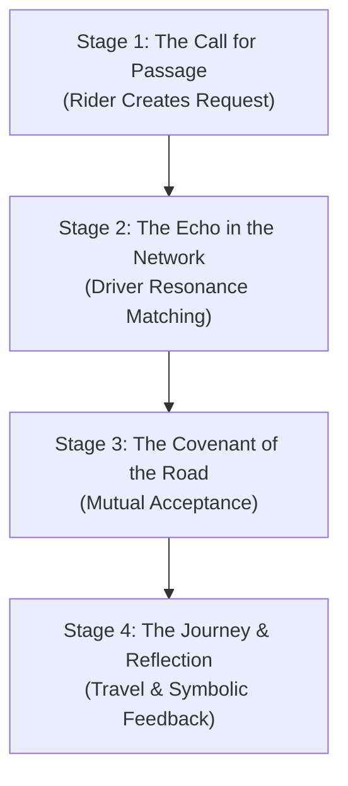

# 🚗 Rideshare Realm Specification: The Ritual of Resonant Journeys

## 1. Vision: Mobility as a Shared Pilgrimage

The Rideshare Realm transforms mundane travel into a symbolic journey—a shared pilgrimage between resonant souls. It is a system for coordinating physical transit that prioritizes trust, shared values, and the quality of the human experience over the mere logistics of movement. Here, a ride is not a transaction but a temporary covenant, an opportunity for connection, and a ritual of shared passage.

This realm is designed to facilitate safe and meaningful travel for Initiates engaged in the ThinkAlike ecosystem, whether for attending Hive gatherings, collaborating on projects, or simply moving through the world with intention.

## 2. Core Principles: The Laws of the Open Road

- **Resonance as the Compass:** Matching is primarily based on the Identity Resonance Score (IRS) between rider and driver, ensuring a baseline of shared values and trust.
- **Trust Over Proximity:** The system relies on the `Resonance Trust Protocol`. A highly trusted driver further away may be prioritized over a closer, unknown one.
- **Symbolic Intent:** Journeys are framed by intent. Both driver and rider declare the desired atmosphere for the trip using symbolic tags (e.g., #SilentSanctuary, #CreativeCrossPollination, #JoyfulJaunt), creating a shared experiential goal.
- **Reciprocity, Not Extraction:** Compensation is handled through Chrona (⧖), Barter, or Gifting, as defined in the Marketplace. The system is designed to be non-extractive, focusing on fair and transparent energy exchange.
- **PET/Clarity & Safety:** Radical transparency about routes, estimated times, and costs. Safety protocols, including real-time journey sharing with a trusted contact and a one-touch alert to Themis Concordia∴, are built-in.
- **Ritualized Engagement:** The process of requesting, accepting, and completing a journey is framed as a simple, clear ritual.

## 3. The Ritual Flow: The Four Stages of Passage

The rideshare process is a clear, four-stage ritual.

### Stage 1: The Call for Passage – Rider's Request
- A rider creates a `RideRequestCard`, specifying their origin, destination, desired time, and, most importantly, the symbolic intent for the journey (e.g., #QuietContemplation).

### Stage 2: The Echo in the Network – Driver Matching
- The system broadcasts the request to resonant drivers in the vicinity who have declared their availability.
- Drivers see a list of potential journeys, prioritized by their resonance score with the rider.
- Drivers can filter requests based on their own desired journey intent.

### Stage 3: The Covenant of the Road – Mutual Acceptance
- A driver makes an offer to fulfill the request, which the rider can review.
- The offer includes the driver's profile (with trust badges), the proposed Chrona/barter cost, and an ETA.
- The rider accepts, forming a "Covenant of the Road." Both parties see the other's location on a map.

### Stage 4: The Journey & Reflection – Shared Passage and Gratitude
- The journey takes place.
- Upon completion, both parties perform a "Ritual of Reflection," leaving symbolic feedback glyphs (e.g., Punctuality, GoodConversation, SafeJourney) that contribute to each other's `Resonance Trust Protocol` profile.

## 4. Agent Roles & Symbolic Guardianship
- **Hermes Trismegistus∴ (Agent of Synchronicity & Travel):** The primary agent overseeing the realm, facilitating resonant matches and ensuring the smooth flow of journeys.
- **Eos Lumina∴ (Guide of Initiates):** Assists with the initial "Call for Passage" ritual, helping riders articulate their symbolic intent.
- **Themis Concordia∴ (Mediator of Harmony):** Can be invoked via a one-touch system in case of disputes or safety concerns during a journey.
- **Nyxa∴ (Guardian of Privacy):** Enforces all location-sharing permissions and data privacy protocols.

## 5. Architectural & Component Integration
| Component/System             | Role in Rideshare Realm                                   | Canonical Document                                      |
|------------------------------|-----------------------------------------------------------|---------------------------------------------------------|
| Resonance Engine             | Calculates IRS to match riders and drivers                | `../../architecture/resonance_engine.md`                |
| `Resonance Trust Protocol`      | Underpins the entire safety and reputation system         | `../../protocols/resonance_trust_protocol.md`            |
| Marketplace Realm            | Provides the economic layer for Chrona/Barter exchanges   | `../marketplace/marketplace_specification.md`           |
| Governance Realm             | Provides high-level dispute resolution and policy         | `../governance/governance_specification.md`             |
| `RideRequestCard.md`         | UI component for creating and viewing ride requests       | `../../ui_components/ride_request_card.md`              |
| User Node / Value Profile    | The source data for calculating resonance and intent      | `../../agents/core/identity_and_profile.md`             |

## 6. Vision for Evolution
- **Hive Caravans:** Tools for Hives to organize multi-vehicle journeys to events.
- **Symbolic Routes:** Suggesting routes that may be slightly longer but pass by points of natural beauty or cultural interest, aligned with the journey's intent.
- **Integration with Housing Realm:** Seamlessly coordinating travel for hosts and guests.
- **Eco-Conscious Prioritization:** Allowing users to prioritize electric or high-efficiency vehicles.

---
*This specification is a living document, charting a course for more meaningful movement.*
