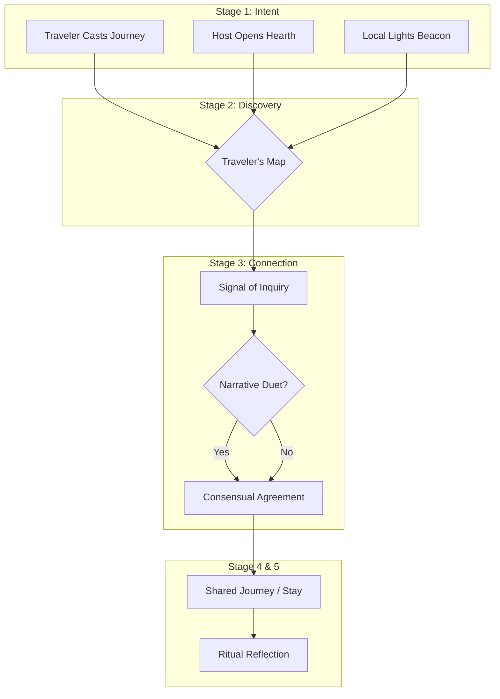

# ✈️ Travel Companion Realm Specification: Journeys of Resonance & Shared Horizons

## 1. Vision: The Road as a Weaving Loom

The Travel Companion Realm extends ThinkAlike's principles of resonant connection into the dynamic space of physical travel. It transforms journeys from simple movements between locations into opportunities for shared experience, mutual aid, and the weaving of the global human tapestry. Inspired by Couchsurfing but rebuilt on ThinkAlike's foundations, this realm is dedicated to deep resonance, trust, and reciprocity.

**Core Purpose:**
- Connect Travelers with Local Beacons (locals offering guidance/meetups) and Hearth Keepers (locals offering short-term hospitality).
- Facilitate discovery of Travel Companions for co-creating shared journeys.
- Foster mindful, respectful travel valuing cultural exchange and genuine connection over transactional tourism.
- Frame travel as a theurgic journey—a conscious act of expanding one's worldview and seeking new resonances.

This realm unlocks concurrently with other "Third Degree" realms, translating digital connections into real-world encounters.

## 2. Core Principles: The Wayfarer's Covenant
- **Resonance & Shared Intent First:** Matching prioritizes UserValueProfile alignment and shared travel values (e.g., "Adventurous Exploration," "Eco-Stewardship").
- **Hospitality as Sacred Gift:** Core exchange is experience, guidance, and trust; Chrona may cover shared costs (e.g., meal contributions).
- **Trust & Safety as The Traveler's Shield:** Built on the Trust Network Topology—verifications, ProfileBadges, and clear safety protocols.
- **PET/Clarity:** Radical transparency about plans, expectations, and boundaries; user-controlled location sharing enforced by Nyxa∴.
- **Mindful Presence:** Encourages respectful engagement with local cultures, ecologies, and communities.

## 3. The Ritual Flow of a Journey

### Stage 1: The Call to the Road – Declaring Intent
- **Travel Plan (Ritual of Setting Forth):** Travelers create a `TravelPlanCard`, outlining destinations, dates, travel style, and desired companions.
- **Hospitality Offer (Opening the Hearth):** Hosts create a `HospitalityOfferCard`, detailing availability, space, and reciprocity expectations.
- **Local Beacon (Lighting a Beacon):** Locals flag profiles to meet travelers for guidance or social exchange (no lodging).

### Stage 2: The Crossing of Paths – Discovery & Resonance
- **Traveler's Map Interface:** Visualizes Travel Plans, Hospitality Offers, and Local Beacons.
- **Filters & Resonance Priming:** Filter by location, dates, and values; system highlights matches with high Identity Resonance Score (IRS).

### Stage 3: The Traveler's Handshake – Duet & Connection
- **Signal of Inquiry:** Interested users send a connection request.
- **Optional Journey Duet:** A `narrative_duet_protocol.md` ritual explores compatibility scenarios before sharing details.
- **Consensual Reveal:** Hermes Echo facilitates step-by-step sharing of logistical details and contact information.

### Stage 4: The Shared Path – The Journey Itself
Conduct the journey guided by agreed protocols and mutual respect.

### Stage 5: The Storyteller's Return – Sharing Reflections
Participants leave a `Ritual Reflection`, offering symbolic endorsements that enhance reputation and ProfileBadges.

## 4. Agent Roles in the Travel Realm
- **Hermes Echo:** Symbolic guide—facilitates introductions, provides resonant suggestions, and frames journeys mythopoetically.
- **Nyxa∴:** Guardianship of privacy and consent for sensitive travel data.
- **Hestia∴:** Ensures hospitality offers uphold sanctuary ethics and safety.
- **Eos Lumina∴:** Facilitates Journey Duets and symbolic rituals.

## 5. Architectural & Component Integration

| Component/System            | Role in Travel Realm                                 | Canonical Document                                  |
|-----------------------------|------------------------------------------------------|-----------------------------------------------------|
| `TravelPlanCard`            | UI for creating and viewing travel intentions        | `../../ui_components/TravelPlanCard.md` (to be created) |
| `HospitalityOfferCard`      | UI for hosting offers                                | `../../ui_components/HospitalityOfferCard.md` (to be created) |
| `Resonance Network`         | Interface for discovering travel connections         | `../resonance_network/resonance_network_specification.md` |
| `Narrative Duet Protocol`   | Ritual for testing deep compatibility                | `../../protocols/narrative_duet_protocol.md`          |
| `Resonance Trust Protocol`     | Underpins reputation and safety                      | `../../protocols/resonance_trust_protocol.md`          |
| Chrona Economy              | Manages Chrona exchanges for shared costs            | `../../governance/economy/chrona_specification.md`    |
| Community Hives             | Can offer group hospitality or journey coordination  | `../hive/hive_specification.md`                   |

## 6. Vision for Evolution
- **Hive Journeys:** Tools for Hives to plan collaborative group trips.
- **Skill-Share Caravans:** Journeys organized around skill-sharing and community projects.
- **Regenerative Travel Networks:** Bridges to eco-lodges and sustainable initiatives.

## Appendix: Data Models & Detailed User Flows (from legacy draft)

### Illustrative Data Models
- **TravelPlan:** planId, userId, destinations, dates, travelStyleValues, seeking, offering, status, privacy.
- **HostingOffer_Travel:** offerId, hostUserId/HiveId, location, availabilityDates, spaceType, exchangeTerms_Travel, hostValues, status.
- **LocalBeaconStatus:** userId, location, availabilityForMeetup, interestsToShare.
- **TravelConnection:** connectionId, travelPlanId, hostingOfferId, beaconUserId, initiatingUserId, acceptingUserId, status, agreementDetails.

### Additional User Flow Details
- Multi-stage consensual reveal for contact/logistics ("Pact of Passage").
- Symbolic feedback for both traveler and host/local (e.g., "Shared a resonant moment").
- Emergency protocols, reporting, and robust verification for safety.
- Platform not for purely commercial lodging; Chrona Stewards DAO and Ethics Council oversee.
- Strict controls over sharing location, itineraries, and contact details.

> This specification provides the foundational blueprint for the Travel Companion Realm. It is harmonized with all related ThinkAlike protocols and principles as of its last update.
