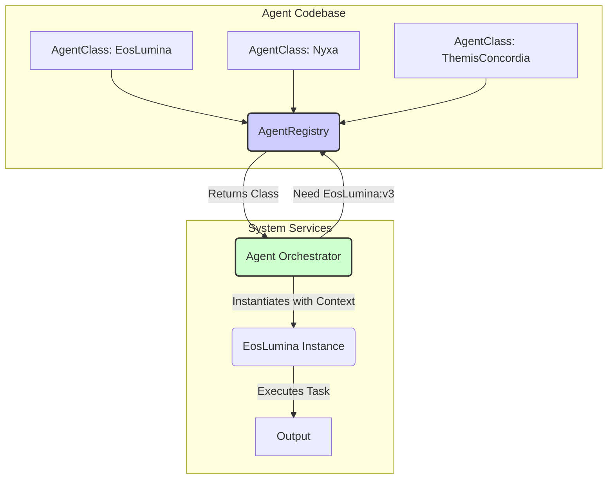

# Agent Registry Protocol v3.0.0

## 1. Overview

The Agent Registry Protocol governs the functionality of the `AgentRegistry` service. This registry serves as a central discovery mechanism for AI agent classes (blueprints), allowing different parts of the ThinkAlike system to dynamically access and instantiate agents. This document defines the protocol for the registry's operation.

## 2. Core Principles

- **Class-Based Registry:** The registry stores agent classes (the blueprints), not live instances.
- **Caller Instantiation:** Services or orchestrators requiring an agent are responsible for retrieving the agent class from the registry and then instantiating it. This allows for flexible initialization with specific contexts (e.g., user-specific data, session IDs).
- **Global Scope:** A single, global `AgentRegistry` instance is used throughout the system to ensure consistency.
- **Dynamic Manifest:** The list of registered agents is a dynamic manifest, queryable from the registry service itself, rather than a static list in a document.

## 3. `agent_id` Naming Convention

To ensure clarity and prevent collisions, all registered agents must have a unique identifier.

- **Uniqueness:** Each `agent_id` string MUST be unique across the entire system.
- **Format:** The `agent_id` string MUST follow the convention: `"[AgentName]:v[MajorVersion]"`.
- **Example:** `"EosLumina:v3"`, `"DataWeaver:v2"`, `"ChronosOracle:v1"`.
- **Versioning:** The major version indicates a significant iteration of the agent's interface or core functionality. The full semantic version (e.g., "3.0.1") should be an attribute within the agent class itself for more granular tracking.

## 4. `AgentRegistry` Service Functionality

The `AgentRegistry` service provides the following key methods:

- **`register_agent(agent_class: Type[BaseAgent])`**: Registers an agent class. The class must have an `agent_id` attribute adhering to the specified naming convention.
- **`get_agent_class(agent_id: str) -> Type[BaseAgent] | None`**: Retrieves a specific agent class by its full `agent_id` string.
- **`get_latest_version_class(agent_name: str) -> Type[BaseAgent] | None`**: Given an `AgentName` (e.g., "EosLumina"), this method identifies and returns the class with the highest registered major version.
- **`unregister_agent(agent_id: str)`**: Removes an agent class from the registry. This supports dynamic loading/unloading scenarios.
- **`list_registered_agents() -> List[str]`**: Returns a list of all registered `agent_id` strings, serving as the dynamic, canonical manifest.

## 5. Instantiation and Lifecycle Management

The `AgentRegistry` is **not** responsible for agent instantiation or lifecycle management.

Higher-level services, such as an **Agent Orchestrator** (see `architecture/agent_orchestration.md`), are responsible for:

1.  Querying the registry for agent classes.
2.  Instantiating agents as needed, passing user-specific or task-specific context to their `__init__` methods.
3.  Managing the lifecycle (activation, deactivation, error handling) of agent instances.

## 6. Canonical Agent Manifest

The canonical manifest of all available agents is no longer a static table within this document. It is now a **dynamic resource** provided by the `AgentRegistry` service itself.

**To get the current list of all registered agents, use the `list_registered_agents()` method or a corresponding CLI command.**

This ensures the manifest is always accurate and up-to-date with the running system state, reflecting any dynamically loaded or unloaded agents.
