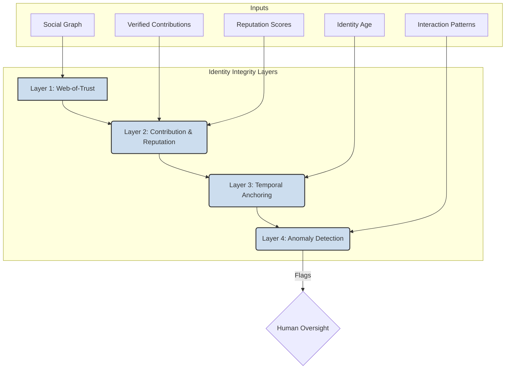

# Sybil Resistance Protocol v3.0.0

## 1. Overview

Sybil attacks, where a single entity creates numerous false identities to gain disproportionate influence, pose a critical threat to decentralized systems. This protocol outlines ThinkAlike's multi-layered defense strategy, designed to protect against such attacks while upholding the core principles of user sovereignty and cognitive liberty.

Our approach is not a single wall, but a set of dynamic, interwoven filters built from social, temporal, and contribution-based signals.

## 2. Guiding Principles

- **Decentralization:** No single authority can grant or revoke identity.
- **Progressive Trust:** Influence is earned through verifiable contribution and interaction, not granted by a central gatekeeper.
- **Privacy by Design:** Verification methods should not require users to reveal unnecessary private information.
- **Transparency:** All resistance mechanisms must be auditable and understandable.

## 3. Multi-Layered Defense Strategy

ThinkAlike employs a combination of passive and active measures to create a resilient social fabric that is inherently resistant to Sybil attacks.

### 3.1. Layer 1: Web-of-Trust Verification
- **Mechanism:** An agent's standing is influenced by the trust scores of the agents they are connected to.
- **Implementation:** Utilizes the social graph defined in the `trust_protocol.md`. New agents with few connections to high-trust agents have limited influence in sensitive domains (e.g., governance).

### 3.2. Layer 2: Proof of Contribution & Reputation
- **Mechanism:** Agents build reputation and trust by making meaningful contributions to the ecosystem.
- **Implementation:** The `chrona_valuation_protocol.md` and `trust_protocol.md` provide the framework for tracking verified contributions (code, moderation, art, etc.) and translating them into reputation scores. It is costly and time-consuming to build reputation for a large number of Sybil identities.

### 3.3. Layer 3: Temporal Anchoring
- **Mechanism:** The age of an identity and the consistency of its engagement over time are key factors in its trust score.
- **Implementation:** The Akashic Record provides an immutable history of an agent's activity. Newly created identities (a hallmark of a Sybil attack) are inherently less trusted than those with a long and positive track record.

### 3.4. Layer 4: Algorithmic Anomaly Detection
- **Mechanism:** AI agents monitor the network for statistical patterns indicative of Sybil activity.
- **Implementation:** Monitoring for patterns such as:
    - Large numbers of new accounts created in a short period.
    - Coordinated, identical voting or interaction patterns from supposedly independent accounts.
    - Accounts with very sparse, machine-like interaction histories.
- **Action:** Flagged accounts or networks are submitted for review by human moderators or the governance council. This does not lead to automatic banning but triggers a deeper investigation.

## 4. Optional Verification Modules

To further enhance security for specific high-stakes realms, communities can opt-in to require additional verification, such as:

- **Proof of Uniqueness:** Using zero-knowledge proofs to verify that an agent corresponds to a unique human without revealing personal data.
- **Proof of Stake:** Requiring a deposit of Chrona to participate in certain governance activities, which is forfeited if malicious behavior is proven.

These are never required for basic participation in the ThinkAlike ecosystem.
