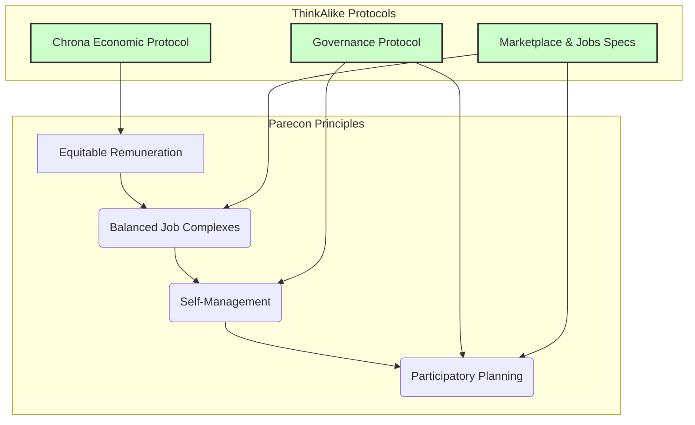

# Participatory Economics (Parecon) Integration Protocol v3.0.0

## 1. Overview

This protocol defines how the core principles of Participatory Economics (Parecon) are integrated into the ThinkAlike ecosystem. The goal is to create an economic framework that values effort and sacrifice, promotes balanced job complexes, ensures equitable remuneration, and facilitates participatory planning.

## 2. Core Parecon Principles in ThinkAlike

-   **Equitable Remuneration for Effort and Sacrifice:** Agents are compensated based on the effort and sacrifice they put into their work, not on the basis of power, property, or output. This is measured and facilitated by the `chrona_valuation_protocol.md`.
-   **Balanced Job Complexes (BJCs):** To the extent possible, roles and tasks are designed to be a mix of empowering and disempowering tasks, ensuring that all participants have the opportunity for meaningful and engaging work.
-   **Self-Management:** Agents have decision-making power in proportion to the degree they are affected by the outcome. This is implemented through the `governance_specification.md`.
-   **Participatory Planning:** The allocation of resources and production of goods/services is determined through a cooperative, decentralized planning process involving all affected agents.

## 3. Integration Mechanisms

### 3.1. Value Accounting & Remuneration
-   **Integration Point:** `chrona_economic_protocol.md` and `chrona_valuation_protocol.md`.
-   **Mechanism:** The Chrona system directly implements equitable remuneration by valuing time, effort, and the nature of the task, rather than market demand or capital ownership.

### 3.2. Contribution & Job Design
-   **Integration Point:** `docs/realms/jobs_and_services/jobs_and_services_specification.md`.
-   **Mechanism:** When new roles or "jobs" are defined within the system, they are encouraged to be designed as Balanced Job Complexes. This involves bundling a variety of tasks to ensure a mix of responsibilities, promoting skill development and shared empowerment.

### 3.3. Collective Decision-Making
-   **Integration Point:** `docs/realms/governance/governance_specification.md`.
-   **Mechanism:** The governance protocol provides the framework for proposals, voting, and feedback loops that enable participatory planning. Agents can collectively decide on project roadmaps, resource allocation, and community-wide initiatives.

### 3.4. Marketplace & Exchange
-   **Integration Point:** `docs/realms/marketplace/marketplace_specification.md`.
-   **Mechanism:** The marketplace facilitates peer-to-peer exchange based on the values established by the Chrona protocols, reinforcing a cooperative economic model rather than a competitive one.

## 4. Future Work

-   **Formalizing BJCs:** Develop more robust tools and guidelines for creating and assessing Balanced Job Complexes within the Jobs & Services realm.
-   **Advanced Participatory Planning Tools:** Create more sophisticated UI/UX for large-scale participatory budgeting and planning exercises within the Governance realm.
